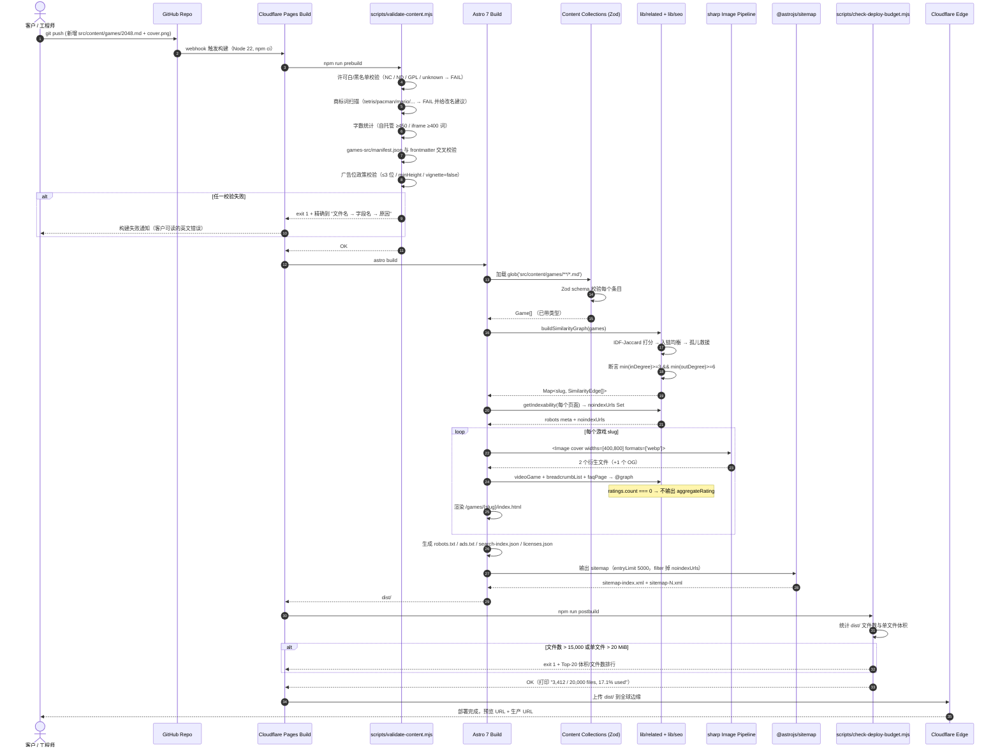
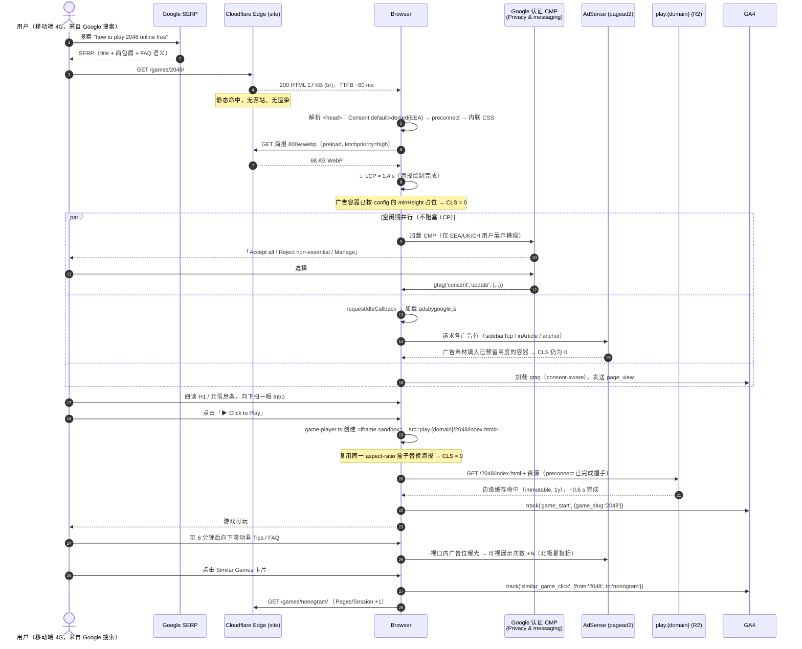
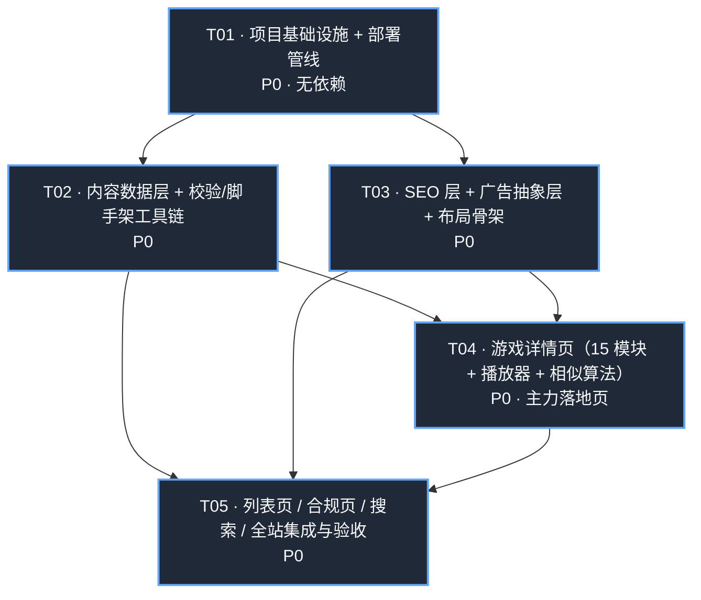

# H5 小游戏站 · 技术架构设计与施工清单（ARCHITECTURE）

| 文档信息 | 内容 |
|---|---|
| Project Name | `h5_games_site` |
| 上游输入 | `docs/PRD.md` v1.0（许清楚，2026-08-04） |
| 撰写人 | 高见远（架构师） |
| 文档版本 | v1.0 |
| 联网核实日期 | **2026-08-04** |
| 适用约束 | PRD §9.1 C1–C5 + 交付总监补充的两条平台事实 |

> **本文档的定位**：这是一份**施工图**，不是技术散文。工程师应当能只看本文档 + PRD §5/§6/§7 就把站建出来。所有涉及框架能力、平台限制、包版本的结论均已于 2026-08-04 联网核实并在正文标注来源。
>
> **一句话结论**：**Astro 7 (SSG) + Tailwind CSS v4 + Content Collections(Zod) + Cloudflare Pages（站点）+ Cloudflare R2（游戏包独立源）**。核心权衡是：用 Astro 的类型化内容层把 R-022/R-023「客户只改数据文件」变成框架自带能力，用 R2 把游戏包从 Pages 的 20,000 文件预算里彻底剥离出去。

---

## 目录

1. [技术选型与决策依据](#1-技术选型与决策依据)
2. [完整目录结构](#2-完整目录结构)
3. [数据模型](#3-数据模型核心)
4. [页面渲染与路由方案](#4-页面渲染与路由方案)
5. [SEO 技术实现方案](#5-seo-技术实现方案)
6. [广告系统设计](#6-广告系统设计对应-c4)
7. [性能方案](#7-性能方案对应-c2)
8. [关键流程时序图](#8-关键流程时序图)
9. [「新增一款游戏」工作流](#9-新增一款游戏的工作流设计对应-c3)
10. [依赖包清单](#10-依赖包清单已联网核实)
11. [任务分解（施工清单）](#11-任务分解给工程师的施工清单)
12. [待明确事项](#12-待明确事项)

---

## 1. 技术选型与决策依据

### 1.0 先否决掉两个坑

| 被否决项 | 否决理由 | 来源（2026-08-04 核实） |
|---|---|---|
| **Vercel 免费版（Hobby）** | Vercel《Fair Use Guidelines》明文把 **"The inclusion of advertisements, including but not limited to online advertising platforms like Google AdSense"** 列为 commercial usage，而 **"Hobby teams are restricted to non-commercial personal use only"**。ToS 另有条款："We may shut down and terminate projects using the hobby plan **without notice for any reason or no reason**"。挂 AdSense = 直接违约，随时可被无预警下线。**这条是硬性法务问题，不是性能问题，无法用技术手段规避。** | vercel.com/docs/limits/fair-use-guidelines、vercel.com/legal/terms |
| **PM 角色默认栈 Vite + React + MUI（纯 CSR SPA）** | 与 C1 直接冲突，PRD §9.2 已自行标注。**明确确认：本项目不使用该组合。** MUI 的运行时 CSS-in-JS 还会额外拖累 CWV，与 C2 冲突。 | — |

### 1.1 四方案横向对比

版本均为 2026-08-04 npm registry / GitHub Releases 实测最新稳定版。

| 维度 | **Astro 7.1.6** ⭐ | Next.js 16.3.0 (SSG/ISR) | Hugo v0.164.0 | Eleventy 3.1.6 |
|---|---|---|---|---|
| **渲染模式（C1）** | ✅ 默认 SSG，纯 HTML 输出 | ✅ SSG 可用，但 App Router 默认带 RSC payload | ✅ 纯 SSG | ✅ 纯 SSG |
| **默认 JS 体积** | ✅ **0 KB**（无 island 时页面零 JS） | ❌ 基线 ~90 KB+ framework runtime + RSC flight data | ✅ 0 KB | ✅ 0 KB |
| **构建速度（1,500 页）** | ✅ 快。Astro 7 用 Rust 编译器 + Vite 8/Rolldown，官方基准：docs.astro.build **6,313 页 73.5 s**（M4 Pro）。按 CF 构建机 4× 折算，我们 1,843 页 ≈ **2–3 min** | 🟠 中。1,500 页 SSG 通常 3–8 min，Turbopack 改善但仍重 | ✅ 最快。1,500 页 <10 s | ✅ 快。1,500 页 20–60 s |
| **内容层类型校验（R-023 命门）** | ✅✅ **Content Collections + Zod v4 原生**。字段缺失/字数不达标 → **构建直接报错并指出文件名和字段名**。这是 R-023 的框架级实现 | 🟠 需自建（contentlayer 已停维护，得手写 zod + glob） | ❌ 无。frontmatter 错了要么静默渲染空白，要么 Go template panic（报错信息对新手不可读） | 🟠 需自建（`eleventy-plugin-*` 或手写 hook） |
| **交互孤岛（搜索/click-to-play/收藏）** | ✅ Islands 原生，按需注水，`client:visible`/`client:idle` 一行搞定 | ✅ 但整站都被 hydrate | 🟠 手写 vanilla JS + 自己配打包 | 🟠 `@11ty/is-land` 插件，能用但要自己搭 |
| **图片管线** | ✅ 内置 `<Image>`/`<Picture>`（sharp），自动 WebP/AVIF + 显式 w/h 防 CLS | ✅ next/image（但静态导出下功能受限） | 🟠 Hugo Pipes 图片处理，能力够但语法晦涩 | 🟠 `@11ty/eleventy-img`，手动调用 |
| **客户 6 个月后还能自己维护吗** | ✅ 客户只碰 `src/content/games/*.md`；报错信息是英文自然语言（`faq: Array must contain at least 5 element(s)`） | 🟠 同样只碰内容文件，但一旦升级 Next 大版本容易全站崩 | 🟠 内容文件同样简单，**但任何模板小改动都要学 Go template，非技术人员完全无法自助** | 🟠 内容简单，模板是 JS/Nunjucks，比 Hugo 友好但仍需要写代码 |
| **生态/招人/AI 辅助** | ✅ 主流，文档极好，LLM 训练语料充足（客户后续找人接手或用 AI 改代码都容易） | ✅ 最大 | 🟠 中，且 Go 模板语料在 LLM 里质量差 | 🟠 小众 |
| **Cloudflare Pages 兼容性** | ✅ 一等公民。`npm run build` → `dist/`，零适配器 | 🟠 SSG 导出可以；**要 ISR 就得上 `@opennextjs/cloudflare`，落到 Workers 请求配额（免费 10 万/天），与 C5 冲突** | ✅ 需装 Hugo extended，CF 构建镜像支持 | ✅ 原生支持 |
| **Astro 7 的风险** | 🟠 2026-06-22 发布，距今 6 周；Rust 编译器对非法 HTML 更严格；默认 Markdown 处理器换成 Sätteri（remark 插件需另装 `@astrojs/markdown-remark`） | — | — | — |

### 1.2 ✅ 最终选型：**Astro 7.1.6 + Tailwind CSS v4 + Cloudflare Pages + Cloudflare R2**

**采纳产品经理的倾向，但把版本、部署形态和资源分层三件事重新定死。**

四条决定性理由：

1. **R-023 是本项目「单人可维护」的技术命门，只有 Astro 把它做成了框架能力。**
   PRD 要求"缺字段时构建报错"。Astro 的 Content Collections 用 Zod schema 在构建期校验每一个内容文件，报错精确到 `src/content/games/spider-solitaire.md → tips: Array must contain at least 5 element(s)`。Hugo/11ty 都得我们自己写一套校验器（等于把框架该干的活挪到项目里维护）。**客户半年后自己加游戏时，唯一的"老师"就是构建报错信息——这条信息的质量直接决定项目能否持续。**

2. **Hugo 更快，但快在了不重要的地方。**
   Hugo 建 1,500 页 <10 s，Astro ~2.5 min。可我们的部署上限是 Cloudflare 的 **20 分钟构建超时**，Astro 有 **8× 余量**。用一个我们不缺的资源（构建时间），去换一个我们极度稀缺的资源（客户的自助维护能力和工程师的实现效率），是错误的交易。

3. **Next.js 的 ISR 在这个项目里是负资产。** 我们的内容是纯静态的（游戏页写完就不变），ISR 解决的问题我们没有，但它带来的 Workers 请求配额消耗和 OpenNext 适配复杂度会直接威胁 C5（$0 成本）。另外 RSC 的 JS 基线与 C2 直接对抗。

4. **Cloudflare Pages 免费档允许商业用途、带宽无限、静态请求无限**（官方定价页明文列出 Free: Unlimited bandwidth / Unlimited static requests / 500 builds per month）。游戏站的带宽消耗是它最大的成本项，这一条把 C5 从"勉强"变成"稳"。

**Astro 7 vs 保守选 Astro 6.4 的取舍**：选 **7.1.6**。理由：(a) 绿地项目无迁移成本，Astro 7 的破坏性变更（Rust 编译器严格性、Sätteri）全部只影响存量代码；(b) Rust 编译器带来的 15–61% 构建提速在 1,500 页规模上是真金白银；(c) 7.1 已发布（2026-07-16），生态整合（Netlify/CF）在 7.0 当天即跟进。**风险对冲**：`package.json` 全部锁死精确版本（不用 `^`），并在 `.nvmrc` 固定 Node 版本；升级只在专门的分支上做。

**技术栈定稿**：

```
渲染层   Astro 7.1.6（SSG，output: 'static'）
样式层   Tailwind CSS v4.3.3（@tailwindcss/vite，非已弃用的 @astrojs/tailwind）
内容层   Astro Content Collections（Content Layer API）+ astro/zod (Zod v4)
交互层   原生 TS Islands（不引入 React/Vue，避免 UI 框架 runtime）
搜索     MiniSearch 7.2.0（客户端，静态 JSON 索引）
图片     Astro <Image> + sharp 0.35.3（构建期，严格限制衍生文件数）
站点托管 Cloudflare Pages（Git 集成，免费档）
游戏包   Cloudflare R2（独立 origin play.{domain}，免费档 10 GB）
运行时   Node 22.x LTS（Astro 6+ 强制要求）
```

### 1.3 ⚠️ Cloudflare Pages 三条硬限制的应对与容量测算

官方数据（developers.cloudflare.com/pages/platform/limits，2026-08-04 核实）：

| 限制 | Free | Paid |
|---|---|---|
| 每次部署文件数 | **20,000** | 100,000 |
| 单个静态资源大小 | **25 MiB** | 25 MiB |
| 每月构建次数 / 并发 | **500 / 1** | 5,000 / 5 |
| 构建超时 | 20 min | 20 min |
| 带宽 / 静态请求 | 无限 | 无限 |

> 补充核实：**Cloudflare Workers Static Assets 的免费档同样是 20,000 文件/版本**（developers.cloudflare.com/workers/platform/limits）。**所以改用 Workers 并不能绕开这个限制，必须从架构上解决。**

#### 三条不可违反的架构规则

**规则 A：游戏包永远不进 Pages 部署，走独立 origin。**

自托管游戏是文件数的主要来源（一个 Phaser 游戏带精灵图 + 音效动辄 80–300 个小文件）。我们把它们放进 **Cloudflare R2 公开桶**，绑定自定义域 `play.{domain}`，游戏 iframe 的 `src` 指向该域。

这一条同时解决了 **四个** 问题：

1. ✅ Pages 文件数不再随自托管游戏数增长（45 款游戏 ≈ 3,600 个文件，全部转移到 R2，**R2 无对象数量限制**）；
2. ✅ 25 MiB 单文件上限失效（R2 单对象上限远高于此）；
3. ✅ **iframe sandbox 变得真正有效**。如果游戏与主站同源，`sandbox="allow-scripts allow-same-origin"` 等于没有沙箱（游戏脚本可以读写主站 DOM/localStorage/Cookie，甚至碰到我们的广告代码）。跨 origin 之后沙箱才有意义，游戏的 localStorage 也和主站隔离；
4. ✅ **游戏资源更新不再触发全站构建**，不消耗 500 次/月构建配额。

R2 免费档：**10 GB-month 存储 / 1,000,000 Class A 操作 / 10,000,000 Class B 操作 / 出站流量永久免费**（developers.cloudflare.com/r2/pricing）。配合 Cache Rules（Edge TTL 1 个月 + `Cache-Control: public, max-age=31536000, immutable`），绝大多数请求在边缘命中，不回源、不计 Class B。

> **对 SEO 的影响：零。** PRD §3 说自托管的 SEO 优势来自"同域内容能被 Google 抓取"——但那指的是 **iframe 外面的正文**，iframe 里的东西无论同域异域 Google 都不计入本页权重。游戏包放在子域不损失任何 SEO 价值，只损失一次 DNS/TLS 握手，而这发生在**用户点击之后**（click-to-play），不进 LCP。用 `<link rel="preconnect" href="https://play.{domain}">` 进一步抹平。

**规则 B：每张图最多生成 3 个衍生文件。**

这是比游戏包更隐蔽的杀手。Astro `<Image>` 默认按 `widths` × `formats` 做笛卡尔积，一张封面轻易产出 8 个文件。1,500 款游戏 × 8 = **12,000 个文件**，加上 HTML 就爆了。

强制策略：
- 封面图只生成 `[400, 800]` 两个宽度 + 单一格式 `webp`（AVIF 编码慢且收益边际，**放弃**）；
- OG 图单独 1 个 `1200×630 webp`；
- 全站禁用 `image.responsiveStyles`，所有 `<Image>` 必须显式传 `widths` 和 `formats`；
- ESLint 自定义规则 + `scripts/validate-content.mjs` 双重拦截未显式声明 widths 的用法。

**规则 C：构建后强制预算检查，超 75% 就失败。**

`scripts/check-deploy-budget.mjs` 在 `astro build` 之后运行：文件数 > **15,000**（20,000 的 75%）或任一文件 > **20 MiB** → `process.exit(1)`，并打印按目录聚合的 Top-20 体积/文件数排行。**宁可让构建失败在本地，也不要让部署失败在 Cloudflare 上——后者对非技术客户是灾难性的。**

#### 容量测算

| 资源类别 | M3（45 款游戏） | M12（600 页） | M24（1,500 页） |
|---|---|---|---|
| HTML（每个 URL 一个 `index.html`） | 92 | 760 | 1,843 |
| 封面/OG 图衍生（3 个/图，规则 B） | 155 | 1,900 | 5,000 |
| CSS / JS bundle（hash 分片） | 25 | 30 | 35 |
| sitemap 分片 / robots / ads.txt / search-index / feed | 8 | 10 | 14 |
| 字体、图标、favicon、静态 OG 兜底图 | 10 | 10 | 10 |
| **Pages 部署文件数合计** | **≈ 290** | **≈ 2,710** | **≈ 6,902** |
| **占 20,000 上限** | 1.5% | 13.6% | **34.5%** ✅ |
| 游戏包（→ R2，不计入） | 3,600 对象 / ~180 MB | ~9,000 / ~450 MB | ~12,000 / ~600 MB |
| **R2 占 10 GB 上限** | 1.8% | 4.5% | **6%** ✅ |

**反事实校验**（若不执行规则 A/B）：M24 时 = 1,843 HTML + 12,000 图片衍生 + 12,000 游戏文件 = **25,843 → 超限，部署直接失败**。规则 A/B 各自贡献了约一半的救命额度。

**构建次数**：客户每周发布 8–12 款，批量合并为 2 次部署/周 ≈ **10 次/月**，加 preview 分支构建，全年 <200 次，对 500 次/月上限有 **50× 余量**。唯一要提醒客户的：**不要在 Cloudflare 上开"每次 commit 都构建"，把内容攒到一批再推。**

**构建时长**：M24 1,843 页按 Astro 7 官方基准折算 ≈ 2–3 min（含 npm install ≈ 4 min），对 20 min 超时有 **5× 余量**。触发红线的规模约在 8,000 页以上，届时的对策是启用 Astro 7 的 Route Caching / 拆分为两个 Pages 项目（游戏页 vs 内容页）。

#### 关于 Cloudflare 服务条款的两点提醒

- Cloudflare CDN 免费档禁止把服务用作**流媒体视频 / 大体积非 HTML 文件**的分发（"不成比例的负载"）。我们的资产是 HTML/CSS/JS/图片/小音效，**属于正常网站流量，不触碰这条**。但明确禁止后续在站上托管视频文件（需要视频请用 YouTube 嵌入）。
- Cloudflare Pages 官方定价页对 Free 档明文列出 unlimited bandwidth / unlimited static requests，**未设商业用途限制**——这是它相对 Vercel Hobby 的结构性优势。

---

## 2. 完整目录结构

```
h5-games-site/
│
├── .nvmrc                          # "22" —— Astro 6+ 强制 Node 22，锁死避免 CF 构建机漂移
├── .env.example                    # PUBLIC_SITE_URL / ADSENSE_PUB_ID / GA4_ID 等示例
├── package.json                    # 依赖锁精确版本（无 ^ ~）
├── astro.config.mjs                # Astro 主配置：site / trailingSlash / sitemap / image
├── tsconfig.json
├── wrangler.toml                   # ★ 仅用于 R2 上传，站点部署不经过它
├── README.md                       # 给工程师的
│
├── site.config.ts                  # ★★ 站点级唯一配置源（站名/域名/邮箱/社交）
│
├── src/
│   ├── config/                     # ★★ 全部"可调参数"集中在这一层，客户唯一需要改代码的地方
│   │   ├── site.ts                 #   站名、域名、slogan、联系邮箱、Organization schema 数据
│   │   ├── ads.ts                  #   ★ 广告抽象层配置（C4：全局开关 + 位置表 + 网络切换）
│   │   ├── analytics.ts            #   GA4 measurement ID、事件名、Consent 默认值
│   │   ├── seo.ts                  #   title/description 模板、noindex 阈值（TAG_MIN_GAMES=6）
│   │   └── nav.ts                  #   主导航、页脚三列链接
│   │
│   ├── content.config.ts           # ★★ Content Collections 定义 + Zod schema（C3/R-022/R-023 核心）
│   │
│   ├── content/                    # ★★★ 内容层：客户唯一需要日常操作的目录，与代码彻底分离
│   │   ├── games/                  #   一个游戏 = 一个 .md 文件
│   │   │   ├── 2048.md
│   │   │   ├── spider-solitaire.md
│   │   │   └── ...
│   │   ├── categories/             #   8 个分类，body 为 300–500 词导语（真 Markdown 长文）
│   │   │   ├── puzzle.md
│   │   │   └── ...
│   │   ├── collections/            #   [P1] 专题合集
│   │   ├── blog/                   #   [P1] 编辑内容
│   │   ├── pages/                  #   About / Privacy / Terms / Contact / DMCA 正文
│   │   └── data/
│   │       ├── tags.json           #   标签台账（slug / 展示名 / 描述 / SEO 文案）
│   │       └── homepage.json       #   首页 300–500 词编辑区文案 + 模块排序
│   │
│   ├── assets/                     # 需要 Astro 构建期优化的图片源文件
│   │   └── games/{slug}/
│   │       ├── cover.png           #   源图 ≥1200×630，构建期生成 400w/800w webp + og webp
│   │       └── screenshot-*.png    #   [可选]
│   │
│   ├── components/
│   │   ├── ads/                    # ★ 广告抽象层（C4）
│   │   │   ├── AdSlot.astro        #   唯一对外接口：<AdSlot placement="game.inArticle" />
│   │   │   ├── AdsHead.astro       #   网络 loader script，仅在 enabled 时输出
│   │   │   └── adapters/
│   │   │       ├── AdSenseSlot.astro
│   │   │       ├── MediavineSlot.astro     # 预留，M18 迁移时只需实现这个文件
│   │   │       └── NoopSlot.astro
│   │   ├── consent/
│   │   │   └── ConsentBootstrap.astro      # Consent Mode v2 default denied（必须在所有标签之前）
│   │   ├── seo/
│   │   │   ├── BaseHead.astro      #   title/desc/canonical/OG/Twitter/robots 统一出口
│   │   │   ├── JsonLd.astro        #   通用 <script type="application/ld+json"> 渲染器
│   │   │   └── schema/             #   纯 TS：输入实体 → 输出 JSON-LD 对象
│   │   │       ├── videoGame.ts
│   │   │       ├── breadcrumbList.ts
│   │   │       ├── faqPage.ts
│   │   │       ├── itemList.ts
│   │   │       └── siteGraph.ts    #   WebSite + SearchAction + Organization
│   │   ├── game/
│   │   │   ├── GamePlayer.astro    # ★ click-to-play 播放器（C2 核心）
│   │   │   ├── ControlsTable.astro #   三列表，移动端折叠为两列
│   │   │   ├── HowToPlaySteps.astro
│   │   │   ├── TipsList.astro
│   │   │   ├── GameInfoTable.astro
│   │   │   ├── FaqAccordion.astro  #   原生 <details>，0 KB JS
│   │   │   ├── SimilarGames.astro
│   │   │   └── Attribution.astro   #   R-024 归属声明
│   │   ├── ui/
│   │   │   ├── GameCard.astro
│   │   │   ├── GameGrid.astro
│   │   │   ├── Pagination.astro    #   真实 URL 分页 + rel=next/prev
│   │   │   ├── Breadcrumbs.astro   #   可见面包屑，与 BreadcrumbList schema 同源
│   │   │   └── SearchBox.astro
│   │   └── layout/
│   │       ├── Header.astro
│   │       ├── Footer.astro
│   │       └── MobileNav.astro
│   │
│   ├── layouts/
│   │   ├── BaseLayout.astro        # <html> 骨架：Consent → Ads head → SEO → Header/Footer
│   │   ├── GamePageLayout.astro
│   │   ├── ListPageLayout.astro    # 分类/标签/合集/all-games 共用
│   │   └── ArticleLayout.astro     # blog / 合规静态页
│   │
│   ├── lib/                        # 纯函数，无 Astro 依赖，可单测
│   │   ├── content/
│   │   │   ├── games.ts            #   getAllGames / getPublishedGames / byCategory / byTag
│   │   │   ├── taxonomy.ts         #   分类/标签聚合与计数
│   │   │   └── wordcount.ts        #   统一字数统计口径（英文按空白切分）
│   │   ├── seo/
│   │   │   ├── indexability.ts     # ★ noindex 规则的唯一实现（meta 与 sitemap 共用）
│   │   │   ├── meta.ts             #   title/description 模板渲染 + 长度断言
│   │   │   └── breadcrumbs.ts      #   面包屑数据的唯一来源
│   │   ├── related/
│   │   │   └── similar.ts          # ★ Similar Games 相关性算法 + 入链均衡
│   │   ├── search/
│   │   │   └── buildIndex.ts
│   │   └── utils/{url,date,slug}.ts
│   │
│   ├── scripts/                    # 浏览器端 TS（会被打包进 island）
│   │   ├── game-player.ts          #   click-to-play 注入 + GA4 game_start
│   │   ├── search.ts               #   MiniSearch 懒加载
│   │   ├── favorites.ts            #   [P1] localStorage
│   │   └── analytics.ts            #   GA4 事件封装 + consent 感知
│   │
│   ├── pages/                      # 路由 = 文件结构
│   │   ├── index.astro
│   │   ├── games/[slug].astro
│   │   ├── c/[category]/index.astro
│   │   ├── c/[category]/page/[page].astro
│   │   ├── t/[tag].astro
│   │   ├── collections/[slug].astro
│   │   ├── blog/[slug].astro
│   │   ├── all-games/index.astro
│   │   ├── all-games/page/[page].astro
│   │   ├── new.astro
│   │   ├── search.astro                    # noindex
│   │   ├── about.astro / privacy-policy.astro / terms.astro
│   │   ├── contact.astro / dmca.astro
│   │   ├── licenses.astro                  # ★ 许可台账公开页（R-024）
│   │   ├── 404.astro
│   │   ├── robots.txt.ts                   # 动态生成，指向 sitemap
│   │   ├── ads.txt.ts                      # ★ 从 config/ads.ts 的 publisherId 生成
│   │   ├── search-index.json.ts
│   │   ├── licenses.json.ts                # data/licenses.json 的构建期生成物
│   │   └── feed.xml.ts                     # [P1]
│   │
│   └── styles/
│       ├── global.css              # Tailwind v4 @import + @theme tokens
│       └── ads.css                 # ★ 广告位固定高度容器（防 CLS）
│
├── public/                         # 原样复制，不做处理。★ 严禁放游戏包
│   ├── _headers                    # 缓存策略 + 安全头
│   ├── _redirects                  # /sitemap.xml → /sitemap-index.xml 等
│   ├── favicon.svg / apple-touch-icon.png
│   └── og-default.png
│
├── games-src/                      # ★ 游戏包源目录（Git 管理，但不进 dist）
│   ├── manifest.json               #   slug → {files, bytes, entry, sha}
│   └── 2048/
│       ├── index.html
│       └── ...
│
├── scripts/                        # Node 构建/运维脚本（客户会用到前两个）
│   ├── new-game.mjs                # ★ npm run new:game
│   ├── publish-games.mjs           # ★ npm run publish:games —— 上传 games-src → R2
│   ├── validate-content.mjs        # ★ 内容与许可合规校验（prebuild 强制）
│   ├── check-deploy-budget.mjs     # ★ 部署文件数/体积预算（postbuild 强制）
│   └── doctor.mjs                  #   体检：字数不足/孤儿页/薄标签页清单
│
├── templates/
│   └── game.template.md            # ★ 带全部 15 个模块 + 内联注释的骨架
│
├── tests/
│   ├── unit/                       # vitest：similar.ts / indexability.ts / meta.ts
│   └── e2e/                        # playwright：CWV、广告间距、click-to-play、schema
│
└── docs/
    ├── PRD.md
    ├── ARCHITECTURE.md             # 本文档
    └── OPERATIONS.md               # [后续] 给客户的零基础操作手册（PRD Q6）
```

**内容与代码分离的落地检验（C3 验收标准）**：新增一款游戏，改动集中在 `src/content/games/{slug}.md`（1 个新文件）+ `src/assets/games/{slug}/cover.png`（1 张图）+ `games-src/{slug}/`（游戏包，仅自托管时）。**`src/components/`、`src/pages/`、`src/layouts/` 三个目录零改动。** CI 里加一条断言：`git diff --name-only` 若同时命中 `src/content/games/` 和 `src/pages/`，输出警告。

---

## 3. 数据模型（核心）

### 3.1 实体关系类图

```mermaid
classDiagram
    class Game {
        +string id
        +string slug
        +string title
        +string h1
        +SeoMeta seo
        +MediaAssets media
        +GameSource source
        +Taxonomy taxonomy
        +ContentModules content
        +LicenseInfo license
        +GameInfoMeta info
        +RatingStub~optional~ ratings
        +Date publishedAt
        +Date updatedAt
        +boolean draft
        +number wordCount~computed~
    }

    class SeoMeta {
        +string title
        +string description
        +string~optional~ canonicalOverride
        +string[] targetKeywords
        +string~optional~ ogImageOverride
        +boolean noindexOverride
    }

    class MediaAssets {
        +ImageMetadata cover
        +string coverAlt
        +ImageMetadata[] screenshots
        +number aspectRatioW
        +number aspectRatioH
    }

    class GameSource {
        +SourceType sourceType
        +string~optional~ bundlePath
        +string~optional~ entryFile
        +string~optional~ embedUrl
        +string~optional~ provider
        +number bundleFileCount
        +number bundleBytes
        +string[] sandboxFlags
    }

    class Taxonomy {
        +string primaryCategory
        +string[] categories
        +string[] tags
        +string[] mechanics
    }

    class ContentModules {
        +string intro
        +string[] about
        +HowToStep[] howToPlay
        +ControlRow[] controls
        +Tip[] tips
        +string[] features
        +FaqItem[] faq
    }

    class HowToStep {
        +string step
        +string detail
    }
    class ControlRow {
        +string action
        +string desktop
        +string mobile
    }
    class Tip {
        +string title
        +string body
    }
    class FaqItem {
        +string q
        +string a
    }

    class GameInfoMeta {
        +string developer
        +string released
        +string[] genre
        +PlayMode players
        +string technology
        +string[] platform
        +string avgSessionMinutes
    }

    class LicenseInfo {
        +LicenseId license
        +string licenseUrl
        +string author
        +string~optional~ authorUrl
        +string sourceUrl
        +string assetsLicense
        +string~optional~ permissionEmail
        +string attributionRendered
        +Date verifiedAt
    }

    class RatingStub {
        +number count
        +number~optional~ value
        +boolean emitAggregateRating
    }

    class Category {
        +string slug
        +string name
        +string h1Template
        +string introMarkdown
        +FaqItem[] faq
        +number order
        +string[] relatedCategories
    }

    class Tag {
        +string slug
        +string name
        +string description
        +boolean forceNoindex
        +number gameCount~computed~
        +boolean indexable~computed~
    }

    class GameCollection {
        +string slug
        +string title
        +string introMarkdown
        +string[] gameSlugs
        +number year
    }

    class BlogPost {
        +string slug
        +string title
        +string bodyMarkdown
        +string[] relatedGameSlugs
    }

    class SimilarityEdge {
        +string from
        +string to
        +number score
        +string[] reasons
    }

    class AdPlacement {
        +string id
        +boolean enabled
        +string format
        +Size desktop
        +Size~nullable~ mobile
        +number minHeightDesktop
        +number minHeightMobile
        +string slotId
    }

    class AdsConfig {
        +boolean enabled
        +NetworkId network
        +Map~string,AdPlacement~ placements
        +AdRules rules
    }

    Game "1" *-- "1" SeoMeta
    Game "1" *-- "1" MediaAssets
    Game "1" *-- "1" GameSource
    Game "1" *-- "1" Taxonomy
    Game "1" *-- "1" ContentModules
    Game "1" *-- "1" LicenseInfo
    Game "1" *-- "1" GameInfoMeta
    Game "1" o-- "0..1" RatingStub
    ContentModules "1" *-- "3..6" HowToStep
    ContentModules "1" *-- "8..15" ControlRow
    ContentModules "1" *-- "5..8" Tip
    ContentModules "1" *-- "5..7" FaqItem
    Category "1" --> "0..*" Game : primaryCategory
    Game "0..*" --> "1..*" Category : categories
    Game "0..*" --> "2..*" Tag : tags
    GameCollection "1" --> "10..*" Game : gameSlugs
    BlogPost "1" --> "0..*" Game : relatedGameSlugs
    Game "1" --> "6..12" SimilarityEdge : computed at build
    AdsConfig "1" *-- "1..*" AdPlacement
```



### 3.2 Content Collections Schema（`src/content.config.ts`）

> Astro 7 使用 Content Layer API + `astro/zod`（Zod v4）。**不要**从 `astro:content` 导入 `z`（已弃用路径）。

```ts
// src/content.config.ts
import { defineCollection, reference } from 'astro:content';
import { glob, file } from 'astro/loaders';
import { z } from 'astro/zod';

/* ---------- 许可白名单 / 黑名单：本项目唯一的法务防线 ---------- */
const ALLOWED_LICENSES = [
  'MIT', 'Apache-2.0', 'BSD-2-Clause', 'BSD-3-Clause',
  'CC0-1.0', 'CC-BY-4.0', 'Unlicense',
  'ISC', 'Zlib',
  'platform-licensed',      // GameDistribution / GamePix 等平台授权
  'author-permission',      // 已取得作者书面同意（必须填 permissionEmail）
] as const;
// 黑名单在 validate-content.mjs 中二次拦截：任何含 -NC / -ND / GPL / AGPL / unknown 的值

const wordCount = (s: string) => s.trim().split(/\s+/).filter(Boolean).length;
const minWords = (n: number, field: string) =>
  (s: string) => wordCount(s) >= n || `${field} needs >= ${n} words, got ${wordCount(s)}`;

/* ---------- 子结构 ---------- */
const controlRow = z.object({
  action:  z.string().min(2),
  desktop: z.string().min(1),
  mobile:  z.string().min(1),
});

const howToStep = z.object({
  step:   z.string().min(3),            // 加粗小标题，如 "Make your first move."
  detail: z.string().min(20),
});

const tip = z.object({
  title: z.string().min(4),
  body:  z.string().min(30),
});

const faqItem = z.object({
  q: z.string().min(8).max(160),
  a: z.string().min(30),
});

const licenseInfo = z.object({
  license:      z.enum(ALLOWED_LICENSES),
  licenseUrl:   z.string().url().optional(),
  author:       z.string().min(2),
  authorUrl:    z.string().url().optional(),
  sourceUrl:    z.string().url().optional(),
  assetsLicense: z.string().min(2).default('same as code license'),
  permissionEmail: z.string().optional(),   // author-permission 时必填
  attributionRendered: z.string().min(8),   // "2048 by Gabriele Cirulli · MIT License"
  verifiedAt:   z.coerce.date(),
});

/* ---------- games ---------- */
const games = defineCollection({
  loader: glob({ pattern: '**/*.md', base: './src/content/games' }),
  schema: ({ image }) => z.object({
    /* — 身份 — */
    title: z.string().min(2).max(60),
    h1:    z.string().min(8).max(90),          // "Play 2048 Online — Free, No Download"
    draft: z.boolean().default(false),

    /* — SEO（PRD §5.2 模块 0） — */
    seo: z.object({
      title:       z.string().min(30).max(60),
      description: z.string().min(120).max(158),
      targetKeywords: z.array(z.string()).min(1).max(8),
      canonicalOverride: z.string().url().optional(),
      ogImageOverride:   z.string().optional(),
      noindexOverride:   z.boolean().default(false),
    }),

    /* — 媒体 — */
    media: z.object({
      cover:    image(),                        // src/assets/games/{slug}/cover.png
      coverAlt: z.string().min(10),             // "{Game} gameplay screenshot"
      screenshots: z.array(image()).max(4).default([]),
      aspectRatio: z.tuple([z.number(), z.number()]).default([16, 9]),
    }),

    /* — 游戏来源（决定 iframe src 与合规门槛） — */
    source: z.discriminatedUnion('sourceType', [
      z.object({
        sourceType: z.literal('self_hosted'),
        bundlePath: z.string().min(1),          // games-src/{slug} → play.{domain}/{slug}/
        entryFile:  z.string().default('index.html'),
        bundleFileCount: z.number().int().positive(),
        bundleBytes:     z.number().int().positive(),
      }),
      z.object({
        sourceType: z.literal('iframe'),
        provider:   z.enum(['gamedistribution', 'gamepix', 'other']),
        embedUrl:   z.string().url(),
      }),
    ]),

    /* — 分类体系 — */
    taxonomy: z.object({
      primaryCategory: reference('categories'),
      categories: z.array(reference('categories')).min(1).max(3),
      tags:       z.array(z.string()).min(2).max(10),
      mechanics:  z.array(z.string()).max(8).default([]),   // 相似度算法用，如 merge/grid/tile
    }),

    /* — PRD §5.2 的 15 个内容模块（结构化，非自由 Markdown） — */
    content: z.object({
      intro:      z.string().refine(minWords(60, 'intro')),               // 模块 5
      about:      z.array(z.string().min(80)).min(2).max(4),              // 模块 6，段落数组
      howToPlay:  z.array(howToStep).min(3).max(6),                       // 模块 7
      controls:   z.array(controlRow).min(8).max(15),                     // 模块 8
      tips:       z.array(tip).min(5).max(8),                             // 模块 9
      features:   z.array(z.string().min(10)).max(6).default([]),         // 模块 10
      faq:        z.array(faqItem).min(5).max(7),                         // 模块 12
    }),

    /* — Game Info 表（模块 11） — */
    info: z.object({
      developer:  z.string().min(2),
      released:   z.string().min(4),
      genre:      z.array(z.string()).min(1).max(4),
      players:    z.enum(['SinglePlayer', 'MultiPlayer', 'CoOp']),
      technology: z.string().default('HTML5 / JavaScript'),
      platform:   z.array(z.string()).default(['Desktop', 'Tablet', 'Mobile browser']),
      avgSessionMinutes: z.number().int().min(1).max(120),
    }),

    /* — 许可（模块 14 / R-024） — */
    license: licenseInfo,

    /* — ★ 评分：没有真实评分时禁止输出 aggregateRating（PRD §5.3 红线） — */
    ratings: z.object({
      count: z.number().int().min(0).default(0),
      value: z.number().min(1).max(5).optional(),
    }).default({ count: 0 })
     .refine(r => r.count === 0 || r.value !== undefined,
       'ratings.value is required once count > 0'),

    publishedAt: z.coerce.date(),
    updatedAt:   z.coerce.date(),
  })
  /* ---- 跨字段业务规则 ---- */
  .refine(g => {
    const total =
      wordCount(g.content.intro) +
      g.content.about.reduce((n, p) => n + wordCount(p), 0) +
      g.content.howToPlay.reduce((n, s) => n + wordCount(s.step + ' ' + s.detail), 0) +
      g.content.tips.reduce((n, t) => n + wordCount(t.title + ' ' + t.body), 0) +
      g.content.faq.reduce((n, f) => n + wordCount(f.q + ' ' + f.a), 0) +
      g.content.features.reduce((n, f) => n + wordCount(f), 0);
    const floor = g.source.sourceType === 'iframe' ? 400 : 450;  // PRD 阶段二硬门槛
    return total >= floor;
  }, 'Original body copy below the hard minimum (450 words self-hosted / 400 words iframe)')
  .refine(g => g.license.license !== 'author-permission' || !!g.license.permissionEmail,
    'license=author-permission requires permissionEmail')
  .refine(g => g.source.sourceType !== 'self_hosted' ||
               (!!g.license.sourceUrl && !!g.license.licenseUrl),
    'self_hosted games require license.sourceUrl and license.licenseUrl'),
});

/* ---------- categories ---------- */
const categories = defineCollection({
  loader: glob({ pattern: '**/*.md', base: './src/content/categories' }),
  // body（Markdown 正文）= 300–500 词导语 + 底部补充内容，由 validate-content.mjs 校验字数
  schema: z.object({
    name: z.string(),
    h1Template: z.string().default('Free {name} Games — Play {count} {name} Games Online'),
    seo: z.object({
      titleTemplate: z.string(),      // "{count} Best Free {name} Games Online ({year}) | {site}"
      descriptionTemplate: z.string(),
    }),
    faq: z.array(faqItem).min(3).max(5),
    order: z.number().int(),
    relatedCategories: z.array(z.string()).default([]),
    icon: z.string().optional(),
  }),
});

/* ---------- tags ---------- */
const tags = defineCollection({
  loader: file('./src/content/data/tags.json'),
  schema: z.object({
    id:   z.string(),                 // slug
    name: z.string(),
    description: z.string().min(40),
    forceNoindex: z.boolean().default(false),
  }),
});

/* ---------- collections / blog / pages（结构从略，同构） ---------- */

export const collections = { games, categories, tags, /* gameCollections, blog, pages */ };
```

### 3.3 `data/licenses.json`：从内容层**生成**，而非手工维护

PRD R-024 要求维护 `data/licenses.json` 台账。**手工维护第二份许可数据必然与游戏文件漂移**，我把它改成构建期生成物：

- 唯一真源：每个 `src/content/games/{slug}.md` 的 `license` 字段（schema 强制完整）；
- `src/pages/licenses.json.ts` 在构建期聚合全部游戏，输出 `/licenses.json`（PRD 的台账格式，字段一一对应）；
- `src/pages/licenses.astro` 渲染人类可读的 `/licenses/` 公开页（同时是一个 E-E-A-T 信号页）；
- `scripts/validate-content.mjs` 做黑名单二次拦截 + 商标词扫描。

输出格式与 PRD §3.2 完全一致：

```json
{
  "generatedAt": "2026-09-01T00:00:00Z",
  "count": 45,
  "entries": [{
    "slug": "2048",
    "title": "2048",
    "source_type": "self_hosted",
    "source_url": "https://github.com/gabrielecirulli/2048",
    "author": "Gabriele Cirulli",
    "license": "MIT",
    "license_url": "https://github.com/gabrielecirulli/2048/blob/master/LICENSE.txt",
    "assets_license": "MIT (same repo)",
    "permission_email": null,
    "added_at": "2026-09-01",
    "verified_at": "2026-08-28",
    "attribution_rendered": "2048 by Gabriele Cirulli, MIT License"
  }]
}
```

> **额外的手工台账**：`docs/license-audit.md` 记录**被否决的候选游戏**（如 Hextris = GPLv3 已排除），这份不进构建，只做尽调留痕。

### 3.4 `games-src/manifest.json`：游戏包与部署预算的连接点

```json
{
  "2048": {
    "entry": "index.html",
    "files": 23,
    "bytes": 412773,
    "sha256": "…",
    "uploadedAt": "2026-09-01T10:22:00Z",
    "publicBase": "https://play.snackarcade.com/2048/"
  }
}
```

由 `scripts/publish-games.mjs` 写入，被 `content.config.ts` 的 `bundleFileCount` / `bundleBytes` 交叉校验（不一致 → 构建失败，防止"内容文件说有游戏、R2 上其实没传"）。

---

## 4. 页面渲染与路由方案

`astro.config.mjs` 关键配置：

```js
export default defineConfig({
  site: process.env.PUBLIC_SITE_URL,        // https://snackarcade.com
  output: 'static',                          // C1
  trailingSlash: 'always',                   // PRD §5.1：统一尾斜杠，避免双收录
  build: { format: 'directory', inlineStylesheets: 'auto' },
  image: { responsiveStyles: false },        // 规则 B：禁止自动 srcset 膨胀
  integrations: [sitemap({ /* 见 §5.3 */ })],
  vite: { plugins: [tailwindcss()] },
});
```

### 4.1 路由表

| URL | 源文件 | 生成方式 | 分页 | 索引策略 |
|---|---|---|---|---|
| `/` | `pages/index.astro` | 静态 | — | index, follow |
| `/games/{slug}/` | `pages/games/[slug].astro` | `getStaticPaths()` 遍历 `games` collection，过滤 `draft` | — | index（draft → 不生成页面） |
| `/c/{cat}/` | `pages/c/[category]/index.astro` | `getStaticPaths()` 遍历 `categories`，取该分类第 1 页（24 款/页） | 第 1 页 | index |
| `/c/{cat}/page/{n}/` | `pages/c/[category]/page/[page].astro` | 嵌套 `getStaticPaths()`，n ≥ 2 | 真实 URL | index，title 追加 `- Page {n}`，**自引用 canonical** |
| `/t/{tag}/` | `pages/t/[tag].astro` | 遍历 `tags`，聚合游戏数 | 单页（>36 款时同样走 `page/{n}`） | **< 6 款 → noindex, follow**（R-005） |
| `/collections/{slug}/` | `pages/collections/[slug].astro` | 遍历 `gameCollections` | — | index（< 10 款 → noindex） |
| `/blog/{slug}/` | `pages/blog/[slug].astro` | 遍历 `blog` | — | index |
| `/all-games/` `/all-games/page/{n}/` | `pages/all-games/*` | 全量，48 款/页，按 `updatedAt` 倒序 | 真实 URL | index（爬虫发现入口） |
| `/new/` | `pages/new.astro` | 最近 48 款 | — | index |
| `/search/` | `pages/search.astro` | 静态壳 + 客户端 MiniSearch | — | **noindex, nofollow**（R-004） |
| `/about/` `/privacy-policy/` `/terms/` `/contact/` `/dmca/` | 各自 `.astro` + `content/pages/*.md` | 静态 | — | index |
| `/licenses/` | `pages/licenses.astro` | 从 games 聚合 | — | index |
| `/404` | `pages/404.astro` | 静态；CF Pages 自动作为 404 响应 | — | noindex |
| `/robots.txt` `/ads.txt` `/search-index.json` `/licenses.json` `/feed.xml` | `pages/*.ts` endpoints | 构建期生成 | — | — |
| `/sitemap-index.xml` `/sitemap-{n}.xml` | `@astrojs/sitemap` | 构建期 | 每片 ≤ 5,000 | — |

### 4.2 分页实现（PRD 要求 `/page/2/` 而非 Astro 默认的 `/2/`）

Astro 内置 `paginate()` 产出 `/c/puzzle/2/`，与 PRD §5.1 的 `/c/puzzle/page/2/` 不符。采用**双文件显式路由**：

```
src/pages/c/[category]/index.astro          → 第 1 页
src/pages/c/[category]/page/[page].astro    → 第 2..N 页（getStaticPaths 过滤 page===1）
```

两者共用 `ListPageLayout.astro` 与同一个 `buildListPageProps()` 函数，避免逻辑分叉。`Pagination.astro` 统一产出：

- `rel="prev"` / `rel="next"`（`<link>` in head）
- 每页 **自引用 canonical**（不 canonical 到第 1 页——PRD §5.4 明确要求）
- 第 n 页 `<title>` 追加 ` - Page {n}`，`description` 追加 `Page {n} of {total}.`

### 4.3 noindex 规则的**唯一实现点**

这是最容易出 bug 的地方：`<meta name="robots">` 和 sitemap 过滤器如果各写一遍，早晚不一致（sitemap 里躺着一堆 noindex 页面 = GSC 报"已提交但被 noindex 排除"，是个持续扣分项）。

```ts
// src/lib/seo/indexability.ts —— 全站唯一实现
export type PageKind = 'home'|'game'|'category'|'tag'|'collection'|'blog'|'static'|'search'|'list'|'404';

export interface IndexabilityInput {
  kind: PageKind;
  itemCount?: number;        // 列表页的条目数
  noindexOverride?: boolean; // 内容文件里的手动开关
  isDraft?: boolean;
}

export const SEO_THRESHOLDS = { TAG_MIN_GAMES: 6, COLLECTION_MIN_GAMES: 10 };

export function getIndexability(i: IndexabilityInput): { index: boolean; follow: boolean; robots: string; reason?: string } {
  if (i.noindexOverride || i.isDraft)                     return no('manual-override');
  if (i.kind === 'search')                                return { index:false, follow:false, robots:'noindex, nofollow', reason:'search' };
  if (i.kind === '404')                                   return no('404');
  if (i.kind === 'tag'        && (i.itemCount ?? 0) < SEO_THRESHOLDS.TAG_MIN_GAMES)        return no('thin-tag');
  if (i.kind === 'collection' && (i.itemCount ?? 0) < SEO_THRESHOLDS.COLLECTION_MIN_GAMES) return no('thin-collection');
  return { index: true, follow: true, robots: 'index, follow' };
}
const no = (reason: string) => ({ index:false, follow:true, robots:'noindex, follow', reason });
```

三处消费同一个函数：

1. `BaseHead.astro` → `<meta name="robots" content={robots}>`
2. `astro.config.mjs` 的 `sitemap({ filter })` → 通过构建期生成的 `noindexUrls` Set 过滤
3. `scripts/validate-content.mjs` → 报告本次构建将产生多少 noindex 页（客户可见的健康指标）

**实现细节**：`filter` 无法直接调 collection，所以在 `astro:build:setup` 钩子里先算出 `noindexUrls: Set<string>` 写到内存/临时文件，sitemap 的 `filter: (url) => !noindexUrls.has(new URL(url).pathname)` 读取它。工程师注意执行顺序。

---

## 5. SEO 技术实现方案

### 5.1 统一 SEO 组件

**规则：任何页面都不允许自己写 `<title>` / `<meta>`，必须通过 `BaseHead.astro`。** ESLint 规则禁止在 `src/pages/**` 出现裸 `<title>`。

```astro
---
// src/components/seo/BaseHead.astro
interface Props {
  kind: PageKind;
  title: string;            // 已渲染好的完整 title
  description: string;
  canonical?: string;       // 缺省 = Astro.site + Astro.url.pathname（自引用）
  ogImage?: ImageMetadata | string;
  ogType?: 'website' | 'article';
  itemCount?: number;
  noindexOverride?: boolean;
  prev?: string; next?: string;
  jsonLd?: object[];        // 由页面组装的 @graph 数组
}
---
<link rel="canonical" href={canonicalUrl} />
<meta name="robots" content={robots} />
<title>{title}</title>
<meta name="description" content={description} />

<!-- Open Graph -->
<meta property="og:type" content={ogType} />
<meta property="og:site_name" content={SITE.name} />
<meta property="og:title" content={title} />
<meta property="og:description" content={description} />
<meta property="og:url" content={canonicalUrl} />
<meta property="og:image" content={ogUrl} />          <!-- 1200×630 -->
<meta property="og:image:width" content="1200" />
<meta property="og:image:height" content="630" />
<meta property="og:locale" content="en_US" />

<!-- Twitter -->
<meta name="twitter:card" content="summary_large_image" />
<meta name="twitter:title" content={title} />
<meta name="twitter:description" content={description} />
<meta name="twitter:image" content={ogUrl} />

{prev && <link rel="prev" href={prev} />}
{next && <link rel="next" href={next} />}

{jsonLd?.length > 0 && <JsonLd graph={jsonLd} />}
```

`src/lib/seo/meta.ts` 承载 PRD §6.3 的模板，并在构建期**断言长度**（title ≤ 60 字符、description 120–158 字符，超限 → 构建失败）。这把"SEO 规范"从人的自觉变成了机器约束。

```ts
export const titleTemplates = {
  game:     ({ title }) => `Play ${title} Online Free — No Download | ${SITE.name}`,
  category: ({ name, count, year }) => `${count} Best Free ${name} Games Online (${year}) | ${SITE.name}`,
  tag:      ({ name, count }) => `${count} Free ${name} Games — Play Online | ${SITE.name}`,
  // …
};
```

### 5.2 结构化数据：组件化 JSON-LD，按页面类型注入

每种 schema 一个纯函数（`src/components/seo/schema/*.ts`），输入实体、输出对象；页面组装 `@graph` 后交给 `<JsonLd>` 一次性输出。**只输出一个 `<script type="application/ld+json">`**，用 `@graph` 串联，避免多脚本导致的实体重复。

| 页面 | @graph 内容 |
|---|---|
| 首页 | `WebSite`(+`SearchAction`) + `Organization` + `ItemList`(Trending) |
| 游戏页 | `VideoGame` + `BreadcrumbList` + `FAQPage` |
| 分类页 | `CollectionPage` + `ItemList` + `BreadcrumbList` + `FAQPage` |
| 标签页/合集页 | `ItemList` + `BreadcrumbList`（noindex 时仍输出，无害） |
| Blog | `Article` + `BreadcrumbList` |
| 静态页 | `WebPage` + `BreadcrumbList` |
| 全站（BaseLayout） | `Organization` 的 `@id` 引用，避免每页重复完整对象 |

**`videoGame.ts` 的关键红线实现**：

```ts
export function videoGameSchema(game: Game, siteUrl: string) {
  const node: Record<string, unknown> = {
    '@type': 'VideoGame',
    '@id': `${siteUrl}/games/${game.slug}/#game`,
    name: game.title,
    url:  `${siteUrl}/games/${game.slug}/`,
    description: game.seo.description,
    image: absoluteUrl(game.media.cover),
    genre: game.info.genre,
    playMode: game.info.players,
    applicationCategory: 'Game',
    operatingSystem: 'Web browser',
    gamePlatform: game.info.platform,
    author: { '@type': 'Person', name: game.license.author,
              ...(game.license.authorUrl && { url: game.license.authorUrl }) },
    publisher: { '@id': `${siteUrl}/#organization` },
    inLanguage: 'en',
    datePublished: iso(game.publishedAt),
    dateModified:  iso(game.updatedAt),
    offers: { '@type': 'Offer', price: '0', priceCurrency: 'USD',
              availability: 'https://schema.org/InStock' },
  };

  // ★★★ PRD §5.3 红线：没有真实评分就绝不输出 aggregateRating
  if (game.ratings.count > 0 && game.ratings.value !== undefined) {
    node.aggregateRating = {
      '@type': 'AggregateRating',
      ratingValue: game.ratings.value.toFixed(1),
      ratingCount: game.ratings.count,
      bestRating: '5', worstRating: '1',
    };
  }
  return node;
}
```

同时在 `tests/unit/schema.test.ts` 加一条**回归测试**：`ratings.count === 0` 时输出对象中不得包含 `aggregateRating` 键。这是防止未来某次改动引入结构化数据作弊的保险丝。

**元信息条的处理**：PRD §5.2 模块 3 和线框图写了 `★ 4.6 (1,284 ratings)`。在 R-030 上线前**页面上也不能显示假评分**（可见内容与 schema 都不能造假）。M1–M3 的元信息条改为：`Puzzle · Single Player · ~6 min per game · Updated Aug 2026`，等有真实评分再补 `★`。这一条要同步给 PM 与前端。

### 5.3 sitemap / robots

```js
// astro.config.mjs
sitemap({
  entryLimit: 5000,                                    // R-013：每片 ≤5,000 URL
  filter: (url) => !noindexUrls.has(new URL(url).pathname),
  changefreq: 'weekly',
  serialize(item) {
    const p = new URL(item.url).pathname;
    if (p === '/')                    return { ...item, priority: 1.0, changefreq: 'daily' };
    if (p.startsWith('/games/'))      return { ...item, priority: 0.9, lastmod: lastmodOf(p) };
    if (p.startsWith('/c/'))          return { ...item, priority: 0.8, changefreq: 'daily' };
    if (p.startsWith('/collections/'))return { ...item, priority: 0.7 };
    if (p.startsWith('/t/'))          return { ...item, priority: 0.5 };
    return { ...item, priority: 0.4, changefreq: 'monthly' };
  },
})
```

`lastmod` 取自游戏文件的 `updatedAt`（**不是文件 mtime**——Git 检出会把 mtime 全刷成构建时间，导致整站 lastmod 每次部署都变，这是新手最常见的 sitemap 事故）。

`public/_redirects` 补一条兼容：`/sitemap.xml  /sitemap-index.xml  200`（PRD §5.1 写的是 `/sitemap.xml`，客户提交给 GSC 时更顺手）。

`src/pages/robots.txt.ts`：

```
User-agent: *
Allow: /
Disallow: /search/
Disallow: /*?*                  # 参数页不收录
Disallow: /api/

Sitemap: {site}/sitemap-index.xml
```

### 5.4 面包屑

`src/lib/seo/breadcrumbs.ts` 是唯一数据源，同时喂给 `<Breadcrumbs>` 可见组件和 `breadcrumbList.ts` schema 生成器。**保证可见面包屑与结构化数据 100% 一致**（Google 会比对，不一致会被忽略甚至判为误导）。

```ts
buildBreadcrumbs({ kind:'game', game })
// → [ {name:'Home', url:'/'},
//     {name:'Puzzle Games', url:'/c/puzzle/'},   // 取 primaryCategory
//     {name:'2048', url:'/games/2048/'} ]        // 末项不输出链接（可见层），schema 里保留 item
```

### 5.5 ★ 内链策略：Similar Games 相关性算法（R-028，禁止手工维护）

**目标**：构建期为每款游戏算出 6–12 个真正相关的游戏；同时保证**没有孤儿页**、**权重不全部堆到热门游戏**。

#### 打分函数

```
score(A, B) =
    3.0 · [primaryCategory(A) == primaryCategory(B)]
  + 2.0 · Jaccard(categories(A), categories(B))
  + 4.0 · IDF-Jaccard(tags(A), tags(B))
  + 1.5 · Jaccard(mechanics(A), mechanics(B))
  + 1.5 · cosine(keywordVec(A), keywordVec(B))
  + 0.5 · log1p(popularity(B)) / log1p(maxPopularity)
```

- **IDF-Jaccard 是这个算法的灵魂**。普通 Jaccard 会让 `no-download`、`mobile` 这类几乎每款游戏都有的标签把所有游戏连成一团糨糊。加 IDF 权重后，`nonogram`、`4-suit`、`split-keyboard` 这类稀有标签的匹配价值远高于通用标签：

  ```
  idf(t) = ln( N / (1 + df(t)) )
  IDF-Jaccard(A,B) = Σ_{t ∈ A∩B} idf(t)  /  Σ_{t ∈ A∪B} idf(t)
  ```

- `keywordVec` = `seo.targetKeywords` + `title` 分词后的 TF 向量（构建期算，无外部依赖）。
- `popularity(B)` = GA4 导出的 `game_start` 数（可选，`src/content/data/popularity.json`，缺失时为 0）。权重只有 0.5，**仅作平局裁决**，避免马太效应。

#### 入链均衡（避免孤儿页 + 分散权重）

朴素 Top-K 会导致少数热门游戏被所有人链接、冷门游戏零入链（PRD §5.4 明确要求"每个游戏页必须至少被 1 个分类页 + 1 个标签页链接到"，但 Similar Games 是内链权重的最大来源，同样需要均衡）。

```
1. 对每个 A，按 score 降序取候选 C(A)（截断到 Top-30）
2. inDegree[*] = 0；capBase = ceil(K * 1.6)   // K = 目标出链数 = 12
3. 两轮贪心：
   Round 1（严格配额）：
     for A in games (按 slug 稳定排序):
       picked = []
       for B in C(A):
         if inDegree[B] < capBase and len(picked) < K: picked.push(B); inDegree[B]++
       out[A] = picked
   Round 2（补齐下限）：
     for A where len(out[A]) < 6:
       从 C(A) 里忽略配额补到 6（保证 PRD 的 6–12 款下限）
4. 孤儿救援：
     for B where inDegree[B] == 0:
       找到 score(·,B) 最高的 3 个 A，强制把 B 插入 out[A]（替换掉 out[A] 里 inDegree 最高的一项）
5. 断言：min(inDegree) >= 3 且 min(len(out[A])) >= 6，否则构建失败
```

- 稳定排序 + 无随机数 = **同样的内容产出同样的内链图**，diff 可审计，不会每次构建都抖动（否则 Google 会看到内链结构频繁变化）。
- 输出附带 `reasons: ['same category','shared tags: merge, grid']`，用于开发期调试和 `npm run doctor` 报告。
- 复杂度 O(N²)，N=1,500 时约 112 万次打分，纯 JS <1 s，M24 规模完全够用。若某天 N > 5,000，按 primaryCategory 分桶后再算即可（已在代码里预留 `bucketBy` 参数）。

#### 其余内链（构成 PRD §5.4 要求的"每页 ≥8 条出站内链"）

| 来源 | 条数 | 锚文本策略 |
|---|---|---|
| 面包屑 → 分类 | 1 | 分类展示名 |
| 元信息条 → 分类 | 1–3 | 分类展示名 |
| 标签胶囊 | 2–4 | 标签展示名 |
| Similar Games | 6–12 | 游戏名（卡片） |
| 正文底部"更多同类" | 1 | **描述性锚文本**：`play more puzzle games` |
| FAQ 第 7 题内嵌 | 2–3 | 游戏名 |

`scripts/validate-content.mjs` 断言每个游戏页出链 ≥ 8，且不含 `click here` / `read more` 等空锚文本。

---

## 6. 广告系统设计（对应 C4）

### 6.1 设计目标

1. **一个布尔值关掉全站广告**（AdSense 审核期必须）；
2. **换广告网络不改任何页面代码**（M18 迁 Mediavine，收入 2–4×）；
3. **每个广告位的尺寸和位置由配置驱动**，支持 A/B（R-034）；
4. **结构上不可能产生 CLS**（容器高度来自配置，编译进 CSS 变量）；
5. **不可能违反 AdSense 政策**（数量上限、间距、标签用词由构建期校验强制）。

### 6.2 配置文件格式（`src/config/ads.ts`）

```ts
export type NetworkId = 'adsense' | 'mediavine' | 'none';
export type PlacementId =
  | 'home.belowHero' | 'home.inFeed'
  | 'category.belowIntro' | 'category.inGrid'
  | 'game.sidebarTop' | 'game.sidebarBottom' | 'game.belowGameMobile' | 'game.inArticle'
  | 'global.anchor';

export interface AdPlacement {
  enabled: boolean;
  format: 'display' | 'in-feed' | 'in-article' | 'anchor';
  /** null = 该断点不渲染（连容器都不生成） */
  desktop: { w: number | 'fluid'; h: number; minHeight: number } | null;
  mobile:  { w: number | 'fluid'; h: number; minHeight: number } | null;
  /** 各网络的位置 ID；换网络时只补这里 */
  slotIds: Partial<Record<NetworkId, string>>;
  label: 'Advertisement' | 'Sponsored Links';   // 类型层面就禁止误导性用词（政策 §7.1-6）
}

export const adsConfig = {
  /** ★★ C4 主开关：AdSense 审核期设为 false，全站零广告代码、零第三方请求 */
  enabled: false,

  /** ★★ 换广告网络的唯一开关 */
  network: 'adsense' as NetworkId,

  networks: {
    adsense: {
      publisherId: import.meta.env.PUBLIC_ADSENSE_PUB_ID ?? '',   // ca-pub-XXXXXXXXXXXXXXXX
      autoAds: false,          // 手动位优先；Auto Ads 打开后 Vignette/Side rail 必须关（PRD §7.1-8）
      pageLevelAds: false,
    },
    mediavine: { siteId: '' },
    none: {},
  },

  /** 广告脚本延迟策略：首屏交互后或空闲时再加载，保护 LCP/INP */
  loadStrategy: 'on-idle' as 'immediate' | 'on-idle' | 'on-interaction',
  lazyRootMargin: '250px',

  /** 全局政策护栏，构建期校验会读它 */
  rules: {
    maxDisplayPerPage: 3,           // PRD §7.1-5
    anchorEnabled: true,
    vignetteEnabled: false,         // PRD §7.1-8：明确关闭
    sideRailEnabled: false,
    gameAreaMinGapPx: 150,          // PRD §7.1-2
    firstAdBelowFold: true,         // PRD §7.1-3
  },

  placements: {
    'home.belowHero': {
      enabled: true, format: 'display', label: 'Advertisement',
      desktop: { w: 728, h: 90,  minHeight: 100 },
      mobile:  { w: 320, h: 100, minHeight: 110 },
      slotIds: { adsense: '1111111111' },
    },
    'game.sidebarTop': {
      enabled: true, format: 'display', label: 'Advertisement',
      desktop: { w: 300, h: 600, minHeight: 610 },
      mobile:  null,                                   // 移动端不渲染
      slotIds: { adsense: '3333333333' },
    },
    'game.belowGameMobile': {
      enabled: true, format: 'display', label: 'Advertisement',
      desktop: null,
      mobile:  { w: 320, h: 100, minHeight: 110 },
      slotIds: { adsense: '4444444444' },
    },
    'game.inArticle': {
      enabled: true, format: 'in-article', label: 'Advertisement',
      desktop: { w: 'fluid', h: 280, minHeight: 290 },
      mobile:  { w: 300, h: 250, minHeight: 260 },
      slotIds: { adsense: '5555555555' },
    },
    'global.anchor': {
      enabled: true, format: 'anchor', label: 'Advertisement',
      desktop: null,
      mobile:  { w: 'fluid', h: 50, minHeight: 50 },
      slotIds: { adsense: '6666666666' },
    },
    // …其余按 PRD §7.6 表格补齐
  } satisfies Record<PlacementId, AdPlacement>,
};
```

**A/B 测试（R-034）**：新增 `src/config/ads.variants.ts` 导出 `variantA` / `variantB` 两套 `placements`，通过环境变量 `PUBLIC_AD_VARIANT` 选择，并把变体名写进 GA4 的 user property，后台按变体分组比较 Page RPM。切换布局 = 改一个环境变量 + 重新部署，零代码改动。

### 6.3 组件接口

```astro
<!-- 页面里唯一的写法，页面完全不知道广告网络是谁 -->
<AdSlot placement="game.inArticle" />
```

```astro
---
// src/components/ads/AdSlot.astro
import { adsConfig } from '@/config/ads';
import AdSenseSlot   from './adapters/AdSenseSlot.astro';
import MediavineSlot from './adapters/MediavineSlot.astro';
import NoopSlot      from './adapters/NoopSlot.astro';

interface Props { placement: PlacementId; class?: string; }
const { placement, class: cls } = Astro.props;
const p = adsConfig.placements[placement];

// C4：主开关或位开关关闭 → 什么都不渲染（连占位容器都没有）
const off = !adsConfig.enabled || !p?.enabled || (!p.desktop && !p.mobile);

const Adapter = { adsense: AdSenseSlot, mediavine: MediavineSlot, none: NoopSlot }[adsConfig.network];
---
{!off && (
  <aside
    class:list={['ad-slot', `ad-slot--${p.format}`, cls]}
    data-placement={placement}
    data-ad-desktop={p.desktop ? '1' : '0'}
    data-ad-mobile={p.mobile ? '1' : '0'}
    style={`--ad-mh-mobile:${p.mobile?.minHeight ?? 0}px;--ad-mh-desktop:${p.desktop?.minHeight ?? 0}px;`}
    aria-label="Advertisement"
  >
    <span class="ad-slot__label">{p.label}</span>
    <div class="ad-slot__inner">
      <Adapter placement={placement} config={p} />
    </div>
  </aside>
)}
```

```css
/* src/styles/ads.css —— 防 CLS 的核心 3 行 */
.ad-slot{
  min-height: var(--ad-mh-mobile);      /* 容器高度在 HTML 到达浏览器时就已确定 */
  contain: layout;                       /* 广告内部布局变化不外溢 */
  display: block; margin-inline: auto; text-align: center;
}
@media (min-width:1024px){ .ad-slot{ min-height: var(--ad-mh-desktop); } }

/* 断点不渲染的位：容器直接消失，不留白 */
.ad-slot[data-ad-mobile="0"]{ display:none; }
@media (min-width:1024px){
  .ad-slot[data-ad-mobile="0"]{ display:block; }
  .ad-slot[data-ad-desktop="0"]{ display:none; }
}
.ad-slot__label{
  display:block; font-size:11px; line-height:1.4; letter-spacing:.04em;
  text-transform:uppercase; color:var(--color-muted); margin-bottom:4px;
}
/* PRD §7.1-2：游戏区与最近广告位间距 ≥150px，写成 token 由布局引用 */
.game-ad-guard{ margin-block-start: var(--game-ad-gap, 150px); }
```

**AdSense adapter**：

```astro
---
// src/components/ads/adapters/AdSenseSlot.astro
const { config: p, placement } = Astro.props;
const pub  = adsConfig.networks.adsense.publisherId;
const slot = p.slotIds.adsense;
---
<ins class="adsbygoogle" style="display:block"
     data-ad-client={pub}
     data-ad-slot={slot}
     data-ad-format={p.format === 'in-article' ? 'fluid' : 'auto'}
     {...(p.format === 'in-article' && { 'data-ad-layout': 'in-article' })}
     data-full-width-responsive="true"></ins>
<script is:inline define:vars={{ placement }}>
  (window.__adQueue ||= []).push(placement);   // 由 ads-loader 按 loadStrategy 统一 push
</script>
```

> **迁移 Mediavine 时的全部工作量**：实现 `MediavineSlot.astro`（约 20 行）+ 把 `network` 改成 `'mediavine'` + 在 `slotIds` 补 mediavine 的位 ID。**页面、布局、组件零改动。** 这就是 C4 的兑现。

### 6.4 广告脚本加载与 CMP / Consent Mode v2 接入位置

`BaseLayout.astro` `<head>` 里的**严格顺序**（顺序错了 Consent Mode 就是摆设）：

```astro
<head>
  <meta charset="utf-8" />
  <meta name="viewport" content="width=device-width, initial-scale=1" />

  <!-- ① Consent Mode v2 默认值：必须在任何 Google 标签之前，且必须是内联同步脚本 -->
  <ConsentBootstrap />

  <!-- ② 站点 SEO -->
  <BaseHead {...seoProps} />

  <!-- ③ 预连接：游戏 origin + 广告 origin -->
  <link rel="preconnect" href={PLAY_ORIGIN} crossorigin />
  {adsConfig.enabled && <link rel="preconnect" href="https://pagead2.googlesyndication.com" crossorigin />}

  <!-- ④ 广告网络 loader（内部含 Google 认证 CMP「Privacy & messaging」的自动注入） -->
  <AdsHead />

  <!-- ⑤ GA4（consent-aware，on-idle 加载） -->
  <Analytics />
</head>
```

```astro
---
// src/components/consent/ConsentBootstrap.astro
---
<script is:inline>
  window.dataLayer = window.dataLayer || [];
  function gtag(){ dataLayer.push(arguments); }
  window.gtag = gtag;

  // Consent Mode v2 四个信号，EEA/UK/CH 默认全部 denied
  gtag('consent', 'default', {
    ad_storage:        'denied',
    ad_user_data:      'denied',
    ad_personalization:'denied',
    analytics_storage: 'denied',
    wait_for_update:   500,
    region: ['AT','BE','BG','HR','CY','CZ','DK','EE','FI','FR','DE','GR','HU','IS','IE','IT',
             'LV','LI','LT','LU','MT','NL','NO','PL','PT','RO','SK','SI','ES','SE','GB','CH'],
  });
  // 其余地区默认 granted（美国主力市场不受 GDPR 约束，保住 RPM）
  gtag('consent', 'default', {
    ad_storage:'granted', ad_user_data:'granted',
    ad_personalization:'granted', analytics_storage:'granted',
  });
</script>
```

**CMP 选型（$0 且合规的唯一解）**：使用 **Google「隐私权和消息」（Privacy & messaging / 原 Funding Choices）** 的 European regulatory message。

- 核实结论（2026-08-04，support.google.com/adsense/answer/13554116）：自 **2024-01-16** 起，向 EEA/UK 用户投放个性化广告**必须**使用 Google 认证且集成 IAB TCF 的 CMP；瑞士自 2024-07-31 起同样要求。**Google 自家的「隐私权和消息」已按 TCF 新要求通过认证**，对 AdSense 发布商免费。
- 另需注意：**自 2026-03-01 起 Google 要求所有新生成的 TC String 使用 TCF v2.3**，仍在生成 v2.2 的 CMP 会被降级为 Limited Ads（收入大幅受损）。用 Google 自家 CMP 可自动跟进版本。
- 接入位置：AdSense 代码就位后，在 AdSense 后台「隐私权和消息 → 欧洲法规」创建并发布消息，**无需在代码里加任何东西**——这是对非技术客户最友好的方案。
- 我们代码侧需要做的只有两件事：(1) 上面的 `ConsentBootstrap`（default denied）；(2) `Analytics.ts` 监听 `consent update` 后再上报事件。
- 若客户未来自建/换 CMP（Cookiebot / Usercentrics / Didomi 等），只需替换 `ConsentBootstrap.astro` 中注入的 CMP 脚本，其余不动。

**`ads.txt`（R-012）**：`src/pages/ads.txt.ts` 从 `adsConfig.networks.adsense.publisherId` 生成，**审核前就要在线**：

```
google.com, pub-XXXXXXXXXXXXXXXX, DIRECT, f08c47fec0942fa0
```

迁 Mediavine 时该 endpoint 追加 Mediavine 给的行即可（配置驱动，无需改模板）。

### 6.5 构建期政策校验（`scripts/validate-ads.mjs`，并入 validate-content）

| 校验项 | 依据 | 失败行为 |
|---|---|---|
| 单页面 `display` + `in-feed` + `in-article` 位数 ≤ 3 | PRD §7.1-5 | build fail |
| 每个 enabled 的位必须有非 0 `minHeight` | §7.1-7 防 CLS | build fail |
| `label` 只能是 `Advertisement` / `Sponsored Links` | §7.1-6 | TS 类型层拦截 |
| `rules.vignetteEnabled === false` | §7.1-8 | build fail（需显式改配置才能开） |
| `enabled === true` 时 `publisherId` 必须非空且匹配 `^ca-pub-\d{16}$` | — | build fail |
| 游戏页首个广告位在游戏区之后 | §7.1-3 | Playwright e2e 断言 DOM 顺序 |
| 游戏区下边缘 → 最近广告位间距 ≥ 150px | §7.1-2 | Playwright e2e 实测 `getBoundingClientRect()` 差值 |

**最后一条尤其重要**：这是唯一无法靠静态分析保证的政策项，必须靠 e2e 实测。测试放在 CI，游戏页布局改动一旦破坏间距立刻红灯。

---

## 7. 性能方案（对应 C2：移动端 LCP < 2.5 s、CLS < 0.1、INP < 200 ms）

### 7.1 预算表（移动端 75 分位，4G，Moto G Power 级设备）

| 指标 | 目标 | 预算分配 |
|---|---|---|
| TTFB | < 200 ms | Cloudflare 边缘静态命中，实测通常 30–80 ms |
| HTML（gzip/br） | ≤ 18 KB | 游戏页正文 ~800 词 + 表格 |
| 关键 CSS | ≤ 9 KB，内联 | Tailwind v4 按需产出 + `inlineStylesheets:'auto'` |
| **LCP 元素** | 游戏封面海报 ≤ 70 KB | 800×450 WebP q75，`fetchpriority="high"` + `<link rel="preload">` |
| 首屏 JS | ≤ 6 KB | 只有 `game-player.ts` + mobile nav |
| 全页 JS（含广告前） | ≤ 15 KB | 不引入 React/Vue |
| 字体 | **0 请求** | 系统字体栈 |
| **LCP 预期** | **1.2 – 1.8 s** | — |
| **CLS 预期** | **< 0.02** | 所有可变高度元素都有预留 |

### 7.2 click-to-play 实现（C2 的头号措施）

```astro
---
// src/components/game/GamePlayer.astro
const { game } = Astro.props;
const [arW, arH] = game.media.aspectRatio;
const src = game.source.sourceType === 'self_hosted'
  ? `${PLAY_ORIGIN}/${game.slug}/${game.source.entryFile}`
  : game.source.embedUrl;
// 自托管游戏在独立 origin，sandbox 才有意义
const sandbox = game.source.sourceType === 'self_hosted'
  ? 'allow-scripts allow-same-origin allow-pointer-lock allow-orientation-lock'
  : 'allow-scripts allow-same-origin allow-popups allow-popups-to-escape-sandbox allow-forms';
---
<div class="game-player" data-src={src} data-sandbox={sandbox} data-slug={game.slug}
     style={`aspect-ratio:${arW}/${arH}`}>
  <Image src={game.media.cover} alt={game.media.coverAlt}
         widths={[400, 800]} formats={['webp']} sizes="(max-width:768px) 100vw, 720px"
         loading="eager" fetchpriority="high" decoding="sync" class="game-player__poster" />
  <button type="button" class="game-player__cta" aria-label={`Play ${game.title}`}>
    <span class="game-player__icon" aria-hidden="true">▶</span>
    <span class="game-player__text">Click to Play</span>
    <span class="game-player__hint">Loads in about 2 seconds</span>
  </button>
</div>
<div class="game-player__controls">
  <button data-action="fullscreen">⛶ Play fullscreen</button>
  <button data-action="favorite">♡ Save for later</button>
  <button data-action="share">🔗 Share</button>
</div>
<script src="/src/scripts/game-player.ts"></script>
```

```ts
// src/scripts/game-player.ts —— 全站唯一必须的首屏 JS，压缩后约 1.6 KB
document.querySelectorAll<HTMLElement>('.game-player').forEach((root) => {
  const start = () => {
    const f = document.createElement('iframe');
    f.src = root.dataset.src!;
    f.title = root.dataset.slug!;
    f.setAttribute('sandbox', root.dataset.sandbox!);
    f.setAttribute('allow', 'autoplay; fullscreen; gamepad; accelerometer; gyroscope');
    f.setAttribute('allowfullscreen', '');
    f.loading = 'eager';
    f.className = 'game-player__frame';
    root.replaceChildren(f);                       // 同一个 aspect-ratio 盒子内替换 → CLS = 0
    root.dataset.state = 'playing';
    window.__track?.('game_start', { game_slug: root.dataset.slug });
  };
  root.querySelector('.game-player__cta')?.addEventListener('click', start, { once: true });
});
```

四个关键点：

1. **海报是 LCP 元素**，`fetchpriority="high"` + `<link rel="preload" as="image" imagesrcset=…>` 打进 `<head>`（由 `GamePageLayout` 注入）。**绝不能对它用 `loading="lazy"`**，这是最常见的 LCP 自杀操作。
2. **外层盒子用 `aspect-ratio` 固定**，iframe 在同一个盒子里替换海报 → **CLS 恒等于 0**。
3. **iframe 到用户点击才创建**，第三方/游戏包的字节完全不进入首屏关键路径，也不进入 LCP 计算。
4. **`game_start` 事件**在这里发（R-019），拿到真实的"到达 → 开玩"转化率，这是后续优化 RPM 的核心数据。

### 7.3 图片策略

| 用途 | 尺寸 | 格式 | 加载 | 衍生文件数 |
|---|---|---|---|---|
| 游戏页海报（LCP） | 400w / 800w | WebP q75 | `eager` + `fetchpriority=high` + preload | 2 |
| 卡片缩略图 | 400w | WebP q72 | `lazy` + `decoding=async` | 复用 400w，0 新增 |
| OG 图 | 1200×630 | WebP q80 | — | 1 |
| **每款游戏合计** | | | | **3**（规则 B） |

- 全部 `<Image>` 必须显式 `width`/`height`（Astro 自动从 `ImageMetadata` 注入）→ **零 CLS**。
- `alt` 由 schema 强制（`coverAlt` min 10 字符），杜绝空 alt。
- 首屏之外的图一律 `loading="lazy" decoding="async"`。
- 放弃 AVIF：编码耗时是 WebP 的 5–10×（1,500 张图会显著吃掉构建预算），而体积收益在这个尺寸档只有 10–15%。**这是一个明确的、可回退的取舍**，若未来构建有余量可在 `image.formats` 加回。

### 7.4 字体策略

**系统字体栈，零网络请求，零 FOUT，零 CLS。**

```css
@theme {
  --font-sans: -apple-system, BlinkMacSystemFont, "Segoe UI", Roboto,
               "Helvetica Neue", Arial, "Noto Sans", sans-serif;
  --font-mono: ui-monospace, SFMono-Regular, "SF Mono", Menlo, monospace;
}
```

游戏站的用户不会因为字体不够品牌化而流失，但会因为多 200 ms 的字体阻塞而流失。若后续客户强烈要求品牌字体：自托管**单个** variable woff2、latin 子集、`font-display: swap`、`<link rel="preload">`，且**仅用于 H1/Logo**，正文保持系统栈。（Astro 7 的核心 Fonts API 可直接托管这件事。）

### 7.5 游戏资源加载策略

| 层 | 策略 |
|---|---|
| 传输 | 全部走 Cloudflare 边缘，HTTP/3 + Brotli |
| 缓存 | R2 上的游戏资源：`Cache-Control: public, max-age=31536000, immutable`；配 Cloudflare Cache Rule（Edge TTL 1 month）。游戏更新时改目录版本号（`/{slug}/v2/`）而不是清缓存 |
| 预连接 | `<link rel="preconnect" href="https://play.{domain}" crossorigin>`，把跨 origin 的 DNS+TLS 提前到用户读正文时完成 |
| 不预取 | **不做 `prefetch` 游戏包**——那等于放弃 click-to-play 省下的带宽，也会污染 CWV 的 network contention |
| 单游戏体积门槛 | `new:game` 脚本对 > 8 MB 的包发出警告，> 20 MB 拒绝（移动端 4G 加载会超过 10 s，体验不可接受） |

`public/_headers`：

```
/*
  X-Content-Type-Options: nosniff
  Referrer-Policy: strict-origin-when-cross-origin
  Permissions-Policy: interest-cohort=(), geolocation=(), microphone=(), camera=()
  X-Frame-Options: SAMEORIGIN

/_astro/*
  Cache-Control: public, max-age=31536000, immutable

/*.html
  Cache-Control: public, max-age=0, must-revalidate

/search-index.json
  Cache-Control: public, max-age=3600
```

> 不设 CSP 严格策略于 P0 阶段——AdSense 的域名清单变化频繁，过早上 CSP 会在客户不懂的时候把广告打没。P1 阶段用 Astro 7 内置的 CSP API（`security.csp`）配 `report-only` 观察一个月再收紧。

### 7.6 INP 与第三方治理

- 全站**无 UI 框架 runtime**，主线程几乎空闲，INP 天然良好。
- FAQ 用原生 `<details>/<summary>`（0 JS），移动端菜单用 CSS `:has()` + 一个 12 行的 toggle。
- **广告脚本 `loadStrategy: 'on-idle'`**：`requestIdleCallback`（fallback `setTimeout 2000`）后才 push `adsbygoogle`，把 LCP 窗口让给内容。
- GA4：consent 更新后 + idle 后加载，事件通过 `window.__track` 缓冲队列，加载前的事件不丢。
- 搜索：MiniSearch 与索引 JSON **只在 `/search/` 页或用户首次聚焦搜索框时**动态 `import()`，其余页面 0 字节。

### 7.7 CWV 守门（CI）

`tests/e2e/cwv.spec.ts`（Playwright + Lighthouse 13.4.1，移动端 preset）在每次 PR 跑：

| 断言 | 阈值 | 页面 |
|---|---|---|
| LCP | < 2,200 ms（比目标严 300 ms 做缓冲） | 首页 / 游戏页 / 分类页 |
| CLS | < 0.05 | 同上 |
| TBT | < 200 ms | 同上 |
| Lighthouse SEO | ≥ 95 | 同上（R-001） |
| 首屏 JS 传输量 | < 20 KB | 游戏页 |
| 游戏区 → 首个广告位间距 | ≥ 150 px | 游戏页（桌面 + 移动） |
| iframe 在点击前不存在 | `page.locator('iframe').count() === 0` | 游戏页 |

---

## 8. 关键流程时序图

### 8.1 构建期：页面生成流程



### 8.2 运行时：用户访问游戏页并开始游戏



---

## 9. 「新增一款游戏」的工作流设计（对应 C3）

### 9.1 客户视角的完整步骤（目标：≤ 30 分钟 / 款）

```
① 选品与许可核实                       ~8 min
   在 GitHub 按 topic:html5-games + License 筛选，或从 js13kGames 挑
   → 确认 LICENSE 文件；确认 /assets 目录的素材许可；确认游戏名无商标风险

② 下载游戏包，放进 games-src/{slug}/    ~2 min

③ 跑脚手架                              ~1 min
   $ npm run new:game
   ? Game slug ......... spider-solitaire
   ? Display title ..... Spider Solitaire
   ? Primary category .. card-board
   ? Source type ....... self_hosted
   ? Bundle folder ..... games-src/spider-solitaire
   ? License ........... MIT
   ? Author ............ Some Developer
   ? Source URL ........ https://github.com/...
   ✔ 已创建 src/content/games/spider-solitaire.md（15 个模块占位 + 字数提示）
   ✔ 已创建 src/assets/games/spider-solitaire/（放 cover.png 到这里）
   ✔ 游戏包体检：47 files / 1.8 MB / entry=index.html  → 已写入 manifest.json
   ✔ 下一步：填 Markdown → npm run doctor → npm run publish:games

④ 填内容（唯一需要动脑的一步）          ~15 min
   打开 src/content/games/spider-solitaire.md，按注释把 15 个模块填满
   注释里直接写着每个字段的字数要求，例：# intro: 60–100 words

⑤ 放封面图                              ~2 min
   src/assets/games/spider-solitaire/cover.png（≥1200×630）

⑥ 自检 + 上传游戏包 + 推送              ~2 min
   $ npm run doctor            # 字数/缺字段/孤儿页体检，全绿才继续
   $ npm run publish:games     # 上传 games-src → R2（只传变更的）
   $ git add . && git commit -m "add spider-solitaire" && git push
   → Cloudflare 自动构建部署（2–4 min），失败会邮件通知并告诉哪一行不对
```

**这个流程满足 PRD G3（端到端 ≤ 30 分钟）和 C3（不改任何组件代码）。**

### 9.2 `npm run new:game` 脚手架设计

```js
// scripts/new-game.mjs（关键逻辑，非完整实现）
import prompts from 'prompts';
import { readFile, writeFile, mkdir } from 'node:fs/promises';
import fg from 'fast-glob';
import pc from 'picocolors';

const TRADEMARKS = /\b(tetris|pac-?man|mario|pokemon|pokémon|flappy|zelda|minecraft|sonic|among ?us|fortnite|roblox)\b/i;
const RENAME_HINTS = { tetris:'Block Drop', 'pac-man':'Maze Muncher', flappy:'Tap Wing' };
const ALLOWED = ['MIT','Apache-2.0','BSD-2-Clause','BSD-3-Clause','CC0-1.0','CC-BY-4.0','Unlicense','ISC','Zlib','platform-licensed','author-permission'];

const a = await prompts([
  { name:'slug',  type:'text', message:'Game slug (a-z0-9-)',
    validate: v => /^[a-z0-9]+(-[a-z0-9]+)*$/.test(v) || 'lowercase-with-hyphens only' },
  { name:'title', type:'text', message:'Display title',
    validate: v => !TRADEMARKS.test(v)
      || pc.red(`商标风险：请改用通用名，例如 ${RENAME_HINTS[v.toLowerCase()] ?? 'Block Drop / Maze Muncher'}`) },
  { name:'sourceType', type:'select', message:'Source',
    choices:[{title:'Self-hosted bundle',value:'self_hosted'},{title:'Third-party iframe',value:'iframe'}] },
  { name:'bundleDir', type: p => p==='self_hosted' ? 'text' : null, message:'Bundle folder under games-src/' },
  { name:'embedUrl',  type: p => p==='iframe'      ? 'text' : null, message:'Embed URL' },
  { name:'primaryCategory', type:'select', message:'Primary category', choices: await listCategories() },
  { name:'license', type:'select', message:'License', choices: ALLOWED.map(v=>({title:v,value:v})) },
  { name:'author',    type:'text', message:'Original author' },
  { name:'sourceUrl', type:'text', message:'Source repo / page URL' },
]);

// ① 自托管：扫描包体，写 manifest，做体积门槛
if (a.sourceType === 'self_hosted') {
  const files = await fg('**/*', { cwd:`games-src/${a.bundleDir}`, onlyFiles:true });
  const bytes = await totalBytes(files);
  if (bytes > 20 * 1024 ** 2) fail(`游戏包 ${mb(bytes)} MB 超过 20 MB 上限，移动端加载体验不可接受`);
  if (bytes >  8 * 1024 ** 2) warn(`游戏包 ${mb(bytes)} MB 偏大，建议压缩音频/精灵图`);
  if (!files.includes('index.html')) fail('包内缺少 index.html 入口');
  await upsertManifest(a.slug, { entry:'index.html', files: files.length, bytes });
  console.log(pc.green(`✔ bundle: ${files.length} files / ${mb(bytes)} MB`));
}

// ② 从模板渲染内容骨架（模板里每个字段都有中英文注释 + 字数要求）
const tpl = await readFile('templates/game.template.md','utf8');
await writeFile(`src/content/games/${a.slug}.md`, render(tpl, {
  ...a,
  year: new Date().getFullYear(),
  today: new Date().toISOString().slice(0,10),
  seoTitle: `Play ${a.title} Online Free — No Download | ${SITE_NAME}`.slice(0,60),
  attribution: `${a.title} by ${a.author} · ${a.license}`,
}), { flag:'wx' });      // wx：已存在则报错，防止覆盖客户已写好的内容

// ③ 建封面目录 + 打印检查清单
await mkdir(`src/assets/games/${a.slug}`, { recursive:true });
printChecklist(a);
```

`templates/game.template.md` 骨架（客户看到的就是这个，注释是他的说明书）：

```markdown
---
title: "Spider Solitaire"
h1: "Play Spider Solitaire Online — Free, No Download"
draft: true            # ← 内容写完后改成 false 才会上线

seo:
  # title 必须 30–60 字符，超出构建会报错
  title: "Play Spider Solitaire Free — 1, 2 & 4 Suits | SnackArcade"
  # description 必须 120–158 字符
  description: "TODO"
  targetKeywords: ["spider solitaire online free", "spider solitaire 2 suits"]

media:
  cover: "../../assets/games/spider-solitaire/cover.png"   # ≥1200×630
  coverAlt: "Spider Solitaire gameplay screenshot"

source:
  sourceType: self_hosted
  bundlePath: "games-src/spider-solitaire"
  entryFile: "index.html"
  bundleFileCount: 47        # ← 由 new:game 自动填，勿手改
  bundleBytes: 1887436

taxonomy:
  primaryCategory: card-board
  categories: [card-board]
  tags: [single-player, no-download, play-with-mouse, classic]
  mechanics: [stacking, sequence, patience]

content:
  # ── 模块 5 · Intro：60–100 词，开场要抓人，必须自然含主关键词 ──
  intro: |
    TODO

  # ── 模块 6 · About：2–4 段，合计 150–250 词。写游戏是什么、玩法核心、有什么特别 ──
  about:
    - "TODO paragraph 1"
    - "TODO paragraph 2"

  # ── 模块 7 · How to Play：3–6 步，合计 120–200 词。命中 "how to play X" 词族 ──
  howToPlay:
    - step: "TODO 加粗小标题"
      detail: "TODO 说明"

  # ── 模块 8 · Controls：8–15 行三列表。命中 "X controls" 词族，精选摘要高命中格式 ──
  controls:
    - { action: "TODO", desktop: "TODO", mobile: "TODO" }

  # ── 模块 9 · Tips：5–8 条，合计 150–250 词。必须真的基于这个游戏的机制写 ──
  # ⚠️ 禁止用模板套话，200 个页面 Tips 雷同会被 Google 判为 doorway pages
  tips:
    - title: "TODO"
      body: "TODO"

  features: []

  # ── 模块 12 · FAQ：5–7 组，合计 200–300 词。会生成 FAQPage 结构化数据 ──
  faq:
    - q: "Is Spider Solitaire free to play?"
      a: "TODO"

info:
  developer: "Some Developer"
  released: "2019"
  genre: ["Card", "Solitaire"]
  players: SinglePlayer
  technology: "HTML5 / JavaScript"
  platform: ["Desktop", "Tablet", "Mobile browser"]
  avgSessionMinutes: 9

license:
  license: MIT
  licenseUrl: "https://github.com/.../LICENSE"
  author: "Some Developer"
  sourceUrl: "https://github.com/..."
  assetsLicense: "MIT (same repo)"
  attributionRendered: "Spider Solitaire by Some Developer · MIT License"
  verifiedAt: 2026-09-01

ratings: { count: 0 }     # ← 有真实评分前保持 0，否则会被判结构化数据作弊

publishedAt: 2026-09-01
updatedAt: 2026-09-01
---

<!-- 正文可留空。如需额外章节（如 History / Variants），在此追加 Markdown，
     会渲染在 Tips 之后、Game Info 之前。 -->
```

### 9.3 `npm run publish:games`（R2 上传）

```js
// scripts/publish-games.mjs
// 1. 读 games-src/manifest.json，对每个 slug 计算目录 sha256
// 2. 与 .publish-cache.json 比对，只上传变更过的 slug（增量）
// 3. wrangler r2 object put {bucket}/{slug}/{path} --file=... \
//      --content-type=<按扩展名推断> \
//      --cache-control="public, max-age=31536000, immutable"
// 4. 并发 8，失败重试 3 次
// 5. 上传后回填 manifest.uploadedAt / publicBase，打印
//    "✔ 3 games uploaded, 142 objects, 4.8 MB. R2 usage: 612 MB / 10 GB"
```

**给非技术客户的降级方案**：若 `wrangler` CLI 对客户过于困难，改用 Cloudflare 控制台 R2 桶的**文件夹拖拽上传**（支持整目录），脚本退化为"打包成 zip + 打印上传指引"。这一点写进 `docs/OPERATIONS.md`。

### 9.4 其余脚本

| 命令 | 作用 |
|---|---|
| `npm run doctor` | 体检报告：各游戏字数/缺失模块、字数低于 600 的页面清单、薄标签页（<6 款）、孤儿游戏（入链=0）、许可待复核（`verifiedAt` 超过 12 个月） |
| `npm run check` | `validate-content` + `astro check`（TS 类型）+ `astro build` + `check-deploy-budget`，等同 CI |
| `npm run new:category` / `new:collection` | 同构脚手架 |
| `npm run refresh:year` | 批量把标题/文案中的 `2026` 更新为当前年（PRD §2.4 词族 5 的低成本内容刷新抓手） |

---

## 10. 依赖包清单（已联网核实）

> **核实方式**：2026-08-04 通过 `npm view <pkg> version`（registry.npmjs.org）实测 `latest` tag；Hugo 通过 GitHub Releases API。**package.json 中一律锁精确版本（不用 `^`）**，升级走独立分支 + 全量 e2e。

### 10.1 生产依赖（dependencies）

| 包 | 核实版本 | 用途 | 备注 |
|---|---|---|---|
| `astro` | **7.1.6** | 框架核心，SSG + Content Collections + Islands | 需 Node ≥ 22；Vite 8/Rolldown；Rust 编译器 |
| `@astrojs/sitemap` | **3.7.3** | sitemap 自动生成 + 分片 | `entryLimit: 5000` |
| `tailwindcss` | **4.3.3** | 样式 | v4 用 `@theme` 定义 token，无 `tailwind.config.js` |
| `@tailwindcss/vite` | **4.3.3** | Tailwind v4 的 Vite 插件 | ⚠️ **不要用已弃用的 `@astrojs/tailwind`** |
| `sharp` | **0.35.3** | 构建期图片处理（Astro `<Image>` 的默认 service） | Astro 自带依赖，显式声明便于锁版本 |
| `minisearch` | **7.2.0** | 客户端站内搜索（R-004） | ~7 KB gzip，前缀 + 模糊匹配，动态 import |

### 10.2 开发依赖（devDependencies）

| 包 | 核实版本 | 用途 |
|---|---|---|
| `typescript` | **7.0.2** | 类型；Astro `strictest` preset |
| `@types/node` | **26.1.2** | 脚本类型 |
| `@astrojs/check` | **0.9.10** | `astro check` 模板类型检查（CI 门禁） |
| `wrangler` | **4.118.0** | R2 上传（`publish:games`）；**不用于站点部署** |
| `prompts` | **2.4.2** | `new:game` 交互式脚手架 |
| `fast-glob` | **3.3.3** | 脚本内文件扫描（游戏包体检、部署预算） |
| `picocolors` | **1.1.1** | 脚本彩色输出（错误信息对客户可读性很重要） |
| `js-yaml` | **5.2.3** | 脚本读写 frontmatter |
| `gray-matter` | **4.0.3** | frontmatter 解析（validate-content / doctor） |
| `vitest` | **4.1.10** | 单测：`similar.ts` / `indexability.ts` / `meta.ts` / schema 生成器 |
| `@playwright/test` | **1.62.1** | e2e：CWV、广告间距、click-to-play、结构化数据 |
| `lighthouse` | **13.4.1** | CI 内 CWV/SEO 打分 |
| `eslint` | **10.8.0** | 代码规范 + 自定义规则（禁裸 `<title>`、禁无 widths 的 `<Image>`） |
| `eslint-plugin-astro` | **3.1.0** | Astro 文件 lint |
| `prettier` | **3.9.6** | 格式化 |
| `prettier-plugin-astro` | **0.14.1** | `.astro` 格式化 |

### 10.3 明确**不引入**的包及理由

| 包 | 不引入理由 |
|---|---|
| `react` / `vue` / `svelte` | 4 个交互点（播放器/搜索/收藏/菜单）合计 <6 KB 原生 TS 可完成；引入框架 runtime 直接违背 C2 |
| `@mui/material` | 运行时 CSS-in-JS + 大体积，与 C2 冲突（PRD §9.2 已标注） |
| `@astrojs/tailwind` | 已被 `@tailwindcss/vite` 取代 |
| `zod`（独立包 4.4.3） | Astro 7 内置 `astro/zod`（Zod v4），独立安装会造成双实例与类型冲突 |
| `pagefind` (1.5.2) | 全文搜索能力更强，但会生成大量分片索引文件，**直接威胁 Cloudflare 20,000 文件预算**。M12 后若确需全文搜索再评估，届时把索引也放 R2 |
| `@astrojs/mdx` | 游戏内容是结构化 frontmatter，分类/博客用标准 Markdown 足够；MDX 会给客户增加心智负担 |
| `@astrojs/markdown-remark` | Astro 7 默认 Markdown 处理器为 Sätteri，我们不使用任何 remark/rehype 插件，无需回退 |
| `@astrojs/partytown` | 广告脚本放 Web Worker 与 AdSense 政策/计费存在灰区风险，收益不确定；用 `on-idle` 加载策略即可 |
| `flexsearch` | 与 MiniSearch 二选一；MiniSearch 的 API 更简单、体积更小、TS 类型更好 |
| `@astrojs/cloudflare` | 那是 SSR 适配器；我们是纯静态输出（`output:'static'`），不需要 |

### 10.4 `package.json` scripts

```jsonc
{
  "engines": { "node": ">=22.0.0 <23" },
  "scripts": {
    "dev":            "astro dev",
    "prebuild":       "node scripts/validate-content.mjs",
    "build":          "astro build",
    "postbuild":      "node scripts/check-deploy-budget.mjs",
    "preview":        "astro preview",
    "check":          "astro check && npm run build",
    "doctor":         "node scripts/doctor.mjs",
    "new:game":       "node scripts/new-game.mjs",
    "new:category":   "node scripts/new-category.mjs",
    "publish:games":  "node scripts/publish-games.mjs",
    "refresh:year":   "node scripts/refresh-year.mjs",
    "test":           "vitest run",
    "test:e2e":       "playwright test",
    "lint":           "eslint . && prettier --check ."
  }
}
```

Cloudflare Pages 构建配置：**Build command** `npm run build`（npm 会自动串起 pre/post）、**Output directory** `dist`、**环境变量** `NODE_VERSION=22`、`PUBLIC_SITE_URL`、`PUBLIC_ADSENSE_PUB_ID`、`PUBLIC_GA4_ID`、`PUBLIC_PLAY_ORIGIN`。

---

## 11. 任务分解（给工程师的施工清单）

### 11.1 任务总览与依赖图



**并行说明**：`T02` 与 `T03` 在 `T01` 完成后**可完全并行**（一个做数据层，一个做展示层，接口通过 `src/lib/**` 的类型契约约定）。这是本项目唯一的并行窗口，建议两人分工时按此切。`T04` 必须等两者都完成。

### 11.2 任务详情

---

#### **T01 · 项目基础设施与部署管线**
`P0` · 依赖：无 · 预估 1 天 · **可独立完成后立刻验证部署链路，越早越好**

**目标**：把"push 代码 → Cloudflare 出网站"这条链路先打通，避免所有功能做完才发现部署卡壳。

**涉及文件**
```
.nvmrc / .env.example / .gitignore
package.json                     (依赖锁精确版本 + scripts)
astro.config.mjs                 (site / trailingSlash:'always' / output:'static' /
                                  build.format:'directory' / image.responsiveStyles:false /
                                  sitemap(entryLimit:5000) / vite:[tailwindcss()])
tsconfig.json                    (extends astro/tsconfigs/strictest, paths '@/*')
wrangler.toml                    (R2 bucket 绑定，仅供上传脚本)
site.config.ts
src/config/{site,nav,seo,analytics}.ts
src/styles/{global.css,ads.css}  (Tailwind v4 @theme tokens + 广告容器 CSS)
src/layouts/BaseLayout.astro     (最小可用骨架：html/head/body + slot)
src/pages/index.astro            (占位)
src/pages/robots.txt.ts
public/{_headers,_redirects,favicon.svg,og-default.png}
.github/workflows/ci.yml         (lint + check + test + build)
README.md
```

**验收标准**
1. `npm run dev` 本地启动无警告；`npm run build` 产出 `dist/`，`index.html` 存在且尾斜杠 URL 规范正确。
2. Cloudflare Pages 项目已创建并绑定 Git，`NODE_VERSION=22`，push 后自动构建成功，`*.pages.dev` 可访问。
3. `/robots.txt` 返回正确内容且指向 `sitemap-index.xml`；`/sitemap.xml` 经 `_redirects` 可访问。
4. `_headers` 生效：`/_astro/*` 返回 `Cache-Control: public, max-age=31536000, immutable`（curl 验证）。
5. Tailwind v4 token 可用（`--font-sans` / 品牌色）；页面 0 个网络字体请求。
6. CI 在 PR 上跑通 lint + astro check + build。

---

#### **T02 · 内容数据层与工具链**
`P0` · 依赖：T01 · 预估 2 天 · **与 T03 并行**

**目标**：把 C3/R-022/R-023 变成框架能力——客户改一个 md 文件就能上线，缺字段构建必炸。

**涉及文件**
```
src/content.config.ts                       (games/categories/tags/collections/blog/pages 的 Zod schema)
src/content/games/2048.md                   (2 个真实样例，严格照 PRD §6.5)
src/content/games/spider-solitaire.md
src/content/categories/*.md                 (8 个分类，body = 300–500 词导语，3 个用 PRD §6.4 成稿)
src/content/data/tags.json                  (首批 ~25 个标签)
src/content/data/homepage.json
src/content/pages/{about,privacy-policy,terms,contact,dmca}.md   (PRD §6.6 成稿 + R-007 必需条款)
src/assets/games/{2048,spider-solitaire}/cover.png
src/lib/content/{games,taxonomy,wordcount}.ts
src/lib/utils/{url,date,slug}.ts
scripts/new-game.mjs
scripts/validate-content.mjs
scripts/check-deploy-budget.mjs
scripts/publish-games.mjs
scripts/doctor.mjs
templates/game.template.md
games-src/manifest.json
src/pages/licenses.json.ts
tests/unit/{wordcount,content}.test.ts
```

**验收标准**
1. 故意删掉 `2048.md` 的 `content.faq` → `npm run build` 失败，错误信息**精确指出文件名与字段名**。
2. 把 `license` 改成 `CC-BY-NC-4.0` 或 `GPL-3.0` → 构建失败并说明"NC/GPL 不可用于商业站"。
3. 把 `title` 改成 `Tetris Classic` → 构建失败并给出改名建议 `Block Drop`。
4. 把 `ratings.count` 设为 0 但填了 `value`，或 count>0 但没 value → 构建失败。
5. Tips 只写 4 条、controls 只写 6 行、正文总词数 430 → 各自触发独立报错。
6. `npm run new:game` 全流程可用：生成的 md 直接 `draft:false` 后能构建通过（除 TODO 文案外无结构错误）；游戏包 >20 MB 被拒绝。
7. `npm run publish:games` 增量上传到 R2 成功，`play.{domain}/2048/index.html` 可访问且返回 immutable 缓存头。
8. `npm run doctor` 输出可读体检报告。
9. `check-deploy-budget.mjs` 在文件数超阈值时 exit 1，正常时打印用量百分比。
10. `/licenses.json` 输出格式与 PRD §3.2 完全一致。

---

#### **T03 · SEO 层 + 广告抽象层 + 布局骨架**
`P0` · 依赖：T01 · 预估 2.5 天 · **与 T02 并行**

**目标**：把 SEO 与广告两件"全站横切"的事做成不可绕过的基础设施，后续所有页面只是消费者。

**涉及文件**
```
src/lib/seo/{indexability,meta,breadcrumbs}.ts
src/components/seo/BaseHead.astro
src/components/seo/JsonLd.astro
src/components/seo/schema/{videoGame,breadcrumbList,faqPage,itemList,siteGraph}.ts
src/config/ads.ts
src/components/ads/AdSlot.astro
src/components/ads/AdsHead.astro
src/components/ads/adapters/{AdSenseSlot,MediavineSlot,NoopSlot}.astro
src/components/consent/ConsentBootstrap.astro
src/scripts/{analytics.ts,ads-loader.ts}
src/pages/ads.txt.ts
src/layouts/{BaseLayout,ListPageLayout,ArticleLayout}.astro
src/components/layout/{Header,Footer,MobileNav}.astro
src/components/ui/{Breadcrumbs,Pagination,GameCard,GameGrid}.astro
scripts/validate-ads.mjs                    (并入 validate-content 调用链)
tests/unit/{indexability,meta,schema}.test.ts
```

**验收标准**
1. `adsConfig.enabled = false` → 构建产物中**搜不到任何 `adsbygoogle` / `pagead2` 字符串**，也无广告占位容器（`grep -r adsbygoogle dist/ | wc -l` 为 0）。
2. `adsConfig.enabled = true` → 广告容器存在且带 `min-height` 内联变量；Lighthouse CLS < 0.05。
3. 把 `adsConfig.network` 改成 `'mediavine'` → 构建通过，页面渲染 Mediavine adapter，**页面/布局文件零改动**（git diff 验证）。
4. `/ads.txt` 输出由 `publisherId` 驱动，publisherId 为空且 enabled=true 时构建失败。
5. `validate-ads.mjs` 能拦住：单页 4 个 display 位、缺 minHeight、`vignetteEnabled:true`。
6. `getIndexability` 单测覆盖全部 8 种 PageKind × 边界条件（tag 5 款 vs 6 款）。
7. `ConsentBootstrap` 是页面里**第一个** `<script>`；`gtag('consent','default')` 在 EEA region 列表上为 denied。
8. `videoGame.ts` 单测：`ratings.count===0` 时输出不含 `aggregateRating` 键（**回归保险丝**）。
9. `meta.ts` 对超长 title/description 抛错。
10. 面包屑可见 DOM 与 `BreadcrumbList` schema 的 name/url 序列逐项相等（单测断言）。

---

#### **T04 · 游戏详情页（主力落地页）**
`P0` · 依赖：T02 + T03 · 预估 3 天 · **本项目 80% 的价值在这一个任务里**

**目标**：把 PRD §5.2 的 15 个模块、§7.3/§7.4 的线框图、C2 的性能要求，一次做到位。

**涉及文件**
```
src/pages/games/[slug].astro                (getStaticPaths + @graph 组装 + preload 注入)
src/layouts/GamePageLayout.astro            (桌面双栏 / 移动单栏 + 150px 广告隔离区)
src/components/game/GamePlayer.astro
src/scripts/game-player.ts
src/components/game/ControlsTable.astro     (移动端折叠为两列)
src/components/game/HowToPlaySteps.astro
src/components/game/TipsList.astro
src/components/game/GameInfoTable.astro
src/components/game/FaqAccordion.astro      (原生 <details>，0 JS)
src/components/game/SimilarGames.astro
src/components/game/Attribution.astro
src/lib/related/similar.ts                  (★ IDF-Jaccard + 入链均衡 + 孤儿救援)
src/styles/game.css
tests/unit/similar.test.ts
tests/e2e/{game-page,cwv,ad-policy}.spec.ts
```

**验收标准**
1. `/games/2048/` 渲染 PRD §5.2 全部必填模块，DOM 顺序与 §7.3 线框图一致。
2. **首屏（移动端 375×667）只有 Header + 面包屑 + H1 + 元信息条 + 游戏区，无任何广告**（e2e 断言）。
3. **点击前页面无 `<iframe>`**；点击后 iframe 出现且 `sandbox` 属性正确；`game_start` 事件被上报（e2e）。
4. **CLS < 0.05**：点击播放前后、广告填充前后，`layout-shift` 累计值达标（Playwright PerformanceObserver 实测）。
5. **移动端 LCP < 2,200 ms**（Lighthouse mobile preset，模拟 4G）。
6. **游戏区下边缘到最近广告位的间距 ≥ 150 px**（桌面 + 移动，`getBoundingClientRect()` 实测）。
7. 结构化数据通过 Google Rich Results Test：`VideoGame` + `BreadcrumbList` + `FAQPage` 三者无错误、无警告（除已知的 FAQ 富媒体限制提示）。
8. `similar.ts` 单测：给定 40 款游戏 fixture，① 每款出链 6–12；② `min(inDegree) >= 3`；③ 同一输入两次运行结果**完全一致**（无随机）；④ 通用标签（`no-download`）不产生高分匹配。
9. 每个游戏页出站内链 ≥ 8 条，无 `click here` 类锚文本。
10. 游戏页全页 JS（广告前）< 20 KB 传输量。
11. 归属声明 `{Game} by {Author} · {License} · Source` 正确渲染并链接到 sourceUrl。

---

#### **T05 · 列表页 / 合规页 / 搜索 / 全站集成与验收**
`P0` · 依赖：T04 · 预估 3 天

**目标**：补齐 R-001/003/004/005/006–013/019/020/021/025，把整站推到"可提交 AdSense 审核"状态。

**涉及文件**
```
src/pages/index.astro                       (R-001：Hero + 3+ 分类区块 + 300–500 词编辑区)
src/pages/c/[category]/index.astro
src/pages/c/[category]/page/[page].astro
src/pages/t/[tag].astro
src/pages/collections/[slug].astro          [P1 骨架先留]
src/pages/all-games/{index,page/[page]}.astro
src/pages/new.astro
src/pages/search.astro
src/pages/search-index.json.ts
src/scripts/search.ts                       (MiniSearch 动态 import)
src/components/ui/SearchBox.astro
src/pages/{about,privacy-policy,terms,contact,dmca,licenses}.astro
src/pages/404.astro
src/pages/feed.xml.ts                       [P1]
src/scripts/favorites.ts                    [P1]
tests/e2e/{list-pages,search,compliance,sitemap}.spec.ts
docs/OPERATIONS.md                          (客户零基础操作手册，PRD Q6)
```

**验收标准**
1. 首页原创正文 ≥ 300 词；≥3 个分类区块各 ≥6 张卡片；Lighthouse SEO ≥ 95。
2. 分类页导语 ≥ 300 词；`ItemList` schema 有效；分页为真实 URL `/c/puzzle/page/2/`，第 2 页 title 带 `- Page 2`，**自引用 canonical**，`rel=prev/next` 正确。
3. 标签页 <6 款 → `<meta name="robots" content="noindex, follow">` 且**不出现在 sitemap 中**（两处一致性 e2e 断言）。
4. `/search/` 为 `noindex, nofollow`；输入 2 字符 <200 ms 出结果；空结果有引导文案；搜索 JS 仅在该页/聚焦时加载。
5. 5 个合规页全部上线：About ≥400 词、Privacy 含 AdSense/DART cookie/GDPR/CCPA/`google.com/settings/ads` 退出链接、Terms、Contact（真实邮箱 + honeypot 表单）、DMCA。
6. `/404` 返回真实 404 状态码，含搜索框 + 热门游戏。
7. 每页有独立 OG/Twitter，游戏页 OG 图 = 游戏封面 1200×630（e2e 抽查 5 个页面）。
8. sitemap 分片 ≤5,000/片，`lastmod` 来自 `updatedAt` 而非文件 mtime（连续两次构建 lastmod 不变）。
9. GA4 四个事件可触发：`game_start` / `game_fullscreen` / `similar_game_click` / `category_click`。
10. 320px 宽度无横向滚动；触控目标 ≥44px；通过 Mobile-Friendly 检查。
11. 每个游戏页至少被 1 个分类页 + 1 个标签页链接到（构建期断言，无孤儿页）。
12. **全站验收**：`npm run check` 全绿；部署预算报告 <20%；Lighthouse 移动端 Perf ≥90 / SEO ≥95 / Best Practices ≥95（关广告状态）。
13. `docs/OPERATIONS.md` 写完，客户能照着独立完成"新增一款游戏 + 部署"。

---

### 11.3 施工顺序建议

```
Day 1        T01（打通部署链路，先跑通再说）
Day 2–4      T02 ∥ T03（两人并行；单人则 T02 → T03）
Day 5–7      T04（主力落地页，质量优先，不要赶）
Day 8–10     T05（补齐 + 全站验收 + 操作手册）
```

**里程碑门禁**：T04 完成后必须先跑一次完整的 Lighthouse + Rich Results Test，**性能和结构化数据不达标就不要往前走**——这两项在 T05 之后再返工，代价是数倍的。

---

## 12. 待明确事项

| # | 事项 | 影响 | 我的建议 / 默认动作 |
|---|---|---|---|
| **A1** | **域名尚未确定**（PRD Q1 未闭环） | 阻塞 `site.config.ts`、canonical、sitemap、OG URL、R2 自定义域、AdSense 申请。**这是整个项目的关键路径起点** | 先用 `snackarcade.com` 作为占位常量，全部通过 `PUBLIC_SITE_URL` 环境变量注入，替换成本为零。但**请客户本周内完成注册**——域名年龄从注册日开始积累，晚一天少一天 |
| **A2** | **游戏包分发用 R2 还是第二个 Pages 项目？** | 影响 `publish:games` 脚本形态与客户的操作难度 | 默认 **R2**（无对象数限制、10 GB 免费、脚本增量上传）。若客户实测 wrangler CLI 有困难，降级为"第二个 Pages 项目 `games-cdn`"——它有**独立的 20,000 文件预算**，用 Git 管理，客户完全不用碰 CLI。**请交付总监与客户确认其命令行接受度后拍板**，T02 开工前需要答案 |
| **A3** | **AdSense Publisher ID / GA4 Measurement ID 何时可得** | `ads.txt`、AdSense 脚本、GA4 事件全部依赖 | 全部走环境变量，缺失时自动降级为 `enabled:false`。**但 `ads.txt` 必须在提交审核前就在线**（R-012），请在申请 AdSense 拿到 pub-id 的当天就配置并重新部署 |
| **A4** | **首批 45 款游戏的选品与许可核实由谁执行？** | 这是 M1–M3 的最大工作量（45 × 8 min 选品 + 15 min 写作 ≈ 17 小时），**且是唯一的法律风险来源** | 架构侧只提供工具（白名单校验 + 商标扫描 + 台账生成）。**选品与许可核实必须由客户或 PM 承担并留痕**，工程师不做法务判断。建议 PM 先交付一份 45 款候选清单（含 repo URL + LICENSE 链接），再进入 T02 的内容填充 |
| **A5** | **元信息条的"★ 4.6 (1,284)"在 R-030 上线前怎么显示** | PRD §5.2 模块 3 与 §7.3 线框图都画了评分，但没有真实评分时**页面可见内容同样不能造假** | **默认去掉星级**，元信息条改为 `Puzzle · Single Player · ~6 min per game · Updated Aug 2026`。需 PM 确认并同步更新线框图 |
| **A6** | **R-030（评分/评论 UGC）的时间点** | 决定 `aggregateRating` 何时可以合法输出，也决定要不要引入后端（目前架构是纯静态，无后端） | 建议 M12 之后再评估。届时用 Cloudflare Workers + D1（免费档 500 万行读/天）实现，**这是本架构唯一预期会引入服务端的地方**，`ratings` 字段已在 schema 中预留 |
| **A7** | **客户本机环境**：能否安装 Node 22 + Git + 命令行操作 | 决定 `new:game` / `publish:games` 是否可用，是 C3 能否兑现的物理前提 | 需要在 `docs/OPERATIONS.md` 之前确认。**降级方案**：若客户完全无法用命令行，改为 GitHub Web 界面直接新建文件（模板贴进去）+ Cloudflare 控制台拖拽上传游戏包，代价是失去脚手架的自动校验（但构建期 Zod 校验仍然生效，安全网还在） |
| **A8** | **CMP 最终选型** | 影响 EEA/UK 收入与合规 | 默认 **Google「隐私权和消息」**（免费、已通过 Google 认证、自动跟进 TCF v2.3）。若客户未来想要更强的地域/样式控制，再评估 Cookiebot / Usercentrics（约 $10–40/月，与 C5 冲突，需先有收入） |
| **A9** | **OG 图是手工制作还是构建期自动生成** | 影响每款游戏的制作耗时（手工约 +5 min/款） | P0 阶段：直接用游戏封面裁切成 1200×630（Astro 构建期完成，0 额外工时）。P1 可加 Satori/resvg 生成带标题文字的品牌化 OG 图，但会增加构建耗时与依赖，非必要不做 |
| **A10** | **Blog（R-027）是否 M1 就要** | 影响 T05 工作量 | 建议 **M4 之后再上**。M1–M3 的每一小时都应该投在游戏页上——AdSense 审核看的是"每页都有实质内容"，不是"有没有博客"。T05 只预留路由与 schema 骨架 |
| **A11** | **Astro 7 升级策略** | 长期维护成本 | 锁精确版本；**每季度评估一次**小版本升级，大版本至少等发布 3 个月且生态跟进后再动，且必须在独立分支跑完整 e2e。写进 `docs/OPERATIONS.md` 的运维章节 |

---

## 附录 A：核实来源清单

| 结论 | 来源 | 核实日期 |
|---|---|---|
| Vercel Hobby 明确禁止含 AdSense 的商业用途；ToS 允许无理由终止 hobby 项目 | vercel.com/docs/limits/fair-use-guidelines、vercel.com/legal/terms | 2026-08-04 |
| Cloudflare Pages Free：20,000 文件/站、25 MiB/文件、500 构建/月、1 并发、20 min 超时、无限带宽与静态请求；付费档 100,000 文件 | developers.cloudflare.com/pages/platform/limits、pages.cloudflare.com | 2026-08-04 |
| Cloudflare Workers Static Assets **免费档同样 20,000 文件/版本**（改用 Workers 不能绕开） | developers.cloudflare.com/workers/platform/limits | 2026-08-04 |
| Cloudflare R2 Free：10 GB-month 存储 / 1M Class A / 10M Class B / **出站流量永久免费** | developers.cloudflare.com/r2/pricing、r2-calculator.cloudflare.com | 2026-08-04 |
| Cloudflare 免费档 CDN 禁止流媒体视频/大体积非 HTML 文件的不成比例分发 | Cloudflare Self-Serve Subscription Agreement（社区与文档汇总） | 2026-08-04 |
| Astro 7.0 发布于 2026-06-22，7.1 于 2026-07-16；Vite 8 + Rolldown、Rust 编译器、Sätteri 默认 Markdown 处理器、advancedRouting 稳定、`src/fetch.ts` 保留、Astro DB 移除 | astro.build/blog/astro-7、astro.build/blog、docs.astro.build/guides/upgrade-to/v7 | 2026-08-04 |
| Astro 7 构建基准：docs.astro.build 6,313 页 114.5s → **73.5s**（M4 Pro）；整体提升 15–61% | astro.build/blog/astro-7 | 2026-08-04 |
| Astro 6+ 要求 Node ≥ 22；Content Layer API 强制；`astro/zod`（Zod v4）取代 `z from 'astro:content'` | astro.build/blog/astro-6、docs.astro.build | 2026-08-04 |
| Astro Content Layer `glob()` / `file()` loader API | docs.astro.build/reference/content-loader-reference | 2026-08-04 |
| Google 自 2024-01-16 起要求 EEA/UK 使用 Google 认证 CMP（含 IAB TCF 集成）；瑞士 2024-07-31；**Google 自家「隐私权和消息」已通过认证** | support.google.com/adsense/answer/13554116 | 2026-08-04 |
| Consent Mode v2 四信号：`ad_storage` / `analytics_storage` / `ad_user_data` / `ad_personalization`；**自 2026-03-01 起要求 TCF v2.3**，仍用 v2.2 会被降级为 Limited Ads | cookiebot.com Google-certified CMP 指南、flexyconsent.com | 2026-08-04 |
| npm 包最新稳定版：astro 7.1.6 / @astrojs/sitemap 3.7.3 / tailwindcss 4.3.3 / @tailwindcss/vite 4.3.3 / sharp 0.35.3 / minisearch 7.2.0 / typescript 7.0.2 / wrangler 4.118.0 / vitest 4.1.10 / @playwright/test 1.62.1 / lighthouse 13.4.1 / eslint 10.8.0 / prettier 3.9.6 / prompts 2.4.2 / fast-glob 3.3.3 / picocolors 1.1.1 / gray-matter 4.0.3 / js-yaml 5.2.3 / @astrojs/check 0.9.10 / @types/node 26.1.2 / eslint-plugin-astro 3.1.0 / prettier-plugin-astro 0.14.1 | `npm view <pkg> version` @ registry.npmjs.org | 2026-08-04 |
| 对比方案版本：Next.js 16.3.0 / Hugo v0.164.0 / Eleventy 3.1.6 / pagefind 1.5.2 / flexsearch 0.8.212 | npm registry、github.com/gohugoio/hugo releases | 2026-08-04 |

---

**文档结束 · v1.0 · 高见远（架构师）· 2026-08-04**
