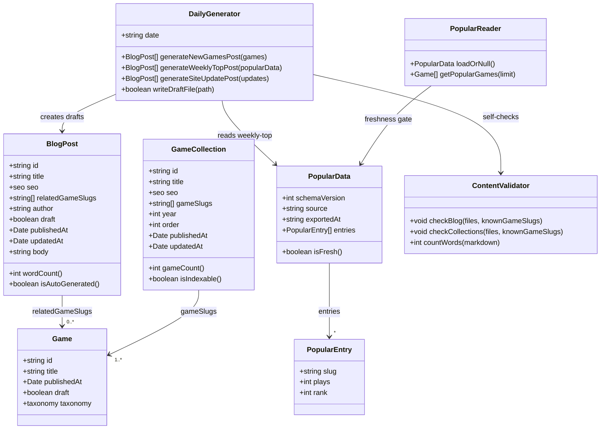
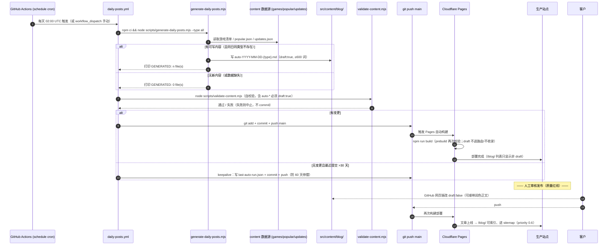

# SnackArcade 增量设计：博客激活 + 合集激活 + 每日自动更新 + GA4 排行榜

| 文档信息 | 内容 |
|---|---|
| Project Name | `h5_games_site`（SnackArcade） |
| 上游输入 | `docs/INCREMENTAL-ANALYSIS-news-blog.md`（许清楚，2026-08）+ 代码现状核对（19 页、blog/collections 骨架已存在、SEO 基建齐全） |
| 撰写人 | 高见远（架构师 / Bob） |
| 文档版本 | v1.0 · 2026-08-04 |
| 设计原则 | **最小变更、不破坏现有 19 页与已通过的测试；blog/collections 的 content schema 一律不改，只补校验。** |
| 一句话实现路径 | **先把「校验闭环 + 导航/首页入口 + sitemap 权重」四行代码补上（T01），然后投入内容资产激活已存在的 blog/collections 路由（T02→T03），再按 P2 加 GitHub Actions 每日生成 draft 草稿流水线（T04）、按 P1 用「真实导出数据文件」做排行榜（T05）——全程零伪造、零新增第三方依赖。** |

---

## 0. 现状核对（代码事实核查，与 PM 分析逐条对照）

> 以下为 2026-08-04 直接读代码核实的事实，设计完全建立在这些事实之上。

| # | PM 分析中的说法 | 代码核实结果 | 对本设计的影响 |
|---|---|---|---|
| 1 | blog 路由已存在但空 | ✅ `src/pages/blog/index.astro`、`[slug].astro` 已实现；`src/content/blog/` 不存在 | P0 只需补内容即可激活；**0 篇时 /blog/ 自动 noindex（`indexability.ts` case 'blog' 有 itemCount===0 守卫，且有单测覆盖），有 1 篇即自动收录** |
| 2 | blog schema 已定义 | ✅ `content.config.ts` L456-470：title/seo/relatedGameSlugs/author/draft/publishedAt/updatedAt | **schema 不动**；无正文字数下限 → 需在 `validate-content.mjs` 补（Zod 无法校验正文 body） |
| 3 | `[slug].astro` 已支持渲染 | ✅ 用 `render(entry)` + `ArticleLayout kind="blog"` | 详情页可用；但 **relatedGameSlugs 目前只定义不渲染**（P1-1 关联游戏卡片未做）→ 并入 T03 |
| 4 | collections 路由已存在 | ✅ `collections/index.astro`、`[slug].astro` 均从 `getCollection('collections')` 取数，用 `getGamesBySlugs` + `GameGrid` 渲染，JSON-LD 齐全 | **路由渲染逻辑完全可用，无需改代码即可激活**；唯一注意：`decide()` 对 collection 要求 `itemCount ≥ 10` 才收录，当前 3 款游戏下合集页会 **noindex（设计如此，不伪造不填充）** |
| 5 | validate-content.mjs 只校验 games/categories | ✅ 确认，只跑 `checkGames` + `checkCategories` | T01 扩展 `checkBlog` + `checkCollections` |
| 6 | sitemap blog 默认 0.4/monthly | ✅ 在 `astro.config.mjs` serialize：`/blog/` 落入最后默认分支 `priority: 0.4, changefreq: 'monthly'` | T01 在默认分支前加 `/blog/` 分支 → 0.6–0.7 / weekly |
| 7 | CI 仅 push/PR 触发 | ✅ `.github/workflows/ci.yml` 无 schedule | T04 新增独立 `daily-posts.yml`（schedule + workflow_dispatch） |
| 8 | 首页由 homepage.json sections 驱动 | ⚠️ **部分属实**：`homepage.json` 有 `sections` 数组，但 `src/pages/index.astro` 实际**没有遍历 sections**，三个区块（Featured/New/Categories）是硬编码渲染的 | T02 给 homepage.json 加 `latestPosts` 文案对象；T03 在 index.astro 硬编码新增 Latest Posts 区块（与现状一致，不做 sections 重构，最小变更） |
| 9 | GA4 已接入 | ✅ `src/config/analytics.ts` + `src/scripts/analytics.ts`，`PUBLIC_GA4_ID` 留空 = 零脚本；已定义 `game_start` 等事件 | 采集侧已就绪；**榜单读取侧（构建期）无法读 GA4 API**，见 §1.4 务实方案 |
| 10 | 广告抽象层 enabled:false | ✅ `src/config/ads.ts` | 博客页 `showAds={false}` 现状保持不变（等 AdSense 过审后再开） |

---

## 1. 增量实现方案（文件级）

### 1.1 P0 —— 博客激活

**目标**：把已存在的 `/blog/` 骨架变成"有内容、可发现、可收录"的内容层。

| 变更点 | 文件 | 改什么 |
|---|---|---|
| 博客正文模板与内容规范 | `templates/blog.template.md`（**新建**） | 手工博客的 md 模板：frontmatter 字段 + 正文结构（intro → 3–5 个 H2 小节 → 站内链接 → 收尾），标注字数红线与内部链接要求 |
| 首批 8–10 篇文章 | `src/content/blog/*.md`（**新建**，内容） | 常青攻略（how to play 2048 / block-drop tips）+ 榜单（best puzzle games）+ 玩法对比（2048 vs block-drop），每篇 ≥600 词、≥2 个指向 `/games/{slug}/` 的内部链接、`author: "SnackArcade Team"` |
| 首页 Latest Posts 区块 | `src/content/data/homepage.json` + `src/pages/index.astro` | homepage.json 加 `latestPosts: {heading, subheading, limit}`；index.astro 在 Categories 区块后新增博客列表区块（读取已发布博客最新 N 篇） |
| 导航入口 | `src/config/nav.ts` | `MAIN_NAV_STATIC` 加 `{ label: 'Blog', href: '/blog/' }`；`MAIN_NAV_CATEGORY_LIMIT` 3→2（保证移动端最多 5 项）；Footer Browse 列加 Blog 链接 |
| 博客详情页关联游戏卡片 | `src/pages/blog/[slug].astro` + `src/lib/content/blog.ts`（新建） | 用已存在的 `relatedGameSlugs` 字段 + `getGamesBySlugs` + 现成 `GameGrid` 渲染 "Related Games" 区块（P1-1 前移，小成本高价值） |
| 博客列表页摘要 | `src/pages/blog/index.astro` | 列表项显示日期 + 正文首段摘要（`excerptOf()` 助手，`src/lib/content/blog.ts`） |
| 文章页发布/更新日期 | `src/layouts/ArticleLayout.astro` | 当 `publishedAt` 传入时显示 "Published {date}"（合法页不传 publishedAt，行为不变） |
| sitemap 权重 | `astro.config.mjs` | serialize 加 `/blog/` 分支：index `priority: 0.7, changefreq: 'weekly'`，文章 `priority: 0.6, changefreq: 'weekly'` |
| 校验闭环 | `scripts/validate-content.mjs` + `src/config/seo.ts` | 新增 `checkBlog()`：必填字段、正文 ≥600 词、slug 合法、relatedGameSlugs 必须指向真实游戏、商标扫描、`auto-*` 文件必须 draft:true；`WORD_COUNT_FLOORS.BLOG_POST = 600` |

### 1.2 P0 —— Collections 激活

**核实结论：`collections/[slug].astro` 能正常从 content collection 取数据，无需改路由代码。** 只需补内容。

| 变更点 | 文件 | 改什么 |
|---|---|---|
| 首批 2–3 个合集 | `src/content/collections/*.md`（**新建**，内容） | `Best Puzzle Games` / `Games Like 2048` / `Quick 5-Minute Games`；gameSlugs 只填真实存在的游戏（当前 3 款），正文 ≥80–100 词介绍 |
| 合集校验 | `scripts/validate-content.mjs` | 新增 `checkCollections()`：gameSlugs 必须指向真实游戏、year 合理性、**gameSlugs < 10 时输出警告（提示当前合集页 noindex，是设计行为而非错误）** |
| 首页/导航露出 | `src/pages/collections/index.astro`（不改）/ homepage.json | 合集入口走现有 collections 首页 + footer（可选）；首页暂不强行加区块，避免 3 款游戏下的空合集观感 |

> ⚠️ **诚实提醒（写给客户）**：合集页 `decide()` 规则是 gameSlugs ≥ 10 才收录。当前只有 3 款游戏，**先建合集、等游戏扩到 10+ 款后自动转收录**——绝不靠填充假游戏凑数，与"无假评分熔断"同一原则。

### 1.3 P2 —— 每日自动更新流水线（架构设计）

**技术路径**（纯静态站标准免费路径）：

```
GitHub Actions（cron 每天 02:00 UTC / 可手动触发）
    → node scripts/generate-daily-posts.mjs 生成"数据汇总型"文章 md
    → 全部 draft: true
    → 跑 validate-content.mjs 自校验
    → git commit & push main
    → Cloudflare Pages Git 集成检测到 push → 自动 build & deploy
    → 客户在 GitHub 把某篇 draft: false → push → 该篇上线
```

**内容类型红线**（与 Google scaled-content-abuse 政策对齐，PM 分析 §4.3）：

| 类型 | 允许自动化？ | 数据来源 | 说明 |
|---|---|---|---|
| `new-games` 站内新游戏汇总 | ✅ | `src/content/games/*.md` 的 publishedAt | 事实性清单：每款游戏 2–3 句描述 + 链接回游戏页 |
| `weekly-top` 本周最受欢迎 | ✅ | `src/content/data/popular.json`（真实导出） | popular.json 缺失/过期 → 该类型跳过，**绝不编数据** |
| `site-update` 站内更新公告 | ✅ | `src/content/data/updates.json`（人工记录的事件列表） | 生成器只排版事实事件，不写观点 |
| 深度攻略 / 评测 / 技巧 / 观点对比 | ❌ **必须人工** | — | 生成器硬编码禁止；自动文章只做数据汇总 |

**draft 审核机制（质量红线）**：
- 生成器写出的每个文件 `draft: true`、`author: "SnackArcade Team"`、文件名 `auto-{YYYY-MM-DD}-{type}.md`。
- 客户在 GitHub 网页端把 `draft: false` 改掉（或改内容），push 即发布——与现有游戏 draft 机制完全一致，零新概念。
- `validate-content.mjs` 强制：`auto-*` 文件必须是 draft:true，**防止误发布未审核的自动内容**。

**GitHub 60 天停摆规则应对**：
- 规则：仓库连续 60 天无任何活动，GitHub 暂停 cron 工作流。
- 对策 1：自动 commit 本身算活动——只要每天有内容生成，流水线就不会停。
- 对策 2：**keepalive 兜底**——若某次运行无内容可写且主分支最后一次提交距今 >30 天，则写入 `src/content/data/last-auto-run.json`（记录 `lastSuccessfulRunAt`，属事实性运维数据，非假内容）并提交，保证仓库每 30 天必有活动，远低于 60 天红线。
- 对策 3：`workflow_dispatch` 手动触发入口，任何时候可人工补跑。

### 1.4 P1 —— GA4 真实数据排行榜（诚实评估 + 务实方案）

**诚实评估**：
- 构建期（Astro SSG / Cloudflare Pages）**无法直接读 GA4 数据**：GA4 Data API 需要 OAuth 2.0 服务账号凭据 + 域名验证，凭据要么放 CI Secrets 要么放 Pages 环境变量，属于"把分析账号密钥交给构建系统"，风险与复杂度都高；且新站数据量小，不值得。
- 因此**不做"构建期自动拉 GA4"作为首发方案**。遵循项目既有熔断原则（ratings 无真实数据不发），排行榜**无真实数据就不渲染，绝不伪造**。

**务实三级方案**：

| 级别 | 方案 | 做法 | 状态 |
|---|---|---|---|
| 1（立即） | **编辑推荐过渡** | 复用现有 `featuredSlugs` + homepage.json 给 Featured 区块加"推荐理由"文案；零数据、零伪造 | P1 可做，T05 内可选 |
| 2（推荐 P1） | **真实数据文件驱动** | 客户每月 1 次：GA4 报表 "Pages and screens" 导出 Top 游戏页 → 粘贴进 `src/content/data/popular.json`（记录 `exportedAt` 与 `source`）→ 首页/合集渲染 "Most Played"。数据 100% 真实，操作 5 分钟 | **T05 主方案** |
| 3（P2+ 可选） | **Cloudflare Web Analytics GraphQL API** | CF WA 支持 API Token 拉取分析数据，可在 CI 定期拉取写 popular.json | 等流量起来、客户愿意配 Token 再评估 |

**诚实机制**：`popular.json` 有 `exportedAt`；`src/lib/content/popular.ts` 判断 **数据超过 60 天未更新 → 视为不存在 → 排行榜区块整体不渲染**（回落编辑推荐），并在 validator/doctor 中提示"榜单数据过期"。

**GA4 采集侧已就绪**：`analytics.ts` 的 `game_start` 等事件定义完好；客户设置 `PUBLIC_GA4_ID` 后数据即开始积累，排行榜方案 2 的数据源随之成立。

### 1.5 署名策略

- 站点署名统一 **SnackArcade**；博客 `author` 字段统一 **`SnackArcade Team`**（含自动生成文章）。
- 与 schema 默认值 `author: 'SnackArcade'` 兼容（内容文件显式写 `SnackArcade Team` 即可，不改 schema）。
- E-E-A-T 的长期选项（个人署名 + 关于页作者介绍）作为**待明确事项**留给客户决定（PM 分析 §5.5）。

---

## 2. 数据结构和接口

### 2.1 blog frontmatter 字段规范（沿用现有 schema，不改）

```yaml
---
# 文件名 = URL slug，如 how-to-play-2048.md → /blog/how-to-play-2048/
title: "How to Play 2048: 7 Tips to Reach the 2048 Tile"
seo:
  title: "How to Play 2048: 7 Tips to Win | SnackArcade"   # 15–60 字符
  description: "..."                                        # 70–158 字符
relatedGameSlugs: ["2048"]                                  # 必须存在于 src/content/games/；渲染关联游戏卡片
author: "SnackArcade Team"                                  # 统一署名
draft: false                                                # 发布红线：自动生成文件必须为 true
publishedAt: 2026-08-05                                     # YYYY-MM-DD
updatedAt: 2026-08-05
---
（正文 Markdown ≥600 词，≥2 个指向 /games/{slug}/ 的内部链接）
```

自动生成文件命名：`auto-{YYYY-MM-DD}-{type}.md`，例如 `auto-2026-08-05-new-games.md`。

### 2.2 collections frontmatter 字段规范（沿用现有 schema，不改）

```yaml
---
title: "Best Puzzle Games to Play in a Coffee Break"
seo:
  title: "Best Puzzle Games 2026 — Top Picks | SnackArcade"  # 15–60 字符
  description: "..."                                          # 70–158 字符
gameSlugs: ["2048", "block-drop"]                             # 必须存在；<10 时合集页 noindex（警告非错误）
year: 2026
order: 1                                                      # 列表页按 order 降序
publishedAt: 2026-08-05
updatedAt: 2026-08-05
---
（正文 ≥80–100 词，介绍这个合集为什么值得玩）
```

### 2.3 popular.json（T05 新增，真实数据快照）

```json
{
  "schemaVersion": 1,
  "source": "ga4-manual-export",
  "exportedAt": "2026-08-04",
  "note": "From GA4 report Pages and screens → top game pages by views. Update monthly.",
  "entries": [
    { "slug": "2048", "plays": 1250, "rank": 1 },
    { "slug": "block-drop", "plays": 980, "rank": 2 }
  ]
}
```

规则：`exportedAt` 距今 >60 天 → `getPopularGames()` 返回 null → 区块不渲染（诚实熔断，同 ratings 原则）。

### 2.4 updates.json（T04 新增，站内更新事件的事实记录）

```json
{
  "updates": [
    {
      "date": "2026-08-05",
      "kind": "collection-added",
      "title": "New collection: Best Puzzle Games",
      "detail": "A hand-picked set of quick puzzle games with full guides."
    }
  ]
}
```

生成器只把事件排版成 `site-update` 文章；空数组 → 该类型当天跳过。

### 2.5 生成脚本接口（`scripts/generate-daily-posts.mjs`）

```
用法：node scripts/generate-daily-posts.mjs [--date YYYY-MM-DD] [--type new-games|weekly-top|site-update|all]
默认：--date 今天(UTC) --type all

输入（只读）：
  - src/content/games/*.md            游戏清单 + publishedAt（new-games）
  - src/content/data/popular.json     本周榜单（weekly-top；缺失/过期→跳过）
  - src/content/data/updates.json     更新事件（site-update；缺失/空→跳过）
  - src/content/blog/*.md             去重：同日期同类型已存在→跳过

输出：
  - src/content/blog/auto-{YYYY-MM-DD}-{type}.md   （draft:true, author:"SnackArcade Team", 正文≥600词）

退出码与输出：
  - 0 且打印 "GENERATED: n file(s)"（n>0 → 工作流 commit；n=0 → 走 keepalive 判断）
  - 非 0 → 工作流失败，不 commit（保护 CF 构建不因坏草稿失败）

设计约束：确定性（同输入同输出）、无随机、无 LLM、无网络请求；内容只允许"数据汇总型"。
```

### 2.6 类图（Mermaid classDiagram）



---

## 3. 程序调用流程

### 3.1 每日自动更新主流程（GitHub Actions 定时 → 生成 → draft → 发布 → CF 重建）



### 3.2 P0 博客激活流程（内容 → 校验 → 收录，纯构建期，无需新增时序）

```
写 md → npm run build（prebuild: validate-content.mjs 校验 ≥600 词/必填/商标/relatedGameSlugs）
      → astro build（Zod schema 校验 frontmatter；blog/index 因 itemCount>0 变 indexable；
                    sitemap serialize 给 /blog/ 打 0.6–0.7/weekly）
      → CF Pages 部署 → /blog/ 进入 sitemap，博客详情页与首页 Latest Posts 区块互链
```

---

## 4. 增量任务列表（按实现顺序，≤5 任务）

> 工作量：S=小（几小时）、M=中（1–3 天）、L=大（1 周+）；类型：代码 = 团队做，内容 = 客户/PM 做（可并行）。

| 任务 | 名称 | 类型 | 工作量 | 依赖 | 涉及文件 |
|---|---|---|---|---|---|
| **T01** | **增量基础设施：SEO 常量 + 导航/页脚入口 + sitemap 权重 + blog/collections 校验闭环** | 代码 | S | 无 | `astro.config.mjs`、`src/config/seo.ts`、`src/config/nav.ts`、`scripts/validate-content.mjs`、`tests/unit/seo-constants.test.ts`（新） |
| **T02** | **首批内容资产：博客模板 + 8–10 篇博客 + 2–3 个合集 + 首页文案 + updates 占位** | 内容 | L | T01（校验器就绪后可立即验证） | `templates/blog.template.md`（新）、`src/content/blog/*.md`（新 8–10 篇）、`src/content/collections/*.md`（新 2–3 篇）、`src/content/data/homepage.json`、`src/content/data/updates.json`（新） |
| **T03** | **页面与导航集成：首页 Latest Posts + 博客详情关联游戏卡片 + 列表摘要 + 发布日期** | 代码 | S | T02 | `src/pages/index.astro`、`src/pages/blog/index.astro`、`src/pages/blog/[slug].astro`、`src/layouts/ArticleLayout.astro`、`src/lib/content/blog.ts`（新）、`src/components/ui/PostCard.astro`（新） |
| **T04** | **P2 每日自动更新流水线：cron 工作流 + 生成脚本 + 3 类自动文章模板 + keepalive** | 代码 | L | T01（校验器必须能校验自动内容）、T02（模板风格参考） | `.github/workflows/daily-posts.yml`（新）、`scripts/generate-daily-posts.mjs`（新）、`templates/blog-auto-new-games.md`（新）、`templates/blog-auto-weekly-top.md`（新）、`templates/blog-auto-site-update.md`（新）、`.github/workflows/ci.yml`（把生成器纳入 CI 验证） |
| **T05** | **P1 GA4 真实排行榜：popular.json 数据文件 + 查询助手 + Most Played 区块 + 运营说明** | 代码 | M | T01、T03（与 T03 顺序改 `src/pages/index.astro`，避免冲突） | `src/content/data/popular.json`（新）、`src/lib/content/popular.ts`（新）、`src/pages/index.astro`、`src/pages/collections/index.astro`（可选挂载）、`docs/CONTENT-SOP.md`（补"导出 GA4 → 更新 popular.json"操作节） |

**任务依赖图**（见 §9 或下方）：

```
T01 ──► T02 ──► T03 ──► T05
  │                ▲
  └────► T04 ──────┘（T04 只依赖 T01/T02，可与 T03/T05 并行）
```

**验收要点（每个任务）**：
- T01：`npm run build` 通过；`tests/unit` 全绿；`validate-content.mjs` 对缺字数的博客文件报错并给出修复指引；sitemap 中 `/blog/` 优先级为 0.6–0.7。
- T02：`npm run build` 通过（T01 校验器已就绪）；/blog/ 不再 noindex；每篇博客 ≥600 词且含内部链接。
- T03：首页出现 Latest Posts 区块；博客详情页出现关联游戏卡片；导航出现 Blog 链接；移动端 nav 仍 ≤5 项。
- T04：手动 `workflow_dispatch` 触发一次，生成 `auto-*.md`（draft:true），CI/CF 构建通过；重复触发不产生重复文件（幂等）。
- T05：popular.json 缺失或过期时页面不渲染排行榜（无报错）；填入真实数据后首页出现 Most Played；`docs/CONTENT-SOP.md` 有导出操作说明。

---

## 5. 依赖包清单

**无新增第三方 npm 依赖**。理由：
- 博客/合集激活：全部使用 Astro 内容集合、gray-matter（已存在 devDependency）、js-yaml（已存在）、node:fs/path。
- 生成脚本：只用 node:fs、node:path、gray-matter、js-yaml。
- GitHub Actions：复用 `actions/checkout@v4`、`actions/setup-node@v4`（ci.yml 已在用）。

新增文件均为项目内 `.mjs` / `.astro` / `.md` / `.json` / `.yml`。

---

## 6. 共享知识（跨文件约定，工程师必须遵守）

1. **slug 规则**：小写 + 连字符 + ASCII（`/^[a-z0-9]+(?:-[a-z0-9]+)*$/`），见 `src/lib/utils/slug.ts`；博客文件名 = slug，自动文件前缀 `auto-`。
2. **日期格式**：frontmatter 一律 `YYYY-MM-DD`（`z.coerce.date` 解析）；渲染用 `src/lib/utils/date.ts` 的 `toIsoDate/toLongDate`（UTC）；**禁止用文件 mtime**（git checkout 会重写 mtime）。
3. **字数红线**：博客正文（markdown body）≥ **600 词**，用与 `src/lib/content/wordcount.ts` 一致的计数规则（validate-content.mjs 内镜像一份并注释"keep in sync"）；合集正文 ≥80 词（软性 warn）。
4. **draft 约定**：`draft: true` 的文件在 prod 不生成路由、不进 sitemap、/blog/ 计数为 0；**`auto-*` 文件强制 draft:true**（校验器硬性检查），人工改 false 才发布。
5. **内部链接红线**：每篇博客至少 2 个指向 `/games/{slug}/` 的链接；`relatedGameSlugs` / `gameSlugs` 引用的游戏 slug 必须真实存在（校验器硬性检查）。
6. **署名**：`author` 统一 `SnackArcade Team`；站点名统一 `SnackArcade`（`src/config/site.ts`）。
7. **商标熔断**：博客/合集正文与 frontmatter 同样受 `validate-content.mjs` 的 TRADEMARKS 检查（tetris/wordle/pac-man 等禁用）。
8. **不伪造原则**：排行榜数据只来自 popular.json（真实导出）；缺失/过期 → 不渲染；auto 文章只做数据汇总型，禁止攻略/观点/技巧。
9. **URL 规范**：所有链接 `trailingSlash: 'always'`，走 `src/lib/utils/url.ts` 的 `blogPath()` / `collectionPath()` / `gamePath()`，禁止手拼路径。
10. **校验器报错风格**：每条错误 = 文件名 + 字段 + 问题 + 修复指引（`fail(file, field, message, fix)`），面向非技术客户。

---

## 7. 待明确事项

1. **自动更新节奏与红线确认**：是否接受"自动文章只做数据汇总 + 必须 draft 草稿 → 人工审核 → 发布"（PM 强烈建议；不接受则 T04 不做）。
2. **排行榜数据源选型**：P1 采用方案 2（GA4 手动导出 popular.json）是否接受；P2+ 是否愿意配 Cloudflare Web Analytics API Token。
3. **署名与 E-E-A-T**：长期是否仍用 `SnackArcade Team` 匿名署名，还是为博客引入个人作者 + 作者介绍页（影响 AdSense 信任度）。
4. **首批博客主题清单**：8–10 篇的具体选题是否由客户/PM 出种子清单（架构侧已给出内容规范与模板）。
5. **合集收录预期**：客户是否理解"合集页在 gameSlugs < 10 时 noindex、扩游戏后自动收录"（当前 3 款游戏下合集对 SEO 是占位而非即时排名资产）。
6. **blog 列表分页**：当前 /blog/ 无分页，文章量大了之后再定（不影响本期）。
7. **GA4 何时开启**：`PUBLIC_GA4_ID` 由客户在 CF Pages 环境变量设置后才开始采集，排行榜数据才可能积累。

---

## 附录 A：与现有测试/CI 的关系（不破坏性声明）

- `tests/unit/indexability.test.ts` 已覆盖 blog index 空/非空与 draft 行为——**不改**，T01 不触碰 `decide()`。
- `tests/qa/regression.mjs` 的 BUG 2（空 /blog/ 不索引）在 T02 有文章后自动变绿（posts>0 且 index）；无需改测试。
- `.github/workflows/ci.yml` 只追加"运行一次生成器验证幂等"步骤（T04），不改动既有 push/PR 行为。
- `src/content.config.ts`（games/categories/tags/pages/collections/blog schema）**零改动**。

## 附录 B：落盘文件

- 本设计文档：`docs/INCREMENTAL-DESIGN-news-blog.md`
- 时序图：`docs/sequence-diagram.mermaid`（§3.1 自动化流水线）
- 类图：`docs/class-diagram.mermaid`（§2.6）
