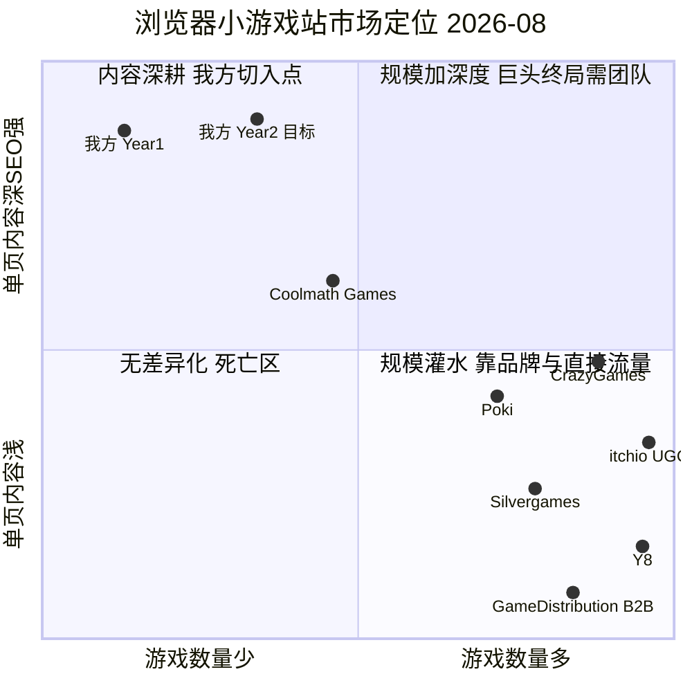

# H5 小游戏站 · 完整产品需求文档（PRD）

| 项目信息 | 内容 |
|---|---|
| 文档语言 | 中文（网站文案部分全部英文） |
| Project Name | `h5_games_site` |
| 目标市场 | 英语区（US / UK / CA / AU / PH / NZ / IE 等） |
| 变现模式 | Google AdSense 展示广告（唯一） |
| 流量模式 | 100% 自然搜索（SEO），零投流预算 |
| 运营形态 | 个人单干，无内容团队 |
| 技术栈建议 | **Astro + Tailwind CSS + Markdown/JSON 内容层，静态生成（SSG）部署 Cloudflare Pages**（详见 §9，最终由架构师定） |
| 撰写人 | 许清楚（产品经理） |
| 文档版本 | v1.0 |
| 数据核实日期 | 2026-08-04 |

> **原始需求复述**：客户想做一个 H5 小游戏网站，游戏面向国外玩家，靠挂 Google AdSense 挣钱，不投流，必须做好 SEO。客户没做过网站，需要产品文案、技术架构和一步步的操作步骤。

> **重要声明**：本文档中所有涉及外部平台规则、收益区间、竞品数据的内容，均已在 2026-08-04 联网核实并标注来源。**收益测算是基于公开区间的估算模型，不是收入承诺。** 上线后 30 天应当用真实 AdSense 后台数据替换模型参数。

---

## 目录

1. [产品定位与商业模式](#1-产品定位与商业模式)
2. [竞品分析](#2-竞品分析)
3. [游戏内容来源方案（关键决策）](#3-游戏内容来源方案关键决策)
4. [用户故事与需求池](#4-用户故事与需求池)
5. [信息架构与 SEO 内容模型](#5-信息架构与-seo-内容模型命脉章节)
6. [产品文案（英文成稿）](#6-产品文案英文成稿)
7. [UI 设计稿（线框图 + 广告位布局）](#7-ui-设计稿线框图--广告位布局)
8. [待确认问题](#8-待确认问题)
9. [给架构师的技术选型输入](#9-给架构师的技术选型输入)

---

## 1. 产品定位与商业模式

### 1.1 一句话定位

> **English slogan：**
> **"Play it now. Actually learn it. No download, no sign-up."**
>
> 备选（更短，适合 Logo 旁）：**"Instant games, real guides."**

**中文解释：**

市面上的浏览器小游戏站分成两类——**能玩但没内容**（Poki、CrazyGames、Y8，游戏页只有两行描述），和**有内容但不能玩**（攻略站、游戏媒体，写了一堆技巧但要你去别处玩）。

我们做的是**把这两件事合在同一个 URL 上**：用户搜 "how to beat level 12 in XXX"，落地到我们的页面，上面既有可以立刻开玩的游戏，下面又有完整的玩法拆解、按键表、技巧和 FAQ。

这个定位同时解决三个问题：
1. **SEO**：单页有 600–900 字原创内容，Google 有理由收录并排名（纯 iframe 页没有）；
2. **AdSense 过审**：Google 审核最常见的拒绝理由就是 "Low value content"，深度内容页是唯一解；
3. **变现效率**：用户看攻略 + 玩游戏，停留时长天然翻倍，广告展示次数（我们的核心 KPI）直接翻倍。

### 1.2 商业模式拆解

```
自然搜索流量  ──►  游戏详情页（深度内容 + 可玩）  ──►  站内跳转到相似游戏  ──►  AdSense 广告展示
   （SEO）              （停留时长）                    （Pages/Session）        （唯一收入）
      │                      │                              │                        │
      ▼                      ▼                              ▼                        ▼
  收录页面数 ×         平均停留 ≥2min ×              每次会话 ≥2.2 页 ×        Page RPM
  平均排名                                                                    （由地域构成决定）
```

**北极星指标（North Star Metric）：月度可视广告展示次数（Viewable Ad Impressions / month）**

拆解公式：

```
月收入 = 月自然搜索 Session × Pages per Session × Page RPM ÷ 1000
```

四个可操作杠杆，优先级从高到低：

| 杠杆 | 说明 | 提升手段 |
|---|---|---|
| ① 收录页面数 | 最大杠杆，线性放大流量 | 每周稳定发布 8–12 个游戏页 |
| ② 英语区流量占比 | 直接决定 RPM，US 流量 CPM 是三线国家的 3–5 倍 | 品类选择（见 §5.5）、英文原生文案、地域化内链 |
| ③ Pages/Session | 一次会话多看几页 = 多几次展示 | Similar Games 模块、分类页导流、"Surprise Me" |
| ④ 页面内容深度 | 影响排名 + 停留 + 广告位数量 | 严格执行 §5.2 内容模板 |

### 1.3 收入测算模型（保守 / 中性 / 乐观）

#### 1.3.1 关键参数：Page RPM 的取值依据

| 数据来源 | 结论 | 访问日期 |
|---|---|---|
| adstimate.com《Gaming AdSense RPM 2026》 | Gaming 类目 RPM **$4–10**，niche multiplier 0.6x，US 流量 3–5x 于三线国家 | 2026-08-04 |
| adnetworksreview.com《Top 10 Ad Networks for Gaming Websites 2026》 | AdSense **Tier1（US/UK/CA/AU）CPM $8–15**，**Tier3 CPM $1–4** | 2026-08-04 |
| evvytools.com AdSense Revenue Calculator | 娱乐/游戏类目 **CPM $1–5**（US-centric），属最低档 | 2026-08-04 |
| Google AdSense 官方《收益分成》 | 内容广告发布商拿到广告主支出的约 **68%**（扣平台费后为 80%） | 2026-08-04 |

**必须向客户说清楚的一点**：上述 $4–10 的区间对应的是**游戏资讯/攻略长文站**（2000 词以上的文章页）。我们这种**游戏播放页**，用户意图是"玩"而不是"读"，广告 CTR 显著更低。因此我建议把区间整体下修，取值如下：

| 档位 | 英语区流量占比 | 页面正文字数 | 广告位配置 | **Page RPM 假设** |
|---|---|---|---|---|
| 保守 | ~35% | 300–400 词 | 2 个展示位 | **$1.00** |
| 中性 | ~55% | 600–800 词 | 3 展示 + 1 锚定 | **$2.80** |
| 乐观 | ~70%+ | 800+ 词，高停留 | 3 展示 + 锚定 + 视频 | **$6.00** |

#### 1.3.2 流量爬坡预测（零投流、单人运营、全新域名）

| 阶段 | 月份 | 累计页面数 | 月 PV（中性预期） | 关键里程碑 |
|---|---|---|---|---|
| 建站冷启动 | M1–M3 | 60–100 | 0.3k – 2k | 新域名沙盒期，几乎无流量属正常 |
| 过审爬坡 | M4–M6 | 150–250 | 5k – 20k | **AdSense 过审**，开始有收入 |
| 复利期 | M7–M12 | 350–600 | 40k – 120k | 长尾词开始批量进前 20 |
| 规模期 | M13–M18 | 700–1000 | 200k – 400k | 品牌词出现，直接流量占比上升 |
| 稳定期 | M19–M24 | 1000–1500 | 400k – 800k | 可申请 Mediavine 提升 RPM |

#### 1.3.3 月收入矩阵（USD）

| 月 PV | 保守 $1.00 | 中性 $2.80 | 乐观 $6.00 |
|---|---|---|---|
| 10,000 | $10 | $28 | $60 |
| 50,000 | $50 | $140 | $300 |
| 100,000 | $100 | $280 | $600 |
| 300,000 | $300 | $840 | $1,800 |
| 500,000 | $500 | $1,400 | $3,000 |
| 1,000,000 | $1,000 | $2,800 | $6,000 |

**综合三档给客户的现实预期：**

- **M6（半年）**：$0 – $60 / 月。这个阶段主要目标是**过 AdSense 审核**，不是赚钱。
- **M12（一年）**：$100 – $350 / 月。
- **M24（两年）**：$400 – $2,000 / 月。
- **要做到 $1,000/月，需要约 35 万 – 100 万月 PV。**

#### 1.3.4 成本与盈亏平衡

| 项目 | 年成本 |
|---|---|
| 域名（.com） | ~$12 |
| 托管（Cloudflare Pages 免费档，静态站完全够用） | $0 |
| CDN / 图片优化（Cloudflare 免费档） | $0 |
| Google Search Console / Analytics 4 | $0 |
| 可选：关键词工具（Ahrefs Webmaster Tools 免费 / Ubersuggest $12月） | $0 – $144 |
| **合计** | **$12 – $160 / 年** |

> **结论：这是一门"时间换钱"的生意，不是"钱换钱"的生意。** 现金成本几乎为零，盈亏平衡点完全取决于流量，而流量取决于客户能否坚持每周发布 8–12 个高质量游戏页、连续 12 个月以上。这是本项目**最大的风险，也是唯一的风险**。

#### 1.3.5 上行空间（模型中未计入）

1. **游戏平台的游戏内广告分成**：GamePix 合作伙伴计划给网站主 **20%–50%** 的广告分成（来源：GamePix 合作伙伴计划公开说明，2026-08-04）。GameDistribution 同样按游戏会话分成。这部分是叠加在 AdSense 之上的第二笔收入，实测量级约为 AdSense 的 +15%~40%。
2. **升级到高级广告联盟（收入第二曲线）**：
   - 月 Session ≥ 50,000 → 可申请 **Mediavine**，公开报价为 AdSense 的 **2–4 倍**（来源：evvytools，2026）
   - 月 PV ≥ 100,000 → 可申请 **Raptive（原 AdThrive）**
   - **这是把 $300/月 变成 $900/月 的最快路径，比再翻一倍流量容易得多。** 请在 §8 待确认问题里留意。

### 1.4 Product Goals（三个正交目标）

| # | 目标 | 可量化标准 |
|---|---|---|
| **G1** | **合规先行**：在 6 个月内通过 Google AdSense 审核 | AdSense 状态 = Approved；5 个合规页面全部上线且被索引 |
| **G2** | **内容护城河**：每个游戏页都是一个能独立排名的落地页 | 游戏页平均原创正文 ≥ 600 词；12 个月内被索引页面 ≥ 500 |
| **G3** | **单人可维护**：一个人每周 ≤ 10 小时能维持内容更新 | 新增一个游戏页的端到端耗时 ≤ 30 分钟（含内容撰写） |

### 1.5 阶段性 KPI

| 指标 | M6 | M12 | M24 |
|---|---|---|---|
| Google 已索引页面数 | ≥ 150 | ≥ 500 | ≥ 1,200 |
| 月自然搜索 Session | ≥ 3,000 | ≥ 30,000 | ≥ 200,000 |
| Pages / Session | ≥ 1.8 | ≥ 2.2 | ≥ 2.5 |
| 平均停留时长 | ≥ 1:30 | ≥ 2:30 | ≥ 3:00 |
| 英语区（US/UK/CA/AU）流量占比 | ≥ 45% | ≥ 55% | ≥ 60% |
| AdSense 状态 | Approved | — | 可申请 Mediavine |
| 月广告收入 | $0–60 | $100–350 | $400–2,000 |

---

## 2. 竞品分析

### 2.1 数据来源说明

以下数据来自 Ahrefs（2026-06/07 抓取）、Semrush（2026-05）、Similarweb（2026）、onelittleweb 市场情报（2026-06），均于 2026-08-04 核实。不同工具口径不同（"自然搜索访问量" vs "总访问量"），已分列标注。

### 2.2 竞品对比表

| 竞品 | 游戏数量 | 月流量（口径） | 游戏来源方式 | SEO 策略 | 变现方式 | 可借鉴点 | 我方差异化机会 |
|---|---|---|---|---|---|---|---|
| **Poki**<br>poki.com | ~1,000+（严格策展） | 自然搜索 **127.8M**（Ahrefs 6月）<br>总访问 **122.5M–160M**<br>DR 79 | 独家签约开发者，必须集成 Poki SDK，**不允许第三方广告**，要求 Web 独占 | 品牌词 + 游戏名词为主；页面内容偏薄；主打 kids/teens | 自营广告网络（pre-roll 为主，Rewarded Video） | 极简 UI、加载极快、kids.poki.com 子域做分级 | 主力市场是**印度(17.9M)/巴西/土耳其**——低 CPM 区。我们主攻美英加澳，正面冲突小 |
| **CrazyGames**<br>crazygames.com | ~7,000+ | 自然搜索 **75M**（Ahrefs 6月）<br>总访问 **91.7M–104M**<br>Authority Score 90 | 开放投稿 + Embed 计划，需集成 SDK，审核周期 **5–14 天**，开发者分成 50–70% | 分类页 + 标签页矩阵；游戏页有描述但普遍 <200 词 | 自营广告（Banner + 游戏中插，约 1–2 分钟一次） | 分类/标签体系完善、多人游戏（房间码）做得极好 | 受众 **18–24 岁、52% 男性**，广告负载重、用户装拦截器比例高。我们做 35+ 休闲脑力品类避开 |
| **Y8**<br>y8.com | ~80,000+（海量灌水） | 自然搜索 **7.1M**（Ahrefs 6月），持续下滑 | 历史 Flash 遗产 + 开放上传，质量不控 | 靠页面绝对数量堆长尾；页面极薄 | 自营广告 + 第三方联盟 | 反面教材：说明"只堆数量不做内容"的模式在 2026 年已经跑不动了 | 直接反向操作：**少而深** |
| **Silvergames**<br>silvergames.com | ~10,000+ | 中量级（未进 Ahrefs Games Top 40） | 第三方聚合（GameDistribution 等）为主 | 分类页 + 关键词堆砌 | **Google AdSense 展示广告** | **和我们模式最接近的可参照对象**——证明"聚合 + AdSense"这条路走得通 | 它的游戏页文案是机翻/模板化的，内容深度是明显软肋 |
| **Coolmath Games**<br>coolmathgames.com | ~1,000+ | 自然搜索 **19.6M**（Ahrefs 6月）<br>总访问 **12.2M**<br>AS 76 | 自研 + 授权组合，长期积累 | **教育定位 + 品牌壁垒**，美国校园口碑级流量 | 展示广告 + 会员去广告 | **最值得学的定位案例**：靠"数学/益智"垂直标签建立品牌认知，而不是拼数量 | 它的品牌太强难以正面打，但它不覆盖 Solitaire/Mahjong/Word 这些成人休闲品类 |
| **itch.io**<br>itch.io | 数十万（UGC） | 自然搜索 **8.7M**（Ahrefs 6月）<br>总访问 **152M**（以直接流量为主） | 完全 UGC，开发者自行上传，自选分成比例（可为 0%） | 靠 UGC 页面数量；页面文案由开发者写，质量参差 | 无内置广告，靠交易分成 | **重要资源池**：是我们寻找可授权独立游戏和联系开发者的最佳渠道 | 不是竞争对手，是**供应商 + 外链来源** |
| **GameDistribution**<br>gamedistribution.com | 平台侧数千款 | B2B，不面向 C 端 | Azerion 旗下 B2B 分发平台，3,000+ 发布商，月触达 3.5 亿玩家 | 不做 C 端 SEO | 按游戏会话与发布商分成 | **是我们的主要游戏供应商**（见 §3） | 同上，供应商而非对手。案例：OnlineGames.io 接入 DGI 后 3 个月月访问从 3,000 涨到 30 万 |

### 2.3 市场定位象限图



> 坐标轴口径：X 轴 = 游戏数量规模（0 = <100 款，1 = >50,000 款）；Y 轴 = 单页内容深度 / SEO 强度（0 = <100 词纯 iframe 页，1 = >800 词深度内容页）。

**读图结论：** 右下角（数量多、内容浅）已经被巨头和灌水站彻底填满，新站进去是自杀。**左上角（数量少、内容极深）是唯一的空位**——因为大平台的运营模型不允许他们为每个游戏写 800 字（他们有几千款游戏，写不动），而这恰恰是一个人每天写 2 篇就能做到的事。**我们的规模劣势，反过来是内容深度的成本优势。**

### 2.4 重点回答：新站靠什么长尾词从巨头手里拿到流量？

巨头的结构性弱点只有一个：**他们的游戏页只有游戏名 + 两行描述，覆盖不了任何修饰词和问题词。** 所有机会都从这里来。

#### 六类可打的长尾词族

| # | 词族类型 | 词模板 | 具体例子 | 为什么能打赢 |
|---|---|---|---|---|
| **1** | **意图修饰词** | `{game} online free no download`<br>`play {game} without downloading`<br>`{game} full screen`<br>`{game} on chromebook` | `2048 online free no download`<br>`spider solitaire full screen free` | 巨头的 title 通常只有游戏名，不带修饰词；我们的 title 模板直接命中 |
| **2** | **玩法问题词**（最高价值） | `how to play {game}`<br>`{game} controls`<br>`{game} tips for beginners`<br>`how to beat level {N} in {game}`<br>`{game} not loading fix` | `how to get 4096 in 2048`<br>`mahjong solitaire tips for beginners` | **巨头页面完全不覆盖**（他们没有 How to Play / Tips 章节）。搜索量小但极精准，而且我们能顺手把游戏内嵌在答案旁边，转化为播放 |
| **3** | **对比/替代词** | `games like {popular game}`<br>`free alternative to {paid game}`<br>`{game} vs {game}` | `games like Wordle`<br>`free alternatives to Monkeytype` | 靠 `/collections/` 专题页承接，一页覆盖一整族词 |
| **4** | **场景/人群词** | `games to play at work`<br>`2 player games on one keyboard`<br>`browser games for old laptops`<br>`games to play with grandma online`<br>`games that work offline` | 同左 | 巨头的信息架构里根本没有"场景"这个维度，纯空白市场 |
| **5** | **年份榜单词** | `best free {genre} games {year}`<br>`top 10 browser {genre} games no download` | `best free word games 2026` | 需要定期更新年份，正好给单人运营提供了低成本的"内容刷新"抓手 |
| **6** | **趋势抢发词**（见效最快） | 新爆款游戏出现后 24–72 小时内建页 | ranktracker 案例：`Merge Cannon: Chicken Defense` 系列词 | **CrazyGames 的游戏审核要 5–14 天，Poki 更慢。个人站当天就能上线。** 这是我们唯一能在时间维度上碾压巨头的地方。监控源：Google Trends、Reddit r/WebGames、itch.io "New & Popular"、GameDistribution 新游列表 |

#### 三条内容差异化角度

1. **"深度指南 + 可玩" 合体页（核心护城河）**
   把攻略站的内容和游戏站的可玩性合并在同一个 URL。用户搜 `how to beat X`，落到我们页面既能看攻略又能立刻玩。**停留时长天然翻倍 → 广告展示次数直接翻倍 → 这既是 SEO 策略，也是变现策略。**

2. **切入"成人休闲/脑力"品类，绕开巨头主战场**
   - Poki 主市场是印度/巴西/土耳其（低 CPM），CrazyGames 是 18–24 岁男性（高广告拦截率）；
   - **Solitaire / Mahjong / Word / Crossword / Sudoku / Trivia** 这批品类：受众 35+ 美国用户、停留时长长、广告拦截器安装率低、CPM 显著更高；
   - 巨头在这些品类投入相对少（Coolmath 偏教育、CrazyGames 偏动作）。
   - **一句话：同样 10 万 PV，玩 Solitaire 的美国中年人比玩动作游戏的印度青少年值 3–5 倍。**

3. **透明的许可与开发者署名**
   每个游戏页明确标注原作者、开源许可、来源链接。三重收益：① 形成 E-E-A-T 信号（Google 2026 年很吃这套）；② 大幅降低 DMCA 风险；③ 可以主动发邮件告知开发者"我给你的游戏写了一整篇指南"，换取自然外链。

#### ⚠️ 关于 "unblocked games" 词族的风险提示

这个词族流量极大（开学季暴涨），很多小游戏站靠它起量。**但我不建议客户主打，理由三条：**

1. 该词族生态已被代理/翻墙站污染，Google 对整个词族的站点信任度偏低；
2. 目标受众是中小学生，**AdSense CPM 是所有人群里最低的**，与我们"高 CPM 成人休闲"的战略直接冲突；
3. 容易被学校网络分类器（GoGuardian 等）整域拉黑，反噬品牌和长期资产价值。

**建议做法：不做域名级和分类级的 unblocked 定位，只允许在个别游戏页的 FAQ 里自然出现一次**，例如：

> *"Can I play 2048 at school? The game runs entirely in your browser with no plugins, so it usually works on school Chromebooks — though your network administrator may still block the site."*

吃自然长尾，不主动追。

---

## 3. 游戏内容来源方案（关键决策）

### 3.1 三条路的实测对比

| 维度 | **A. 第三方聚合平台嵌入** | **B. 自托管开源游戏** | **C. 自研原创游戏** |
|---|---|---|---|
| **代表** | GameDistribution (Azerion)、GamePix、CrazyGames Embed | GitHub MIT/Apache/CC0 项目、itch.io 授权作品 | 自己写 |
| **游戏数量上限** | 数千款，几乎无上限 | 现实可用约 **50–150 款**（需逐个筛许可） | 1–5 款/年 |
| **上线单个游戏耗时** | 5 分钟（复制 iframe） | 30–90 分钟（下载、改样式、部署、核许可） | 2 周–2 月 |
| **分成规则** | GamePix 合作伙伴计划：网站主拿游戏内广告的 **20%–50%**（流量大质量好的站比例更高）<br>GameDistribution：按游戏会话与发布商分成，比例需签约后确认 | **100% 归自己**，无分成 | 100% |
| **能否自己挂 AdSense** | ✅ **可以**。你的 AdSense 广告位在 iframe **外面**的页面上，平台的广告在 iframe **里面**，互不冲突，是两笔独立收入。<br>⚠️ **红线**：AdSense 代码本身**绝不能**放进 iframe 里（Google 明确禁止 "place ads in a frame within another page"） | ✅ 完全自由 | ✅ 完全自由 |
| **iframe 对 SEO 的影响** | ⚠️ **iframe 里的内容 Google 不计入本页权重**。所以一个"只有 iframe + 50 字描述"的页面，在 Google 眼里就是**空页面**——这正是 AdSense 拒信里 "Low value content" 的最大来源。<br>✅ 但只要 iframe 外面有 600+ 字原创内容，SEO 完全没问题 | ✅ 游戏本身是同域资源，加载更快（Core Web Vitals 更好），无跨域延迟 | ✅ 最优 |
| **版权风险** | 🟢 **低**。平台已完成授权链条，你只是被授权的展示方 | 🟠 **中，需人工把关**（详见 §3.2） | 🟢 无 |
| **维护成本** | 极低，平台负责游戏可用性 | 中，游戏挂了要自己修 | 高 |
| **可控性** | 低（平台可随时下架游戏、改分成、插更多广告） | 高 | 最高 |
| **对"单人可维护"的适配** | ⭐⭐⭐⭐⭐ | ⭐⭐⭐ | ⭐ |

### 3.2 ⚠️ 版权合规红线（自托管路线必读）

这是整个项目**唯一可能导致法律麻烦**的地方，务必逐条执行。

#### 可以商用的许可

| 许可 | 能否用于挂广告的商业站 | 义务 |
|---|---|---|
| **MIT** | ✅ 可以 | 保留原始版权声明与许可全文 |
| **Apache-2.0** | ✅ 可以 | 保留声明 + NOTICE 文件 |
| **BSD 2/3-Clause** | ✅ 可以 | 保留声明 |
| **CC0 / Public Domain** | ✅ 可以 | 无义务（仍建议署名） |
| **CC-BY 4.0** | ✅ 可以 | **必须显著署名**原作者 |
| **Unlicense** | ✅ 可以 | 无义务 |

#### 绝对不能碰的

| 许可 | 原因 |
|---|---|
| **CC-BY-NC（任何 NC 变体）** | 🔴 **NC = 非商业。挂广告的网站在法律上就是商业使用。这是明确侵权。** |
| **CC-BY-ND** | 🔴 禁止改编（改样式、改分辨率、去 logo 都算） |
| **GPL / AGPL-3.0** | 🟠 传染性许可。AGPL 尤其危险——网络提供服务即触发源码公开义务。**新手直接避开**（例：Hextris 是 GPLv3） |
| **无许可证声明的仓库** | 🔴 **默认"保留所有权利"，等同于禁止使用。"GitHub 上是公开的"不等于"你可以用"。** |

#### 三个最容易踩的坑

1. **代码许可 ≠ 素材许可**
   典型案例：GitHub 项目 `humancto/legacy-games`，**代码是 MIT，但美术素材（Ansimuz 的 Legacy Collection）适用作者在 itch.io 上的另一套条款**。必须分别核实 `/assets` 目录的许可。

2. **开源许可挡不住商标侵权**
   即使代码是 MIT，如果游戏名叫 *Tetris*、*Pac-Man*、*Flappy Bird*、*Super Mario*、*Pokémon*，那是**商标 + 角色版权问题，和代码许可无关**。Tetris Holding LLC 是业内出了名的积极维权方。
   **✅ 正确做法：改名为通用名。** `Tetris 克隆` → **Block Drop**；`Pac-Man 克隆` → **Maze Muncher**；`Flappy Bird 克隆` → **Tap Wing**。同时替换掉任何相似的角色美术。

3. **itch.io 上"免费下载" ≠ "授权你转载"**
   免费只是价格，不是许可。必须页面上有明确的开源许可声明，**或者你拿到开发者的书面同意邮件**。后者反而是最强的法律证据，也最容易——大部分独立开发者很乐意换一个外链。

#### 必须建立的合规资产

**① 游戏许可台账（`data/licenses.json`，P0 需求）**
每上一个游戏必须记录：

```json
{
  "slug": "2048",
  "title": "2048",
  "source_type": "self_hosted",
  "source_url": "https://github.com/gabrielecirulli/2048",
  "author": "Gabriele Cirulli",
  "license": "MIT",
  "license_url": "https://github.com/gabrielecirulli/2048/blob/master/LICENSE.txt",
  "assets_license": "MIT (same repo)",
  "permission_email": null,
  "added_at": "2026-09-01",
  "attribution_rendered": "2048 by Gabriele Cirulli, MIT License"
}
```

**② 每个游戏页页脚渲染归属声明**（P0）：
`Game: 2048 by Gabriele Cirulli · MIT License · Source`

**③ DMCA 页面 + 有效的联系邮箱**（P0）：给权利人一个规范的投诉通道，是免责的关键。

#### 合法游戏的寻找渠道

| 渠道 | 说明 |
|---|---|
| GitHub `topic:html5-games` + License 筛选器 | 直接按 MIT/Apache/CC0 过滤，最高效 |
| **js13kGames** 历年参赛作品 | 绝大多数 MIT，体积极小（<13KB），加载飞快，Core Web Vitals 满分 |
| itch.io + 明确标注 CC0/CC-BY 的作品 | 需逐个核实，或直接邮件求授权 |
| Phaser.js 官方 examples / 社区游戏 | 质量稳定 |
| OpenGameArt.org、Kenney.nl | **素材**来源（CC0），配合自研使用 |
| 直接邮件联系独立开发者 | 最慢但最安全，且能换外链 |

### 3.3 ✅ 明确推荐方案：**B 打底 → A 放量 → C 点缀**

我推荐一个**三阶段组合方案**，而不是单选一条路。理由是：AdSense 审核是本项目的第一个生死关卡，而三条路对过审的贡献度完全不同。

```
┌─────────────────────────────────────────────────────────────────┐
│  阶段一（M1–M3）：B 为主 —— 目标是"过 AdSense 审核"              │
│  ├─ 自托管 30–40 款 MIT/CC0 开源游戏（同域资源，非 iframe）       │
│  ├─ 每款配 600–900 词原创内容（严格执行 §5.2 模板）              │
│  ├─ 10–15 篇原创编辑内容（榜单、玩法指南、专题）                 │
│  ├─ 5 个合规页面全部上线                                         │
│  └─ 【M3 末提交 AdSense 审核】                                   │
├─────────────────────────────────────────────────────────────────┤
│  阶段二（M4–M12）：A 为主 —— 目标是"放量"                        │
│  ├─ 接入 GameDistribution + GamePix，每周新增 8–12 款            │
│  ├─ 强制门槛：任何 iframe 游戏页必须有 ≥400 词原创内容才允许上线  │
│  ├─ 同时开启平台游戏内广告分成（第二笔收入）                     │
│  └─ 保留阶段一的自托管游戏作为"内容质量样板区"                   │
├─────────────────────────────────────────────────────────────────┤
│  阶段三（M12+）：C 点缀 —— 目标是"品牌与外链"                    │
│  ├─ 自研 2–3 款轻量原创游戏（js13k 量级即可，不求大）            │
│  ├─ 同步发布到 itch.io / CrazyGames / GameDistribution           │
│  └─ 换取高质量外链 + 提升整站 E-E-A-T                            │
└─────────────────────────────────────────────────────────────────┘
```

#### 为什么必须是这个顺序（四条理由）

1. **AdSense 过审只认原创内容，不认游戏数量。**
   一个 300 款全是 iframe 的站，被判 "Low value content" 的概率远高于一个 40 款但每页 800 字的站。**阶段一用自托管游戏，是因为同域内容能被 Google 完整抓取，而 iframe 里的东西 Google 一个字都不算。** 这一步偷懒，后面全废。

2. **过审前不要碰第三方平台的游戏内广告。**
   审核期间页面上出现另一家广告网络的素材，会增加不确定性。等 AdSense 拿到手之后再接入。

3. **过审后再放量，是因为 A 的边际成本最低。**
   iframe 嵌入 5 分钟一个，这是单人运营能做到 1000+ 页面的唯一途径。B 路线一天最多做 3–4 个，撑不起规模。

4. **C 不是为了游戏本身，是为了外链和 E-E-A-T。**
   自研游戏在 itch.io / CrazyGames 上的页面会回链到我们站，这是新站最难拿到的高质量外链。**不要为了做游戏而做游戏，那是无底洞。**

#### 阶段一自托管游戏的具体选品建议（30–40 款）

优先选择：**规则简单、无 IP 争议、有搜索量、加载快**。

| 品类 | 推荐款式（均需核实许可后使用，必要时改名） |
|---|---|
| 数字/逻辑 | 2048（MIT, Gabriele Cirulli）、Sudoku、Minesweeper、Nonogram、0hh1 |
| 卡牌/桌面 | Klondike Solitaire、Spider Solitaire、FreeCell、Mahjong Solitaire、Chess vs AI、Checkers |
| 文字 | Wordle 类猜词、Anagram、Typing Test、Hangman |
| 街机 | Snake、Breakout、Space Shooter、Tetris 克隆（**改名 Block Drop**）、Pong |
| 休闲 | Memory Match、Tic Tac Toe、Connect Four、Bubble Shooter、Flappy 克隆（**改名 Tap Wing**） |

> 注：卡牌/文字/逻辑类占比应 **≥60%**，因为这是 §2.4 里说的高 CPM 成人品类，是我们的战略核心，不是凑数。

---

## 4. 用户故事与需求池

### 4.1 User Stories

| # | 用户故事 | 对应需求 |
|---|---|---|
| **US-1** | **As a** 美国上班族（35 岁，午休 10 分钟），**I want** 在 Google 搜 "free solitaire no download" 后一键就能开始玩，不用注册、不用装插件，**so that** 我能在最短时间内放松一下 | R-002, R-016, R-017 |
| **US-2** | **As a** 卡住关卡的玩家，**I want** 搜 "how to beat level 12 in XXX" 时找到既有攻略、又能立刻重玩的页面，**so that** 我不用在攻略站和游戏站之间来回切换 | R-002（How to Play / Tips / FAQ） |
| **US-3** | **As a** 想找新游戏的休闲玩家，**I want** 按品类和标签（双人 / 益智 / 手机可玩）浏览并看到编辑推荐语，**so that** 我能快速判断哪个值得试 | R-003, R-005, R-026 |
| **US-4** | **As a** 手机用户（占流量 60%+），**I want** 游戏在竖屏手机上能正常显示和操作，广告不遮挡游戏区，**so that** 我不会因为误触广告而愤然关闭 | R-014, R-017 |
| **US-5** | **As a** 站长（客户本人），**I want** 新增一个游戏只需填一个结构化文件（JSON/Markdown）就自动生成完整页面、面包屑、结构化数据和 sitemap 条目，**so that** 我一个人每周能稳定产出 10 个页面 | R-022, R-023 |
| **US-6** | **As a** Google AdSense 审核员，**I want** 在网站上清晰找到 About / Privacy Policy / Terms / Contact / DMCA，并看到每个页面都有实质原创内容，**so that** 我可以放心批准这个站点 | R-006 ~ R-011 |
| **US-7** | **As a** 游戏原作者，**I want** 在使用我作品的页面上看到我的署名和源码链接，**so that** 我不会去投诉，甚至愿意帮忙转发 | R-024 |

### 4.2 需求池

#### P0 —— 必须有（不做就无法上线 / 无法过 AdSense 审核）

| 编号 | 需求描述 | 验收标准 |
|---|---|---|
| **R-001** | **首页**：Hero 区 + 热门游戏 + 分类模块 + 300–500 词原创编辑导语 | 首页正文原创字数 ≥ 300；至少展示 3 个分类区块，每区块 ≥6 个游戏卡片；Lighthouse SEO ≥ 95 |
| **R-002** | **游戏详情页**：按 §5.2 内容模板实现全部字段 | 每页原创正文 ≥ 600 词（硬性下限 450）；必含 How to Play / Controls 表 / Tips / FAQ / Game Info / Similar Games 六个模块；游戏区首屏可见 |
| **R-003** | **分类页**：`/c/{slug}/` 网格 + 300–500 词原创导语 + 底部补充内容 | 导语 ≥ 300 词；含 ItemList 结构化数据；分页使用真实 URL（`/c/puzzle/page/2/`）而非无限滚动 |
| **R-004** | **站内搜索**：即时前缀搜索（静态 JSON 索引，无需后端） | 输入 2 字符内返回结果 <200ms；搜索结果页 `noindex`；空结果有引导 |
| **R-005** | **标签页**：`/t/{slug}/`（2-player / 3d / mobile / no-download / new 等） | 每个标签页 ≥ 6 个游戏才允许生成，否则 `noindex`（避免薄内容页拖累整站） |
| **R-006** | **About 页**：说明网站是谁做的、为什么做、内容标准、更新频率 | ≥ 400 词；含真实署名与联系方式；不得为一句话模板 |
| **R-007** | **Privacy Policy 页** | 必须明确写到：Cookies、第三方广告、**Google AdSense 与 DoubleClick DART cookie**、数据收集范围、GDPR（EEA/UK）与 CCPA（加州）用户权利、退出方式（含 `google.com/settings/ads` 链接） |
| **R-008** | **Terms of Service 页** | 含内容使用规则、免责声明、第三方游戏责任界定、准据法 |
| **R-009** | **Contact 页** | 含**可用的**邮箱地址 + 表单；主导航或页脚可直达；表单需防垃圾（honeypot 即可） |
| **R-010** | **DMCA / Copyright 页** | 提供标准 DMCA takedown 流程与指定接收邮箱 |
| **R-011** | **Cookie 同意横幅（CMP）** | 必须使用 **Google 认证的 CMP**（Google 自 2024-01-16 起对 EEA/UK 流量强制要求，不合规会停止投放）；支持 Google Consent Mode v2 |
| **R-012** | **`ads.txt`** | 部署于 `/ads.txt`，含 AdSense 发布商 ID；**申请审核前就要放好** |
| **R-013** | **`sitemap.xml` + `robots.txt`** | sitemap 自动生成、分片（每片 ≤5000 URL）、含 `lastmod`；robots.txt 指向 sitemap；搜索页/参数页 disallow |
| **R-014** | **HTTPS + 自有顶级域名** | 必须 `.com/.net/.org` 自有域名（免费子域名过审率极低）；全站 HTTPS，无混合内容 |
| **R-015** | **移动端响应式** | 320px 宽度下无横向滚动；游戏区自适应；触控目标 ≥44px；通过 Google Mobile-Friendly Test |
| **R-016** | **结构化数据** | 游戏页：`VideoGame` + `BreadcrumbList` + `FAQPage`；分类页：`ItemList` + `BreadcrumbList`；全站：`WebSite`(含 SearchAction) + `Organization`。全部通过 Google Rich Results Test 无错误 |
| **R-017** | **Core Web Vitals** | LCP < 2.5s、INP < 200ms、CLS < 0.1（移动端 75 分位）；**游戏 iframe 必须点击后才加载（click-to-play 海报图）**；所有广告位预留固定高度防 CLS |
| **R-018** | **AdSense 广告位系统** | 按 §7 布局实现；广告位可通过配置项全局开关（审核期间需能一键关闭）；游戏区与最近广告位间距 ≥150px |
| **R-019** | **GA4 + Google Search Console 接入** | GA4 事件需覆盖：`game_start`、`game_fullscreen`、`similar_game_click`、`category_click`；GSC 完成域名所有权验证并提交 sitemap |
| **R-020** | **面包屑导航** | 每个非首页页面可见面包屑，与 `BreadcrumbList` schema 一致 |
| **R-021** | **404 页** | 自定义 404，含搜索框 + 热门游戏推荐；返回真实 404 状态码 |
| **R-022** | **内容数据层** | 游戏内容以结构化文件（JSON / Markdown frontmatter）管理，新增一个游戏无需改任何模板代码 |
| **R-023** | **新增游戏 CLI / 模板脚手架** | 提供 `npm run new:game` 生成带全部必填字段的内容文件骨架；缺字段时构建报错 |
| **R-024** | **游戏归属与许可声明** | 每个游戏页渲染 `作者 · 许可 · 源码链接`；`data/licenses.json` 台账完整 |
| **R-025** | **OG / Twitter Card** | 每页有独立 `og:title` / `og:description` / `og:image`（1200×630）；游戏页 OG 图使用游戏封面 |

#### P1 —— 应该有（过审后 3–6 个月内补齐，直接影响收入天花板）

| 编号 | 需求描述 | 验收标准 |
|---|---|---|
| **R-026** | 专题合集页 `/collections/{slug}/`（承接 "best free X games 2026" 类词） | 每个合集 ≥10 款游戏 + ≥500 词原创导读 |
| **R-027** | 博客 `/blog/{slug}/`（攻略、榜单、行业内容） | 每篇 ≥1000 词；每月 ≥2 篇 |
| **R-028** | 相似游戏推荐算法（同分类 + 共同标签加权，而非随机） | 相似游戏点击率 ≥8%；Pages/Session 提升 ≥0.3 |
| **R-029** | 收藏 / 最近玩过（localStorage，无需账号） | 首页展示"Continue Playing"区块 |
| **R-030** | 游戏评分与评论（UGC，带审核队列） | 评论内容注入 `aggregateRating` schema；含垃圾评论过滤 |
| **R-031** | 全屏按钮 + 游戏区放大模式 | 移动端支持横屏全屏 |
| **R-032** | 图片全部 WebP/AVIF + 懒加载 + 响应式 `srcset` | 首页图片总传输 ≤300KB |
| **R-033** | RSS / Atom feed | `/feed.xml` |
| **R-034** | 广告位 A/B 测试能力（位置、数量、尺寸） | 可通过配置切换布局方案并在 GA4 分组对比 Page RPM |

#### P2 —— 可以有（有余力再做）

| 编号 | 需求描述 |
|---|---|
| **R-035** | 排行榜 / 分数上传（需轻量后端） |
| **R-036** | 用户账号系统 |
| **R-037** | PWA / 离线可玩 |
| **R-038** | 深色模式 |
| **R-039** | 多语言（es / pt-BR / fr）—— **注意：这会稀释高 CPM 流量占比，建议 M18 之后再评估** |
| **R-040** | Newsletter 订阅 |

---

## 5. 信息架构与 SEO 内容模型（命脉章节）

### 5.1 站点 URL 结构设计

```
https://{domain}/
│
├── /                                    首页
│
├── /games/{game-slug}/                  ★ 游戏详情页（主力落地页）
│      例：/games/2048/
│          /games/spider-solitaire/
│          /games/block-drop/
│
├── /c/{category-slug}/                  分类页
│      例：/c/puzzle/
│          /c/card-board/
│          /c/word/
│   └── /c/{category-slug}/page/{n}/     分类分页（真实 URL）
│
├── /t/{tag-slug}/                       标签页
│      例：/t/2-player/
│          /t/no-download/
│          /t/play-with-mouse/
│
├── /collections/{slug}/                 专题合集页  [P1]
│      例：/collections/best-free-word-games-2026/
│
├── /blog/{post-slug}/                   编辑内容  [P1]
│
├── /all-games/                          全量索引页（帮助爬虫发现，分页）
├── /new/                                最新上架
├── /search?q=                           站内搜索（noindex, nofollow）
│
├── /about/
├── /privacy-policy/
├── /terms/
├── /contact/
├── /dmca/
│
├── /sitemap.xml   /sitemap-games.xml  /sitemap-pages.xml
├── /robots.txt
└── /ads.txt
```

#### 关键 URL 决策与理由

| 决策 | 理由 |
|---|---|
| **游戏页用扁平 `/games/{slug}/`，不用 `/games/{category}/{slug}/`** | 一个游戏经常属于多个分类（2048 既是 puzzle 又是 number 又是 single-player）。嵌套分类会导致 URL 归属歧义、重复内容风险、以及未来调整分类时的大规模 301。**扁平结构是所有成熟游戏站的共同选择。** |
| **分类前缀用 `/c/` 而非 `/category/`** | URL 更短，且避免与游戏 slug 冲突 |
| **URL 全小写、连字符分词、结尾带斜杠、无参数** | 统一规范，避免 `/games/2048` 与 `/games/2048/` 双收录 |
| **分页用 `/page/2/` 真实 URL，不用无限滚动** | 无限滚动的内容 Google 抓不到。第 2 页起 title 加 `- Page 2` 区分 |
| **搜索页 `noindex`** | 防止无限组合的搜索 URL 被收录，形成薄内容污染 |
| **标签页少于 6 个游戏时自动 `noindex`** | 薄内容页会拖累整站质量评分，也是 AdSense 拒审常见原因 |
| **每页设置自引用 canonical** | 防止参数、大小写、尾斜杠造成的重复 |

### 5.2 ★ 游戏详情页内容模板（本项目最重要的一张表）

> **一句话原则：iframe 里的东西 Google 一个字都读不到。这个页面能不能排名，100% 取决于 iframe 外面你写了什么。**

#### 字段清单与字数要求

| 序 | 模块 | 元素 | 字数建议 | 必填 | SEO 作用 |
|---|---|---|---|---|---|
| 0 | **Head** | `<title>` | 50–60 字符 | ✅ | 主关键词承载 |
| 0 | | `<meta description>` | 140–158 字符 | ✅ | CTR |
| 0 | | canonical / OG / Twitter | — | ✅ | 去重 + 社交 |
| 1 | **面包屑** | Home › {Category} › {Game} | — | ✅ | 结构 + BreadcrumbList |
| 2 | **H1** | `Play {Game} Online — Free, No Download` | 一行 | ✅ | 主词 + 修饰词 |
| 3 | **元信息条** | 评分 · 分类 · 平均时长 · 更新日期 | — | ✅ | E-E-A-T + 用户信任 |
| 4 | **游戏区** | 点击播放海报 → iframe/canvas；全屏、收藏、分享按钮 | — | ✅ | 核心体验；**必须首屏可见** |
| 5 | **Intro 引言** | 一段抓人的开场，含主关键词 | **60–100 词** | ✅ | 承接搜索意图，降低跳出 |
| 6 | **H2 About {Game}** | 游戏是什么、玩法核心、有什么特别 | **150–250 词** | ✅ | 主体内容，语义相关度 |
| 7 | **H2 How to Play** | 编号步骤 3–6 步 | **120–200 词** | ✅ | **命中 `how to play {game}` 词族** |
| 8 | **H2 Controls** | 三列表：Action / Desktop / Mobile，8–15 行 | 表格 | ✅ | **命中 `{game} controls` 词族**，且是精选摘要（Featured Snippet）高命中格式 |
| 9 | **H2 Tips & Strategies** | 5–8 条实用技巧（要真有用，不能是废话） | **150–250 词** | ✅ | **命中 `{game} tips` / `how to beat` 词族**，也是内容深度的主要来源 |
| 10 | **H2 Features** | 5–6 条要点 | 60–100 词 | ⬜ | 可扫读性 |
| 11 | **H2 Game Info** | 表格：Developer / Released / Genre / Technology / Platform / License / Last Updated | 表格 | ✅ | E-E-A-T + 许可合规 |
| 12 | **H2 FAQ** | 5–7 组问答 | **200–300 词** | ✅ | 命中问题词族 + FAQPage schema + AI 摘要友好 |
| 13 | **H2 Similar Games** | 6–12 个游戏卡片 | — | ✅ | 内链权重分发 + 提升 Pages/Session |
| 14 | **归属声明** | `Game by {Author} · {License} · Source` | 一行 | ✅ | 版权合规 |
| 15 | **评论/评分** [P1] | UGC | — | ⬜ | 内容持续新鲜度 + aggregateRating |
| | **合计原创正文** | | **目标 600–900 词，硬下限 450 词** | | |

#### FAQ 的 5–7 个标准问题模板（每个游戏都能套）

```
1. Is {Game} free to play?
2. Do I need to download or install anything?
3. Can I play {Game} on my phone or tablet?
4. What are the controls for {Game}?
5. Is there a way to save my progress?
6. Can I play {Game} at school or work?          ← 自然吃 unblocked 长尾
7. What games are similar to {Game}?             ← 内链锚点
```

#### ⚠️ 三条必须避免的做法

1. **禁止把平台给的官方描述直接粘上去。** GameDistribution 的描述在几千个站上都一样，Google 判定为重复内容，等于自废武功。**所有文案必须重写。**
2. **禁止用同一套模板文案批量填充。** 如果 200 个页面的 Tips 段落结构和用词高度雷同，会被识别为 doorway pages。每个游戏的 Tips 必须真的基于这个游戏的机制来写（这也是为什么必须自己玩过）。
3. **禁止 iframe 直接自动加载。** 必须点击播放。原因：① Core Web Vitals（第三方 iframe 会严重拖累 LCP）；② 省带宽；③ GA4 能统计真实 `game_start` 率。

### 5.3 结构化数据（Schema.org）

#### 游戏详情页

```json
{
  "@context": "https://schema.org",
  "@graph": [
    {
      "@type": "VideoGame",
      "@id": "https://{domain}/games/2048/#game",
      "name": "2048",
      "url": "https://{domain}/games/2048/",
      "description": "A sliding tile puzzle where you merge matching numbers to reach 2048.",
      "image": "https://{domain}/img/games/2048-cover.webp",
      "genre": ["Puzzle", "Number Game"],
      "playMode": "SinglePlayer",
      "applicationCategory": "Game",
      "operatingSystem": "Web browser",
      "gamePlatform": ["Web Browser", "Desktop", "Mobile"],
      "author": { "@type": "Person", "name": "Gabriele Cirulli" },
      "publisher": { "@type": "Organization", "name": "{SiteName}" },
      "inLanguage": "en",
      "offers": { "@type": "Offer", "price": "0", "priceCurrency": "USD",
                  "availability": "https://schema.org/InStock" },
      "aggregateRating": { "@type": "AggregateRating",
                           "ratingValue": "4.6", "ratingCount": "1284",
                           "bestRating": "5", "worstRating": "1" }
    },
    { "@type": "BreadcrumbList", "itemListElement": [ /* Home › Puzzle › 2048 */ ] },
    { "@type": "FAQPage", "mainEntity": [ /* 5-7 Question/Answer */ ] }
  ]
}
```

| Schema 类型 | 用在哪 | 说明 |
|---|---|---|
| `VideoGame` | 游戏详情页 | 继承自 `SoftwareApplication`，Google 支持。**只有存在真实用户评分时才能加 `aggregateRating`**——伪造评分是明确违反 Google 结构化数据政策的，会导致人工处罚。上线初期先不加，等 R-030 评分功能上线后再补。 |
| `BreadcrumbList` | 所有非首页 | 直接影响 SERP 展示样式，性价比最高 |
| `FAQPage` | 游戏页 + 分类页 | ⚠️ 说明：Google 自 2023-08 起将 FAQ 富媒体结果限定为政府/医疗类站点，**普通站点不会展示富摘要**。但仍强烈建议保留——它对 Google AI Overviews / LLM 抓取的语义解析价值很高，而且成本为零。 |
| `ItemList` | 分类页 / 合集页 | 帮助理解列表页语义 |
| `WebSite` + `SearchAction` | 全站（首页输出） | 争取 Sitelinks Searchbox |
| `Organization` | 全站 | E-E-A-T 基础，含 logo、联系方式 |

### 5.4 SEO 技术要点清单

| 项 | 要求 |
|---|---|
| 渲染方式 | **必须服务端渲染或静态生成（SSG）**。纯客户端 SPA 对新站是灾难——Google 渲染排队可能长达数周，等于自断收录 |
| 首字节时间 | TTFB < 300ms（静态站 + CDN 天然达标） |
| 游戏 iframe | `loading="lazy"` + 点击后注入 src；`sandbox` 属性按需最小授权 |
| 图片 | WebP/AVIF、显式 `width`/`height` 防 CLS、封面图 `alt="{Game} gameplay screenshot"` |
| 内链密度 | 每个游戏页至少 8 条出站内链（分类 ×1–3、标签 ×2–4、相似游戏 ×6–12） |
| 锚文本 | 用描述性锚文本（`play more puzzle games`），禁止 `click here` |
| Hreflang | 单语言站不需要；未来做多语言时再加 |
| 分页 | `rel="next"/"prev"` + 每页自引用 canonical（不要把分页 canonical 到第一页） |
| 孤儿页面 | 每个游戏页必须至少被 1 个分类页 + 1 个标签页链接到 |
| 更新信号 | 内容文件带 `updated_at`，渲染 "Last updated: {date}" 并同步到 sitemap `lastmod` |

### 5.5 首批上线的游戏品类与数量（针对单人运营设计）

#### 品类规划（8 个分类，首批 45 款）

| 优先级 | 分类 | slug | 首批数量 | 战略理由 |
|---|---|---|---|---|
| ⭐⭐⭐ | **Card & Board** | `card-board` | 8 | Solitaire/Mahjong 是英语区**最大的常青搜索池**，受众 35+ 美国用户，**CPM 最高、停留最长、广告拦截率最低** |
| ⭐⭐⭐ | **Word & Trivia** | `word` | 6 | Wordle 效应带来的持续搜索需求；停留时长极长；美国流量占比天然高 |
| ⭐⭐⭐ | **Puzzle & Logic** | `puzzle` | 8 | 搜索量最大的头部品类；Sudoku/Minesweeper/Nonogram 都是常青词 |
| ⭐⭐ | **Arcade & Retro** | `arcade` | 7 | 怀旧词族稳定；开源资源最丰富，自托管最容易 |
| ⭐⭐ | **2 Player** | `2-player` | 5 | 长尾词族巨大（`2 player games on one keyboard`），巨头覆盖不足 |
| ⭐⭐ | **Idle & Clicker** | `idle` | 4 | **单次会话时长冠军**，直接拉高每会话广告展示次数 |
| ⭐ | **Racing & Driving** | `racing` | 4 | 流量大但 CPM 一般，作为品类完整性补充 |
| ⭐ | **Action & Shooting** | `action` | 3 | 同上，且是 CrazyGames 主场，不硬碰 |
| | **合计** | | **45** | |

> **核心配比原则：高 CPM 品类（Card/Word/Puzzle/Idle）占 26/45 ≈ 58%。** 这不是随便排的——这是把 §1.3 收入模型里"英语区流量占比"和"停留时长"两个变量直接内建进选品里。

#### 内容产出节奏（单人可持续版）

| 阶段 | 周期 | 每周新增 | 累计游戏页 | 单周投入 |
|---|---|---|---|---|
| 冲刺期 | M1–M3 | 4 款（自托管，含内容） | 45 | 8–10 h |
| 放量期 | M4–M9 | 10 款（iframe，含内容） | ~300 | 8–10 h |
| 稳定期 | M10–M18 | 8 款 + 2 篇专题 | ~700 | 6–8 h |
| 维护期 | M19+ | 5 款 + 老页面刷新 | 1000+ | 4–6 h |

**给客户的现实提醒：** 每周 8–10 小时、连续做 18 个月。这是本项目**唯一的真实成本**。如果做不到这个节奏，请在 §8 的 Q6 里选择降级方案，不要硬上。

---

## 6. 产品文案（英文成稿）

> 以下所有英文文案均为可直接使用的成稿。示例站名统一使用 **SnackArcade**，客户确定最终域名后全局替换即可。

### 6.1 网站名候选（5 个）

> ⚠️ **域名可注册性必须实时核查**（推荐 Porkbun 或 Namecheap）。我按"不易撞已注册商标 + 组合词 + 无连字符"原则筛选，命中率较高但不保证。建议一次性把 5 个都查一遍，选第一个可注册的 `.com`。

| # | 名称 | 域名建议 | 理由 |
|---|---|---|---|
| **1 ⭐推荐** | **SnackArcade** | `snackarcade.com` | ① "Snack" 精准传达"5 分钟碎片时间"的产品定位，是本站与巨头的核心差异；② "Arcade" 是真实搜索头词，带天然语义相关性；③ 两个常见词组合，英语母语者一遍就记住、一遍就能拼对（这点比中文使用者想象的重要得多）；④ 组合词不易撞商标；⑤ 视觉上好做 Logo（薯片 + 街机） |
| **2** | **PlayNook** | `playnook.com` | ① 仅 8 个字符，极短易输入，利于培养直接流量；② "Nook"（角落/小天地）传达舒适感，契合成人休闲品类的调性；③ 品牌感强，未来扩品类不受限；④ 缺点：不含强 SEO 词 |
| **3** | **BrowserBites** | `browserbites.com` | ① 头韵（BB）非常上口；② **含 "Browser" 这个真实关键词**，对 `browser games` 词族有轻微加成；③ "Bites" 再次强化短时长定位；④ 缺点：13 字符偏长 |
| **4** | **NoLoadGames** | `noloadgames.com` | ① **最强 SEO 信号**，直接对应 `no download games` / `games without downloading` 高意图词族；② 用户一看名字就知道核心卖点，CTR 天然高；③ 缺点：品牌想象空间小，未来难升级 |
| **5** | **TabArcade** | `tabarcade.com` | ① "打开一个标签页就能玩"的场景化表达，暗合 `games to play at work` 场景词族；② 短、现代、科技感；③ 含 "Arcade" 关键词；④ 缺点："Tab" 有歧义（也可指账单） |

**备选（前 5 个都注册不到时用）：** `PixelPause.com`、`CoffeeBreakArcade.com`、`OneTabGames.com`、`SnackyGames.com`

**命名红线（务必遵守）：**
- ❌ 不要含 `poki` / `friv` / `crazygames` / `coolmath` / `y8` 等已有品牌的近似词
- ❌ 不要含 `tetris` / `pacman` / `mario` / `pokemon` 等商标词
- ❌ **不要把 `unblocked` 放进域名**（理由见 §2.4）
- ❌ 不要用连字符（`snack-arcade.com` 会显得低质）
- ✅ 优先 `.com`；退而求其次 `.games` / `.gg` / `.io`（但 `.com` 对英语区用户的信任度明显更高）

### 6.2 首页 Hero 区

```
H1:
Free Online Games. No Download, No Sign-Up, Just Play.

Subheadline:
Hand-picked browser games you can start in a single click — each one with a
real how-to-play guide, full controls and pro tips. Works on desktop, tablet
and phone.

Primary CTA:   [ Browse All Games ]
Secondary CTA: [ 🎲 Surprise Me ]

Trust line (小字，Hero 下方):
No installs · No plugins · No account needed · Free forever
```

**备选 H1（A/B 测试用）：**
- `Play Free Browser Games — Instantly, No Download Required`
- `Quick Games for Quick Breaks. Free, Instant, No Download.`

### 6.3 Meta Title / Description 模板

#### 首页

```
Title (58 chars):
Free Online Games — Play Instantly in Your Browser | SnackArcade

Description (152 chars):
Play 300+ free online games right in your browser. No download, no sign-up,
no plugins. Puzzle, card, word, arcade and 2-player games with full guides.
```

#### 分类页

```
Title 模板 (≤60 chars):
{N} Best Free {Category} Games Online ({Year}) | SnackArcade

示例:
42 Best Free Puzzle Games Online (2026) | SnackArcade
28 Best Free Card & Board Games Online (2026) | SnackArcade

Description 模板 (≤158 chars):
Play the best free {category} games in your browser — no download needed.
Every game comes with how-to-play steps, controls and tips. Updated {Month} {Year}.

示例:
Play the best free puzzle games in your browser — no download needed.
Every game comes with how-to-play steps, controls and tips. Updated August 2026.
```

#### 游戏详情页

```
Title 模板 (≤60 chars):
Play {Game} Online Free — No Download | SnackArcade

示例:
Play 2048 Online Free — No Download | SnackArcade
Play Spider Solitaire Free — 1, 2 & 4 Suits | SnackArcade

Description 模板 (≤158 chars):
Play {Game} free in your browser. {One-line hook}. Full controls, how-to-play
guide, pro tips and FAQ. No download — works on mobile and desktop.

示例:
Play 2048 free in your browser. Slide tiles, merge matching numbers and chase
the 2048 tile. Full controls, strategy guide and FAQ. No download needed.
```

### 6.4 分类页导语文案（3 个示例，成稿）

#### `/c/puzzle/` — Puzzle & Logic Games

```
Free Puzzle Games — Play Brain Teasers Online

Puzzle games are the reason browser gaming exists. No install, no tutorial
video, no forty-hour campaign — just one clean problem in front of you and
the quiet satisfaction of solving it. Every puzzle game in this collection
loads in a few seconds and can be picked up or dropped at any moment, which
makes them ideal for a coffee break, a commute, or that stretch of a workday
where you need ten minutes of something that isn't email.

We've split this category into the four things people actually search for:
number puzzles like 2048 and Sudoku, spatial puzzles like Nonogram and
Block Drop, logic grids where you deduce your way to a single answer, and
match-and-merge games that reward pattern recognition over reflexes. None of
them require an account. None of them ask for your email.

Every game page here includes a written how-to-play guide, a full controls
table for both keyboard and touch, and a set of tips we wrote after actually
playing the thing — because "use the arrow keys" is not a strategy guide.

New puzzles are added every week. If you're not sure where to start, 2048 and
Minesweeper are the two most-played games in this category.
```

#### `/c/card-board/` — Card & Board Games

```
Free Card & Board Games — Solitaire, Mahjong, Chess and More

There's a reason Solitaire has outlived every operating system it ever
shipped on. Card and board games have a rhythm to them — deal, consider,
commit, repeat — that holds up whether you're playing for two minutes or two
hours. This collection brings the classics into the browser, with no download
and no card-shuffling animation you can't skip.

You'll find the full Solitaire family here (Klondike, Spider in 1, 2 and 4
suits, and FreeCell), Mahjong Solitaire with multiple tile layouts, plus
Chess and Checkers against an adjustable computer opponent. Every game
remembers your progress in the browser, so closing the tab doesn't cost you
the hand.

If you grew up playing these on a desktop computer, they work exactly the
way you remember. If you're learning, each page has a plain-English rules
section — no jargon, no assumed knowledge.

Card and board games are consistently the most-played category on this site,
and it's the one we add to most often.
```

#### `/c/2-player/` — 2 Player Games

```
Free 2 Player Games — Play With a Friend on One Device

Online multiplayer is great until you're sitting next to the person you want
to play with. These games are built for exactly that situation: two people,
one screen, one keyboard — or one phone passed back and forth.

Every game in this collection uses a split control scheme, usually WASD for
player one and the arrow keys for player two, so nobody's fighting over the
same keys. On touchscreens, controls are split to opposite sides of the
display. No lobby, no room code, no waiting for a match — you both just start
playing.

The collection covers head-to-head classics like Chess, Checkers and Connect
Four, faster competitive games, and a handful of co-op titles where you're
working together instead of against each other. Sessions run anywhere from
two minutes to twenty.

Each page lists the exact key bindings for both players up front, so you can
sort out who's using what before the first round instead of during it.
```

### 6.5 游戏详情页完整填充示例（以 2048 为例）

> 这是一个可以直接复制上线的完整样例。**新增游戏时，把这个结构照抄一遍，内容全部重写即可。**

```markdown
<!-- ============ HEAD ============ -->
Title:        Play 2048 Online Free — No Download | SnackArcade
Description:  Play 2048 free in your browser. Slide tiles, merge matching
              numbers and chase the 2048 tile. Full controls, strategy guide
              and FAQ. No download — works on mobile and desktop.
Canonical:    https://snackarcade.com/games/2048/
OG Image:     /img/games/2048-cover.webp  (1200×630)

<!-- ============ BREADCRUMB ============ -->
Home › Puzzle Games › 2048

<!-- ============ H1 ============ -->
# Play 2048 Online — Free, No Download

<!-- ============ META BAR ============ -->
★ 4.6 (1,284 ratings) · Puzzle · Single Player · ~6 min per game · Updated Aug 2026

<!-- ============ GAME AREA ============ -->
[ 点击播放海报 → iframe/canvas ]
[ ⛶ Fullscreen ]  [ ♡ Add to Favorites ]  [ 🔗 Share ]

<!-- ============ INTRO (84 words) ============ -->
2048 is the sliding tile puzzle that ate the internet in 2014 and never
really let go. The rules take five seconds to explain: swipe in any
direction, every tile slides as far as it can, and two tiles with the same
number merge into one. Reach the 2048 tile and you win. What makes it stick
is how fast a comfortable board turns into a locked one — usually because
of a move you made six turns ago.

<!-- ============ H2 About ============ -->
## About 2048

2048 was created by Italian developer Gabriele Cirulli over a single weekend
in March 2014 and released as open source under the MIT license. It went from
a hobby project to roughly four million visitors in its first week, and
spawned an entire genre of merge puzzles that's still going strong a decade
later.

The board is a 4×4 grid. Each move spawns a new tile — usually a 2, occasionally
a 4 — in a random empty cell. That randomness is the whole game. You can play
a technically perfect sequence and still get boxed in by an unlucky 4 landing
in the wrong corner. Good players don't avoid bad spawns; they build a board
structure that survives them.

There's no time limit, no lives, and no ads inside the game itself. It runs
entirely in your browser and your best score is saved locally, so you can
close the tab and pick it up later. Winning at 2048 is only the halfway point
— the game lets you keep going afterwards, and 4096 is a genuinely different
challenge.

<!-- ============ H2 How to Play (147 words) ============ -->
## How to Play 2048

1. **Make your first move.** Swipe or press an arrow key. Every tile on the
   board slides as far as it can in that direction — there's no such thing as
   moving a single tile.
2. **Merge matching tiles.** When two tiles with the same number collide, they
   combine into one tile with double the value. Two 2s become a 4, two 4s
   become an 8, and so on.
3. **Watch for the new tile.** After every successful move, a new 2 or 4
   appears in a random empty cell. If a move wouldn't change the board at all,
   it doesn't count and no tile spawns.
4. **Reach 2048.** Chain enough merges to build a single 2048 tile and you've
   won. You can choose to keep playing for a higher score.
5. **Avoid a full board.** The game ends when the grid is full and no two
   adjacent tiles can merge.

<!-- ============ H2 Controls ============ -->
## Controls

| Action        | Desktop                    | Mobile / Tablet        |
|---------------|----------------------------|------------------------|
| Move up       | ↑ Arrow key or `W`         | Swipe up               |
| Move down     | ↓ Arrow key or `S`         | Swipe down             |
| Move left     | ← Arrow key or `A`         | Swipe left             |
| Move right    | → Arrow key or `D`         | Swipe right            |
| Undo last move| `Ctrl` + `Z`               | Tap the ↩ Undo button  |
| Restart game  | `R`                        | Tap **New Game**       |
| Fullscreen    | `F` or the ⛶ button        | Tap the ⛶ button       |

<!-- ============ H2 Tips (238 words) ============ -->
## Tips & Strategies for 2048

**Pick one corner and never leave it.** This is the single biggest jump in
skill. Choose a corner — bottom-left works well for most people — and commit
to keeping your largest tile there for the entire game. Everything else is
built around protecting that decision.

**Only use three directions.** If your big tile lives in the bottom-left, use
only Left, Down and Up. The moment you press Right, your large tile can slide
away from its corner and the board structure collapses. Treat the fourth
direction as unavailable unless you have literally no other legal move.

**Build a descending row, not a pile.** Keep your bottom row ordered from
largest to smallest — for example 512, 256, 128, 64. This "snake" pattern
means each tile always has a natural merge partner arriving from the row
above, instead of large tiles being stranded next to small ones.

**Merge low tiles first.** New 2s and 4s are what fill up your board. Clearing
them early keeps space open. Chasing a big merge while six 2s clutter the grid
is how most games end.

**Slow down at 60% full.** Once the board is more than half occupied, every
move matters. Before you swipe, check what the board looks like afterwards —
especially whether you're about to open your protected corner.

**Undo is a learning tool, not a cheat.** When you get stuck, undo once and
look at what the board did. Most losses trace back to a single careless move
several turns earlier.

<!-- ============ H2 Game Info ============ -->
## Game Info

| | |
|---|---|
| **Developer**   | Gabriele Cirulli |
| **Released**    | March 2014 |
| **Genre**       | Puzzle, Number, Merge |
| **Players**     | Single player |
| **Technology**  | HTML5 / JavaScript |
| **Platform**    | Desktop, Tablet, Mobile browser |
| **License**     | MIT License |
| **Last updated**| August 2026 |

<!-- ============ H2 FAQ (256 words) ============ -->
## Frequently Asked Questions

**Is 2048 free to play?**
Yes, completely. 2048 is open source under the MIT license and free to play
here with no payment, no trial and no premium tier.

**Do I need to download or install anything?**
No. 2048 runs entirely in your web browser. There's nothing to install, no
plugin, no Flash, and no account to create.

**Can I play 2048 on my phone?**
Yes. The game supports touch controls — swipe in any direction to move the
tiles. It works in both portrait and landscape on iOS and Android browsers.

**Is my progress saved?**
Your current board and best score are saved in your browser's local storage,
so you can close the tab and come back to the same game. Clearing your browser
data or switching devices will reset it.

**What's the highest possible tile in 2048?**
The theoretical maximum on a 4×4 grid is 131,072, but that requires a
near-perfect run with extremely favourable tile spawns. Reaching 8192 is
already considered an excellent result.

**Can I play 2048 at school or work?**
The game runs entirely in your browser with no plugins or downloads, so it
generally works on locked-down machines including school Chromebooks. Your
network administrator may still block the site itself.

**What games are similar to 2048?**
If you enjoy 2048, try **Threes-style merge puzzles**, **Block Drop** for
spatial stacking, or **Nonogram** if you prefer deduction over reflexes. All
three are linked below.

<!-- ============ H2 Similar Games ============ -->
## Similar Games You Might Like
[Block Drop] [Nonogram] [Minesweeper] [Sudoku] [Merge Blocks] [2248]

<!-- ============ ATTRIBUTION ============ -->
2048 by Gabriele Cirulli · MIT License · View source

正文原创字数合计：约 780 词 ✅
```

### 6.6 About 页文案（完整成稿）

```markdown
# About SnackArcade

## Why this site exists

Most free game websites fall into one of two camps.

The first camp has ten thousand games and two sentences of description for
each one. You click through, the game loads, and if you don't immediately
understand the controls, you leave. There's no explanation, no context, and
no reason to stay.

The second camp writes excellent guides and walkthroughs — but then sends you
somewhere else to actually play.

SnackArcade exists because there was no good reason for those two things to
live on separate websites. Every game here comes with a proper written
guide: what the game is, how to play it, the full control scheme for both
keyboard and touch, and a set of tips that came from actually sitting down
and playing it. Then the game is right there, one click away, at the top of
the same page.

## What you'll find here

Games that load in seconds and can be finished — or abandoned — in ten
minutes. Solitaire and Mahjong. Word games and number puzzles. Retro arcade
classics. Two-player games you can play with someone sitting next to you.
Idle games for when you want something running in a background tab.

What you won't find: downloads, installers, browser plugins, forced sign-ups,
newsletter popups before you've played anything, or games that were clearly
built to sell you something else.

## How games are chosen

Every game is played before it goes on the site. If the controls are broken
on mobile, if it takes twenty seconds to load, or if it's a shameless clone
with nothing of its own, it doesn't make the cut. We'd rather have three
hundred games worth playing than ten thousand nobody finishes.

We're also careful about where games come from. Titles hosted directly on
this site are open-source or licensed for this use, and every one credits its
original developer with a link back to the source. Games served through
partner platforms are licensed through those platforms. If you're a developer
and you believe your work is being used incorrectly, please get in touch —
see our DMCA page and we'll respond quickly.

## Who runs this

SnackArcade is a one-person project. That means updates arrive in batches
rather than continuously, and it means every word on every game page was
written by an actual human who played the game first. It also means feedback
gets read by the person who can act on it.

If a game is broken, a control table is wrong, or you think we've missed
something obvious, tell us on the contact page. It genuinely helps.

## How the site is funded

SnackArcade is free and always will be. The site is supported by display
advertising, which is why you'll see ads around — but never on top of — the
games. We don't sell user data, we don't run pop-ups over gameplay, and we
don't gate any game behind a payment. Details on what data is collected and
how advertising cookies work are in our Privacy Policy.

**Get in touch:** hello@snackarcade.com
```

### 6.7 页脚与 CTA 文案

#### 页脚

```
────────────────────────────────────────────────────────────────
SnackArcade
Free browser games with real guides. No download, no sign-up.

BROWSE              CATEGORIES           SITE
All Games           Puzzle               About
New Releases        Card & Board         Contact
Most Played         Word & Trivia        Privacy Policy
Collections         Arcade               Terms of Service
                    2 Player             DMCA / Copyright
                    Idle & Clicker       Sitemap

────────────────────────────────────────────────────────────────
All games are the property of their respective developers and are
used under licence or with permission. Individual credits and
licence details appear on each game page.

© 2026 SnackArcade. All rights reserved.
────────────────────────────────────────────────────────────────
```

#### 站内 CTA 微文案

| 位置 | 文案 |
|---|---|
| 游戏卡片悬停 | `Play now →` |
| 游戏区未加载海报 | `▶ Click to Play` / 副行 `Loads in about 2 seconds` |
| 分类页底部 | `Didn't find it? Browse all 312 games →` |
| 相似游戏区标题 | `If you liked this, try these` |
| 搜索无结果 | `No games matched "{query}". Try browsing by category — or tell us what you were looking for.` |
| 404 页 | `This page took a wrong turn.` / 副行 `The game you're after might have moved. Try a search, or start from the homepage.` |
| 收藏按钮（未收藏） | `♡ Save for later` |
| 收藏按钮（已收藏） | `♥ Saved` |
| 全屏按钮 | `⛶ Play fullscreen` |
| 首页信任行 | `No installs · No plugins · No account needed · Free forever` |
| Cookie 横幅标题 | `We use cookies to run ads that keep this site free.` |
| Cookie 横幅按钮 | `[ Accept all ]  [ Reject non-essential ]  [ Manage preferences ]` |

---

## 7. UI 设计稿（线框图 + 广告位布局）

### 7.1 AdSense 广告位合规规则（设计前必读）

以下每一条都对应 Google Publisher Policies 或 AdSense 计划政策的明确要求，**违反会导致收益清零甚至封号**：

| # | 规则 | 落地要求 |
|---|---|---|
| 1 | **禁止在 iframe 内放 AdSense 代码** | Google 明确禁止 "place ads in a frame within another page"。我们的广告位一律在游戏 iframe **外部**的页面 DOM 上 |
| 2 | **禁止诱导误点** | 游戏区（含虚拟按键、Play 按钮、Restart 按钮）与最近的广告位**间距 ≥150px**；广告绝不能与游戏控件同色同框 |
| 3 | **首屏不得被广告占据** | 移动端首屏只能有游戏 + H1 + 面包屑，**第一个广告位必须在游戏区之后** |
| 4 | **禁止广告覆盖内容** | 锚定广告（Anchor）只能贴底、必须可关闭、且不得遮挡游戏虚拟按键 |
| 5 | **广告数量克制** | 每页 ≤3 个展示位 + 1 个锚定位。研究显示第 4、5 个广告位会因广告盲区和加载变慢导致**净收入下降** |
| 6 | **标签用词受限** | 广告上方只允许写 `Advertisement` 或 `Sponsored Links`，禁止 `Recommended`、`You may like` 等误导性词 |
| 7 | **防 CLS** | 每个广告容器必须 CSS 预留固定 `min-height`，否则广告加载会推动内容位移，直接损害 Core Web Vitals 与排名 |
| 8 | **游戏页禁用 Vignette 插页广告** | Vignette 在页面跳转时全屏弹出，会打断"玩→看相似游戏→再玩"的核心动线，损失的停留时长大于广告收益。**初期在 Auto Ads 设置中关闭 Vignette 与 Side rail** |
| 9 | **审核期全局关广告** | 广告位需可通过一个配置开关全站关闭（R-018） |
| 10 | **EEA/UK 必须有认证 CMP** | 见 R-011 |

### 7.2 首页线框图（Desktop ≥1024px）

```
┌──────────────────────────────────────────────────────────────────────────┐
│ [🎮 SnackArcade]   Puzzle  Card  Word  Arcade  2-Player  All   [🔍____]   │ sticky 56px
├──────────────────────────────────────────────────────────────────────────┤
│                                                                          │
│        H1  Free Online Games. No Download, No Sign-Up, Just Play.        │  HERO
│        Hand-picked browser games you can start in a single click —       │  首屏无广告
│        each one with a real how-to-play guide, controls and pro tips.    │
│                                                                          │
│              [ Browse All Games ]      [ 🎲 Surprise Me ]                │
│        No installs · No plugins · No account needed · Free forever       │
│                                                                          │
├──────────────────────────────────────────────────────────────────────────┤
│  Advertisement                                                           │
│  ▓▓▓▓▓▓▓ AD SLOT #1 — Responsive Display ▓▓▓▓▓▓▓                         │  728×90 desktop
│  （预留 min-height:100px 防 CLS）                                         │  320×100 mobile
├──────────────────────────────────────────────────────────────────────────┤
│  🔥 Trending This Week                                                    │
│  ┌────────┐┌────────┐┌────────┐┌────────┐┌────────┐┌────────┐            │
│  │ thumb  ││ thumb  ││ thumb  ││ thumb  ││ thumb  ││ thumb  │            │
│  │ Title  ││ Title  ││ Title  ││ Title  ││ Title  ││ Title  │            │
│  │ Puzzle ││ Card   ││ Word   ││ Arcade ││ Idle   ││ 2P     │            │
│  └────────┘└────────┘└────────┘└────────┘└────────┘└────────┘            │
├──────────────────────────────────────────────────────────────────────────┤
│  🃏 Card & Board Games                              [ See all 28 → ]     │
│  ┌────────┐┌────────┐┌────────┐┌────────┐┌────────┐┌────────┐            │
│  └────────┘└────────┘└────────┘└────────┘└────────┘└────────┘            │
├──────────────────────────────────────────────────────────────────────────┤
│  🧩 Puzzle & Logic Games                            [ See all 42 → ]     │
│  ┌────────┐┌────────┐┌────────┐┌────────┐┌────────┐┌────────┐            │
│  └────────┘└────────┘└────────┘└────────┘└────────┘└────────┘            │
├──────────────────────────────────────────────────────────────────────────┤
│  Advertisement                                                           │
│  ▓▓▓▓▓▓▓ AD SLOT #2 — In-feed Responsive ▓▓▓▓▓▓▓                         │
├──────────────────────────────────────────────────────────────────────────┤
│  📝 Word & Trivia Games                             [ See all 19 → ]     │
│  ┌────────┐┌────────┐┌────────┐┌────────┐┌────────┐┌────────┐            │
│  └────────┘└────────┘└────────┘└────────┘└────────┘└────────┘            │
├──────────────────────────────────────────────────────────────────────────┤
│  ★ 首页原创编辑区（300–500 词，SEO 必需，不可省略）                        │
│  H2  What Makes a Good Browser Game                                      │
│  正文……（说明选品标准、为什么每个游戏都配指南、更新频率）                  │
│  → 内链到 About / 各分类页 / 热门专题                                     │
├──────────────────────────────────────────────────────────────────────────┤
│  FOOTER（见 §6.7）                                                        │
└──────────────────────────────────────────────────────────────────────────┘
```

### 7.3 游戏详情页线框图（Desktop ≥1024px）★ 最重要

```
┌───────────────────────────────────────────────────────────────────────────┐
│ [🎮 SnackArcade]  Puzzle  Card  Word  Arcade  2-Player  All      [🔍___]   │
├───────────────────────────────────────────────────────────────────────────┤
│ Home › Puzzle Games › 2048                            〔BreadcrumbList〕  │
├─────────────────────────────────────────────────┬─────────────────────────┤
│ H1  Play 2048 Online — Free, No Download        │  Advertisement          │
│ ★4.6 (1,284) · Puzzle · Single · ~6min · Aug'26 │ ▓▓▓ AD SLOT A ▓▓▓       │
│                                                 │   300×600               │
│  ┌───────────────────────────────────────────┐  │   Sidebar Display       │
│  │                                           │  │   position: sticky      │
│  │     ┌───────────────────────────────┐     │  │                         │
│  │     │                               │     │  │  ⚠ 与游戏区横向留白      │
│  │     │   GAME CANVAS / IFRAME        │     │  │    ≥ 40px               │
│  │     │   16:9  click-to-play poster  │     │  │                         │
│  │     │   ▶ Click to Play             │     │  │                         │
│  │     │                               │     │  │                         │
│  │     └───────────────────────────────┘     │  │                         │
│  │                                           │  │                         │
│  │  [⛶ Fullscreen] [♡ Save] [🔗 Share]       │  │                         │
│  └───────────────────────────────────────────┘  │                         │
│                                                 │                         │
│  ⚠⚠ 游戏区下边缘 → 任何广告  间距 ≥ 150px  ⚠⚠     │                         │
│                                                 ├─────────────────────────┤
│  Intro paragraph（60–100 词）                    │  Advertisement          │
│                                                 │ ▓▓▓ AD SLOT B ▓▓▓       │
│  H2  About 2048          （150–250 词）          │   300×250               │
│                                                 ├─────────────────────────┤
│  H2  How to Play 2048    （120–200 词，编号步骤） │  If you liked this,     │
│      1. …  2. …  3. …  4. …  5. …               │  try these              │
│                                                 │  ┌─────┐ ┌─────┐        │
│  H2  Controls                                   │  │thumb│ │thumb│        │
│  ┌──────────┬───────────────┬────────────────┐  │  └─────┘ └─────┘        │
│  │ Action   │ Desktop       │ Mobile/Tablet  │  │  ┌─────┐ ┌─────┐        │
│  ├──────────┼───────────────┼────────────────┤  │  │thumb│ │thumb│        │
│  │ Move up  │ ↑ / W         │ Swipe up       │  │  └─────┘ └─────┘        │
│  │ …        │ …             │ …              │  │                         │
│  └──────────┴───────────────┴────────────────┘  │                         │
├─────────────────────────────────────────────────┴─────────────────────────┤
│  Advertisement                                                            │
│  ▓▓▓▓▓ AD SLOT C — In-article Responsive ▓▓▓▓▓                            │
│  （正文中部；上下各留 ≥32px；不得紧邻任何按钮）                             │
├───────────────────────────────────────────────────────────────────────────┤
│  H2  Tips & Strategies for 2048     （150–250 词，5–8 条加粗小标题）        │
│                                                                           │
│  H2  Game Info                                                            │
│  ┌────────────────┬──────────────────────────────┐                        │
│  │ Developer      │ Gabriele Cirulli             │                        │
│  │ Released       │ March 2014                   │                        │
│  │ Genre          │ Puzzle, Number, Merge        │                        │
│  │ Technology     │ HTML5 / JavaScript           │                        │
│  │ License        │ MIT License                  │                        │
│  │ Last updated   │ August 2026                  │                        │
│  └────────────────┴──────────────────────────────┘                        │
│                                                                           │
│  H2  Frequently Asked Questions     （5–7 组，〔FAQPage〕）                 │
│      ▸ Is 2048 free to play?                                              │
│      ▸ Do I need to download anything?                                    │
│      ▸ …                                                                  │
│                                                                           │
│  H2  Similar Games You Might Like                                         │
│  ┌────────┐┌────────┐┌────────┐┌────────┐┌────────┐┌────────┐             │
│  └────────┘└────────┘└────────┘└────────┘└────────┘└────────┘             │
│                                                                           │
│  H2  Ratings & Comments  [P1]                                             │
│                                                                           │
│  ── 2048 by Gabriele Cirulli · MIT License · View source ──               │
├───────────────────────────────────────────────────────────────────────────┤
│  FOOTER                                                                   │
└───────────────────────────────────────────────────────────────────────────┘
```

### 7.4 游戏详情页线框图（Mobile ≤480px）★ 60% 流量在这里

```
┌───────────────────────┐
│ ☰   SnackArcade    🔍 │  sticky 52px
├───────────────────────┤
│ Home › Puzzle › 2048  │
│                       │
│ H1 Play 2048 Online   │
│    — Free, No Download│
│ ★4.6 · Puzzle · 6min  │
│                       │
│ ┌───────────────────┐ │
│ │                   │ │   ★ 首屏只有游戏
│ │   GAME  (poster)  │ │   ★ 绝不放广告
│ │   ▶ Click to Play │ │
│ │                   │ │
│ └───────────────────┘ │
│  [⛶] [♡] [🔗]         │
│                       │
│                       │  ← ⚠ 空白间距 ≥150px
│                       │
├───────────────────────┤
│ Advertisement         │
│ ▓▓▓ AD 320×100 ▓▓▓    │
├───────────────────────┤
│ Intro paragraph       │
│                       │
│ About 2048            │
│                       │
│ How to Play           │
│  1. … 2. … 3. …       │
├───────────────────────┤
│ Advertisement         │
│ ▓▓▓ AD 300×250 ▓▓▓    │
├───────────────────────┤
│ Controls              │
│ ┌───────┬───────────┐ │
│ │Action │ Mobile    │ │  ← 移动端表格折叠为两列
│ ├───────┼───────────┤ │
│ │Move ↑ │ Swipe up  │ │
│ └───────┴───────────┘ │
│                       │
│ Tips & Strategies     │
│ Game Info             │
│ FAQ  (折叠面板)        │
│                       │
│ Similar Games         │
│ ┌────┐┌────┐          │  ← 2 列网格
│ └────┘└────┘          │
│ ┌────┐┌────┐          │
│ └────┘└────┘          │
├───────────────────────┤
│ FOOTER                │
├───────────────────────┤
│ ▓ ANCHOR 320×50   ✕ │  ← 贴底锚定，可关闭
└───────────────────────┘     游戏运行时不得遮挡虚拟按键
```

### 7.5 分类页线框图（Desktop）

```
┌──────────────────────────────────────────────────────────────────────────┐
│ [🎮 SnackArcade]  Puzzle  Card  Word  Arcade  2-Player  All     [🔍___]   │
├──────────────────────────────────────────────────────────────────────────┤
│ Home › Puzzle Games                                                      │
│                                                                          │
│ H1  Free Puzzle Games — Play 42 Brain Teasers Online                     │
│                                                                          │
│ 原创导语 300–500 词（★ SEO 权重页，绝不可用一句话打发）                    │
│ ……………………………………………………………………………………………………                  │
│                                                                          │
│ Filter: [All] [2-Player] [3D] [Mobile] [New] [Most Played] [A-Z]         │
├──────────────────────────────────────────────────────────────────────────┤
│ Advertisement                                                            │
│ ▓▓▓▓▓ AD SLOT #1 — Responsive Display ▓▓▓▓▓                              │
├──────────────────────────────────────────────────────────────────────────┤
│ ┌────────┐┌────────┐┌────────┐┌────────┐┌────────┐┌────────┐             │
│ │ thumb  ││ thumb  ││ thumb  ││ thumb  ││ thumb  ││ thumb  │             │
│ │ Title  ││ Title  ││ Title  ││ Title  ││ Title  ││ Title  │             │
│ │ ★4.6   ││ ★4.4   ││ ★4.8   ││ ★4.2   ││ ★4.5   ││ ★4.7   │             │
│ └────────┘└────────┘└────────┘└────────┘└────────┘└────────┘             │
│ ┌────────┐┌────────┐┌────────┐┌────────┐┌────────┐┌────────┐             │
│ └────────┘└────────┘└────────┘└────────┘└────────┘└────────┘             │
├──────────────────────────────────────────────────────────────────────────┤
│ Advertisement                                                            │
│ ▓▓▓▓▓ AD SLOT #2 — In-feed（第 12 张卡片后）▓▓▓▓▓                          │
├──────────────────────────────────────────────────────────────────────────┤
│ ┌────────┐┌────────┐┌────────┐┌────────┐┌────────┐┌────────┐             │
│ └────────┘└────────┘└────────┘└────────┘└────────┘└────────┘             │
│                                                                          │
│            « Prev   [1] 2  3  4   Next »                                 │
│            （真实 URL /c/puzzle/page/2/，非无限滚动）                      │
├──────────────────────────────────────────────────────────────────────────┤
│ H2  How to Choose a Puzzle Game        （200–300 词补充内容）              │
│ H2  Puzzle Games FAQ                   （3–5 组问答，〔FAQPage〕）         │
│                                                                          │
│ Related categories: Word & Trivia · Card & Board · Logic · Idle          │
├──────────────────────────────────────────────────────────────────────────┤
│ FOOTER                                                                   │
└──────────────────────────────────────────────────────────────────────────┘
```

### 7.6 广告位配置汇总

| 页面 | 位置 | 尺寸（Desktop / Mobile） | 类型 | 备注 |
|---|---|---|---|---|
| 首页 | Hero 之下 | 728×90 / 320×100 | Display | 首屏之外 |
| 首页 | 内容区中部 | Responsive / 300×250 | In-feed | 第 2、3 分类之间 |
| 分类页 | 导语之下 | 728×90 / 320×100 | Display | — |
| 分类页 | 卡片网格中部 | Responsive | In-feed | 第 12 张卡片后 |
| **游戏页** | 侧栏上 | 300×600 / 不显示 | Display sticky | 移动端隐藏 |
| **游戏页** | 侧栏下 | 300×250 / 不显示 | Display | 移动端隐藏 |
| **游戏页** | 游戏区后 | 不显示 / 320×100 | Display | **仅移动端**，距游戏 ≥150px |
| **游戏页** | 正文中部 | Responsive / 300×250 | In-article | — |
| 全站 | 贴底 | 不显示 / 320×50 | **Anchor** | 仅移动端，可关闭 |

**Auto Ads 设置建议：** 开启 `Anchor ads` + `In-page ads`；**关闭** `Vignette ads` 与 `Side rail ads`（见 §7.1 第 8 条）。

---

## 8. 待确认问题

> 每条都给了默认建议。客户如果没有强烈意见，直接回复"就按你说的来"即可，我们按默认方案推进。

| # | 问题 | 我的默认建议 | 影响面 |
|---|---|---|---|
| **Q1** | **域名最终定哪个？** | 按 §6.1 顺序去 Porkbun 查询，选**第一个可注册的 `.com`**。优先 `snackarcade.com`，其次 `playnook.com`。**必须是 `.com` 自有域名**，不要用免费子域名（AdSense 过审率极低）。**这件事最紧急——域名越早注册，域名年龄越早开始积累。** | 阻塞所有后续工作 |
| **Q2** | **首批 45 款游戏，是否接受"高 CPM 品类占 58%"的配比？**（Card/Word/Puzzle/Idle 为主，Action/Racing 为辅） | **接受。** 这是把收入模型直接内建进选品：同样 10 万 PV，35+ 美国用户玩 Solitaire 的价值是青少年玩动作游戏的 3–5 倍。如果客户个人更喜欢动作游戏，请克制——**这是生意，不是兴趣。** | 内容方向，难以后期调头 |
| **Q3** | **游戏来源是否接受"先自托管 40 款过审、再用 iframe 放量"的两段式？** 这意味着前 3 个月上线速度会明显慢于直接嵌 iframe。 | **接受。** 直接全 iframe 的站被判 "Low value content" 的概率很高，一旦被拒，重新申请要等 2–4 周且难度上升。**前 3 个月慢一点，换的是整个项目的生存权。** | 决定 AdSense 能否过审 |
| **Q4** | **是否接受"每周 8–10 小时、连续 18 个月"的投入承诺？** | **这是项目成立的前提条件。** 如果客户确定做不到，请立刻降级为方案 B：只做 100 个页面的精品小站，目标从"$1000/月"下调为"$100–200/月被动收入"，把内容深度做到极致而不追求页面数量。**降级不丢人，但半途而废等于全部沉没。** | 决定整个项目的规模目标 |
| **Q5** | **月 Session 到 50,000 后，是否愿意从 AdSense 迁移到 Mediavine？** | **愿意，且应作为既定路线图。** Mediavine 公开报价是 AdSense 的 2–4 倍，门槛是 50,000 月 Session。**把 $300/月 变成 $900/月，比再把流量翻一倍容易得多。** 需要提前做的准备：从第一天起就在 GA4 里正确统计 Session（R-019），并保持广告布局可调（R-034）。 | 收入天花板 |
| **Q6** | **是否需要我方（团队）额外产出《零基础操作手册》？** 客户原话要求"一步一步帮我做好"，但 PRD 是给架构师和开发看的，不是给新手站长看的。 | **需要，建议单独立项。** 内容包括：域名注册与 DNS 配置 → Cloudflare Pages 部署 → Google Search Console 验证与 sitemap 提交 → GA4 建号 → AdSense 申请全流程与拒审应对 → 每周内容更新 SOP（含"如何用 30 分钟写完一个游戏页"的模板与检查清单）。**建议由架构师在技术方案定稿后编写，我提供内容 SOP 部分。** | 客户能否真正独立运营 |

---

## 9. 给架构师的技术选型输入

> 本节不做技术决策，只把产品侧的硬约束交给架构师，供其做技术方案。

### 9.1 五条不可妥协的产品约束

| # | 约束 | 原因 |
|---|---|---|
| **C1** | **必须 SSG 或 SSR，绝不能是纯客户端 SPA** | SEO 是本项目的唯一流量来源。纯 CSR 站点的 Google 渲染排队可能长达数周，对新站等同于自杀 |
| **C2** | **移动端 LCP < 2.5s、CLS < 0.1** | 60% 流量来自移动端；Core Web Vitals 直接影响排名，广告位又天然损害 CLS，必须从架构层预留 |
| **C3** | **内容与代码分离**：新增一个游戏只改数据文件，不改模板代码 | 客户是非技术人员，必须能独立运营（R-022、R-023） |
| **C4** | **广告位可全局开关 + 布局可配置** | AdSense 审核期需一键关闭；后期需 A/B 测试广告布局（R-018、R-034） |
| **C5** | **托管成本必须为 $0** | 项目前 12 个月现金收入接近 0，任何月付服务都会拖垮客户的坚持意愿 |

### 9.2 我的技术倾向（供架构师参考，非决策）

**首选：Astro + Tailwind CSS + Markdown/JSON Content Collections + Cloudflare Pages**

理由：
- Astro 默认零 JS 输出，Core Web Vitals 天然优秀，完美契合 C2；
- Content Collections 提供带类型校验的内容层，字段缺失会在构建时报错，正好落实 R-023；
- 静态输出 + Cloudflare Pages 免费档，满足 C5；
- 交互组件（搜索、收藏、游戏加载器）可用 Island 架构局部注水，不拖累整站。

**备选：Next.js (App Router) + SSG/ISR + Tailwind**
生态更成熟、招人容易，但默认 JS 体积大于 Astro，需要额外优化才能达到同等的 CWV 表现。

> ⚠️ **注意**：我的角色默认技术栈是 Vite + React + MUI + Tailwind，但**该组合默认输出的是客户端 SPA，与 C1 直接冲突，本项目不适用**。这一点请架构师明确确认。

### 9.3 关键技术风险（需架构师在方案中回应）

| 风险 | 说明 |
|---|---|
| 第三方游戏 iframe 拖累 CWV | 必须实现 click-to-play + 海报图占位，iframe 的 src 在用户点击后才注入 |
| 广告位导致 CLS | 所有广告容器必须 CSS 预留固定 `min-height` |
| 站内搜索无后端 | 建议构建期生成静态 JSON 索引，前端用 MiniSearch/FlexSearch 做前缀匹配 |
| 1000+ 页面的构建时间 | 需评估全量 SSG 的构建耗时，必要时引入增量构建 |
| CMP 与 Consent Mode v2 集成 | 需选用 Google 认证 CMP，且不能阻塞首屏渲染 |
| 游戏许可台账的构建时校验 | `licenses.json` 缺字段应导致构建失败，防止漏署名引发 DMCA |

---

## 附录 A：数据来源清单

| 数据 | 来源 | 核实日期 |
|---|---|---|
| Gaming 类 AdSense RPM $4–10，niche multiplier 0.6x | adstimate.com《Gaming AdSense RPM 2026》 | 2026-08-04 |
| AdSense Tier1 CPM $8–15 / Tier3 $1–4 | adnetworksreview.com《Top 10 Ad Networks for Gaming Websites in 2026》 | 2026-08-04 |
| 娱乐/游戏类目 CPM $1–5；Mediavine 门槛 50k session、2–4x 收益；Raptive 门槛 100k PV | evvytools.com AdSense Revenue Calculator | 2026-08-04 |
| AdSense 发布商分成 68%（扣平台费后 80%） | Google AdSense 官方帮助《AdSense revenue share》 | 2026-08-04 |
| 禁止在 iframe 内放置 AdSense 广告 | publishergrowth.com AdSense FAQ（引 AdSense 政策） | 2026-08-04 |
| AdSense 2026 过审要求（必需页面、HTTPS、移动端、ads.txt、内容量、审核 1–14 天） | adsenseaudit.net、blogerhub.com、digimetricshub.com | 2026-08-04 |
| Poki 自然搜索 127.8M（6月）/ 总访问 122.5M–160M / DR 79 / 主市场印度 17.9M | Ahrefs（2026-06、2026-07）、onelittleweb（2026-06） | 2026-08-04 |
| CrazyGames 自然搜索 75M / 总访问 91.7M–104M / AS 90 / 美国 18.8M / 18-24 岁 52% 男性 | Ahrefs（2026-06）、Semrush（2026-05）、Similarweb（2026） | 2026-08-04 |
| Coolmath Games 自然搜索 19.6M / 总访问 12.2M / AS 76；Y8 自然搜索 7.1M；itch.io 自然搜索 8.7M | Ahrefs（2026-06）、Semrush（2026-05） | 2026-08-04 |
| 浏览器游戏市场规模 $8.01B（2026） | The Business Research Company（2026） | 2026-08-04 |
| HTML5 游戏市场 $5.32B(2024) → $9.22B(2033)，CAGR 6.34% | Business Research Insights | 2026-08-04 |
| GamePix 合作伙伴计划：网站主拿 20%–50% 广告分成；开发者 45% | GamePix 官方合作伙伴计划说明 | 2026-08-04 |
| GameDistribution：Azerion 旗下，3000+ 发布商，月触达 3.5 亿玩家；DGI iframe 嵌入；OnlineGames.io 案例（3 个月 3,000→300,000 月访问） | blog.gamedistribution.com、polaris7.io | 2026-08-04 |
| Poki 不允许第三方广告、需集成 SDK、要求 Web 独占；CrazyGames 审核 5–14 天、开发者分成 50–70% | best-games.io《Best Places to Submit HTML5 Games》 | 2026-08-04 |
| 2048 为 Gabriele Cirulli 开发，MIT 许可；Hextris 为 GPLv3 | superdevresources.com《15+ Open Source HTML5 Games》 | 2026-08-04 |
| 游戏页 SEO 最佳实践（150–300 词下限、How to Play/Controls/Tips 结构、分类页 300–500 词导语、Schema、懒加载 iframe） | gamelauncher.net、ranktracker.com | 2026-08-04 |
| 长尾词族与用户分群（unblocked / no download / games like / 场景词 / 趋势抢发） | ranktracker.com《GameShred SEO Blueprint》、docs.ubghub.org | 2026-08-04 |

---

## 附录 B · 许可证核查勘误（v1.0.1 增补，2026-08-04）

PRD v1.0 中关于开源游戏许可证的部分表述来自二手资料（技术博客 / 榜单文章）。在编制《GAME-SEEDLIST.md》时，我们改用 **GitHub REST API 逐仓库核验**（`/repos/{owner}/{repo}` 的 `license.spdx_id` + `/repos/{owner}/{repo}/license` 全文），发现多个"业内公认 MIT"的项目实际许可证并非如此。**以下结论以 API 核验为准，覆盖任何二手来源的说法：**

| 项目 | 二手资料常见说法 | API 实测（2026-08-04） | 处置 |
|---|---|---|---|
| `ellisonleao/clumsy-bird` | MIT | **GPL-3.0** | ❌ 排除（传染性） |
| `Hextris/hextris` | 开源可商用 | **NOASSERTION / GPL-3.0** | ❌ 排除（PRD §3.2 表述正确） |
| `end3r/Gamedev-Canvas-workshop` | 教学示例可自由使用 | **无 LICENSE 文件（NOASSERTION）** | ❌ 排除（默认版权全保留） |
| `cwackerfuss/react-wordle` | MIT | **仓库 404（已删除/改名）** | ❌ 排除（无法核验） |
| `gabrielecirulli/2048` | MIT | **MIT ✅ 属实** | ✅ 采用 |

**流程约束（写入 §3.2 版权红线，作为强制项）：**

1. 任何游戏在进入 `licenses.json` 之前，必须由工程师用 API 复核一次许可证，并记录 `verified_at` 时间戳。二手资料一律不作为依据。
2. 代码许可证 ≠ 素材许可证。含图片 / 音频 / 字体的仓库，必须逐目录检查 `assets/*/README` 或 `CREDITS`；无法定性的素材文件**物理删除**，不可"先上线再说"。
3. 排除清单（上表 4 项）写入工程侧 denylist，防止后续误引入。

详见 `docs/GAME-SEEDLIST.md` §0（排除说明）与 §6（核验声明）。

---

**文档结束 · v1.0.1 · 许清楚（产品经理）· 2026-08-04**
